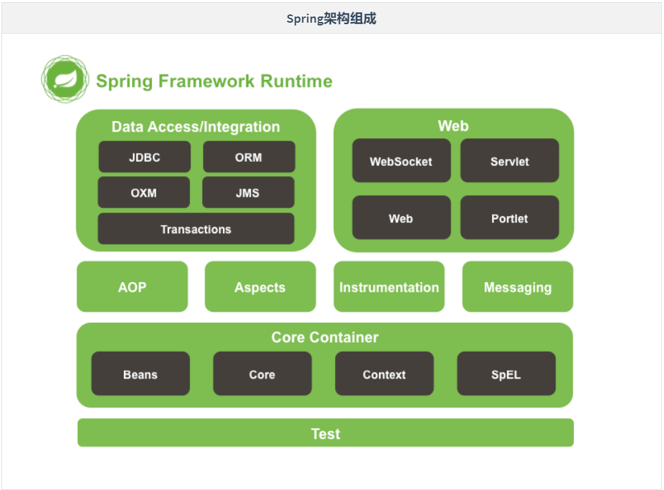

# Day57笔记

## 一、MyBatis收尾

### 1.1 sqlsession对象创建

* sqlsessionFactory创建对象
* sqlsession创建对象

### 1.2 数据访问方法

* 查询的方法

### 1.3 $  和 ‘#’  #

## 二、Spring

### 2.1 以往项目可能出现的问题

* 耦合性
* 适用性
* 数据库
  * 事务
  * 开启关闭
* 对象创建

### 2.2 静态工厂创建对象

```java
package com.shine.factory;

import java.io.IOException;
import java.util.Properties;

public class StaticBeanFactory {
    private static Properties properties = new Properties();

    static {
        try {
            properties.load(StaticBeanFactory.class.getClassLoader().getResourceAsStream("bean.properties"));
        } catch (IOException e) {
            e.printStackTrace();
        }
    }

    /**
     * 获取对象的方法
     * @param beanName
     * @return
     */
    public static Object getBean(String beanName) {
        try {
            Class<?> clazz = Class.forName(properties.getProperty(beanName));

            if (clazz != null){
                return clazz.newInstance();
            }
        } catch (ClassNotFoundException e) {
            e.printStackTrace();
        } catch (InstantiationException e) {
            e.printStackTrace();
        } catch (IllegalAccessException e) {
            e.printStackTrace();
        }
        return null;
    }
}

```


### 2.3 实例工厂创建对象

```java
package com.shine.factory;

import java.io.IOException;
import java.util.Properties;

public class InstanceBeanFactory {
    private Properties properties = new Properties();

    /**
     * 构造器
     */
    public InstanceBeanFactory() {
        try {
            properties.load(InstanceBeanFactory.class.getClassLoader().getResourceAsStream("bean.properties"));
        } catch (IOException e) {
            e.printStackTrace();
        }
    }

    /**
     * 获取对象
     * @param beanName
     * @return
     */
    public Object getBean(String beanName){
        try {
            Class<?> clazz = Class.forName(properties.getProperty(beanName));

            if (clazz != null){
                return clazz.newInstance();
            }

        } catch (ClassNotFoundException e) {
            e.printStackTrace();
        } catch (IllegalAccessException e) {
            e.printStackTrace();
        } catch (InstantiationException e) {
            e.printStackTrace();
        }
        return null;
    }
}
```

### 2.4 Spring创建对象

> 1、创建maven项目，导入依赖
>
> 2、创建实体类、Dao实现类... ...
>
> 3、创建配置文件，编写bean标签
>
> 4、测试

### 2.5 Spring框架的核心内容




> Author：Aaron
>
> Version：9.0.2


[TOC]


### 三、引言

------

#### 1.1 原生web开发中存在哪些问题？

> - 传统Web开发存在硬编码所造成的过度程序耦合（例如：Service中作为属性Dao对象）。
> - 部分Java EE API较为复杂，使用效率低（例如：JDBC开发步骤）。
> - 侵入性强，移植性差（例如：DAO实现的更换，从Connection到SqlSession）。


### 四、Spring框架

------

#### 4.1 概念

> - Spring是一个项目管理框架，同时也是一套Java EE解决方案。
> - Spring是众多优秀设计模式的组合（工厂、单例、代理、适配器、包装器、观察者、模板、策略）。
> - Spring并未替代现有框架产品，而是将众多框架进行有机整合，简化企业级开发，俗称"胶水框架"。


#### 4.2 访问与下载

> 官方网站：<https://spring.io/>
>
> 下载地址：<http://repo.spring.io/release/org/springframework/spring/>


### 五、Spring架构组成

------

> Spring架构由诸多模块组成，可分类为
>
> - 核心技术：[依赖注入]()，事件，资源，i18n，验证，数据绑定，类型转换，SpEL，[AOP]()。
> - 测试：模拟对象，TestContext框架，Spring MVC测试，WebTestClient。
> - 数据访问：[事务]()，DAO支持，JDBC，ORM，封送XML。
> - Spring MVC和 Spring WebFlux Web框架。
> - 集成：远程处理，JMS，JCA，JMX，电子邮件，任务，调度，缓存。
> - 语言：Kotlin，Groovy，动态语言。

|      Spring架构组成      |
| :----------------------: |
|  |

| **GroupId**         | **ArtifactId**             | **说明**                                           |
| ------------------- | -------------------------- | -------------------------------------------------- |
| org.springframework | [spring-beans]()           | [Beans 支持，包含 Groovy]()                        |
| org.springframework | [spring-aop]()             | [基于代理的AOP支持]()                              |
| org.springframework | [spring-aspects]()         | [基于AspectJ 的切面]()                             |
| org.springframework | [spring-context]()         | [应用上下文运行时，包括调度和远程抽象]()           |
| org.springframework | [spring-context-support]() | [支持将常见的第三方类库集成到 Spring 应用上下文]() |
| org.springframework | [spring-core]()            | [其他模块所依赖的核心模块]()                       |
| org.springframework | [spring-expression]()      | [Spring 表达式语言，SpEL]()                        |
| org.springframework | spring-instrument          | JVM 引导的仪表（监测器）代理                       |
| org.springframework | spring-instrument-tomcat   | Tomcat 的仪表（监测器）代理                        |
| org.springframework | spring-jdbc                | 支持包括数据源设置和 JDBC 访问支持                 |
| org.springframework | spring-jms                 | 支持包括发送/接收JMS消息的助手类                   |
| org.springframework | spring-messaging           | 对消息架构和协议的支持                             |
| org.springframework | spring-orm                 | 对象/关系映射，包括对 JPA 和 Hibernate 的支持      |
| org.springframework | spring-oxm                 | 对象/XML 映射（Object/XML Mapping，OXM）           |
| org.springframework | [spring-test]()            | [单元测试和集成测试支持组件]()                     |
| org.springframework | [spring-tx]()              | [事务基础组件，包括对 DAO 的支持及 JCA 的集成]()   |
| org.springframework | [spring-web]()             | [web支持包，包括客户端及web远程调用]()             |
| org.springframework | [spring-webmvc]()          | [REST web 服务及 web 应用的 MVC 实现]()            |
| org.springframework | spring-webmvc-portlet      | 用于 Portlet 环境的MVC实现                         |
| org.springframework | spring-websocket           | WebSocket 和 SockJS 实现，包括对 STOMP 的支持      |
| org.springframework | [spring-jcl]()             | [Jakarta Commons Logging 日志系统]()               |

## 六、IOC(Inversion of Control )

### 6.1 概述

* 控制反转

> Inverse Of Controll：控制反转**
>
> **反转了依赖关系的满足方式，由之前的自己创建依赖对象，变为由工厂推送。(变主动为被动，即反转)**
>
> **解决了具有依赖关系的组件之间的强耦合，使得项目形态更加稳健**

### 6.2 项目中的耦合问题

* 对象的创建和使用都是直接通过new的方式创建
* 一旦发生修改，所有有引用的位置都会发生 
* 耦合性强
* 我们的软件追求的是高内聚、低耦合

### 6.3 解决方案

* 不引用任何一个具体的组件(实现类)，在需要其他组件的位置预留存取值入口(set/get)

> 此时，如果需要更换其他UserDAO实现类，则UserServiceImpl不用任何改动！
>
> 则此时的UserServiceImpl组件变得更加稳健！

## 七、依赖注入

### 7.1 概述

* **Dependency Injection**
* 在创建对象的过程中给对象的属性赋值，称为依赖注入

### 7.2 set注入(基于setter)

* 此处的set指的是类中的setter方法，实体类中必须有setter方法，否则无法赋值

#### Users

```java
package com.shine.entity;

import java.util.Date;

/**
 * 通过Spring创建Users的对象
 *  使用Spring给属性赋值
 */
public class Users {
    private Integer id;
    private String username;
    private String password;
    private String sex;
    private Date birthday;

    public void setId(Integer id) {
        this.id = id;
    }

    public void setUsername(String username) {
        this.username = username;
    }

    public void setPassword(String password) {
        this.password = password;
    }

    public void setSex(String sex) {
        this.sex = sex;
    }

    public void setBirthday(Date birthday) {
        this.birthday = birthday;
    }

    @Override
    public String toString() {
        return "Users{" +
                "id=" + id +
                ", username='" + username + '\'' +
                ", password='" + password + '\'' +
                ", sex='" + sex + '\'' +
                ", birthday=" + birthday +
                '}';
    }
}
```

#### bean.xml

```xml
    <bean id="users" class="com.shine.entity.Users">
        <property name="id">
            <value>100100</value>
        </property>
        <property name="username" value="中国联通"></property>
        <property name="password" value="10086"></property>
        <property name="sex" value="男"></property>
<!--        <property name="birthday" value="1990/12/20"></property>-->
        <property name="birthday" ref="birthday"></property>
    </bean>

    <bean id="users02" class="com.shine.entity.Users">
        <property name="id" value="10010"></property>
        <property name="username" value="中国联通"></property>
        <property name="password" value="10000"></property>
        <property name="sex" value="男"></property>
<!--        <property name="birthday" value="1990/12/20"></property>-->
        <property name="birthday" ref="birthday"></property>
    </bean>

    <bean id="birthday" class="java.util.Date"></bean>
```

#### 测试

```java
    @Test
    public void getUsers01(){
        ApplicationContext ioc = new ClassPathXmlApplicationContext("bean.xml");

        // 默认使用单例模式
        Users users01 = ioc.getBean("users", Users.class);
        System.out.println(users01);

        Users users02 = ioc.getBean("users", Users.class);
        System.out.println(users02);

        System.out.println(users01==users02);

    }
```

### 7.3 自动注入(基于setter)

* 不用在配置中 指定为哪个属性赋值，及赋什么值。（也是通过setter方法赋值）
* 由spring自动根据某个 "原则" ，在工厂中查找一个bean，为属性注入属性值

#### Users(应该复制的是UserDao,复制错了 )

```java
package com.shine.entity;

import java.util.Date;

/**
 * 通过Spring创建Users的对象
 *  使用Spring给属性赋值
 */
public class Users {
    private Integer id;
    private String username;
    private String password;
    private String sex;
    private Date birthday;

    public void setId(Integer id) {
        this.id = id;
    }

    public void setUsername(String username) {
        this.username = username;
    }

    public void setPassword(String password) {
        this.password = password;
    }

    public void setSex(String sex) {
        this.sex = sex;
    }

    public void setBirthday(Date birthday) {
        this.birthday = birthday;
    }

    @Override
    public String toString() {
        return "Users{" +
                "id=" + id +
                ", username='" + username + '\'' +
                ", password='" + password + '\'' +
                ", sex='" + sex + '\'' +
                ", birthday=" + birthday +
                '}';
    }
}
```

#### UsersService

```java
package com.shine.service.impl;

import com.shine.dao.UsersDao;
import com.shine.entity.Users;
import com.shine.service.UsersService;

public class UsersServiceImpl implements UsersService {

    private UsersDao usersDao;
    
	//仍然是借助setter方法实现赋值
    public void setUsersDao(UsersDao usersDao) {
        this.usersDao = usersDao;  
    }

    @Override
    public Integer saveUser(Users users) {
        System.out.println("UserServiceImpl...saveUser...");
        usersDao.insertUser(users);
        return null;
    }
}
```

#### bean-auto.xml

```xml
<?xml version="1.0" encoding="UTF-8"?>
<beans xmlns="http://www.springframework.org/schema/beans"
       xmlns:xsi="http://www.w3.org/2001/XMLSchema-instance"
       xsi:schemaLocation="http://www.springframework.org/schema/beans
       http://www.springframework.org/schema/beans/spring-beans.xsd">

    <!--<bean id="userService" class="com.shine.service.impl.UsersServiceImpl">
        <property name="usersDao" ref="usersDao"></property>
    </bean>-->

<!--    <bean id="usersDao" class="com.shine.dao.impl.UsersDaoImpl"></bean>-->
    //容器实例化时bean也实例化
    <bean id="usersDao" class="com.shine.dao.impl.UsersDaoImpl"></bean>
    <bean id="usersDao000" class="com.shine.dao.impl.UsersDaoImpl"></bean>

    <bean id="userService2" class="com.shine.service.impl.UsersServiceImpl" autowire="byName"></bean>

    <bean id="userService3" class="com.shine.service.impl.UsersServiceImpl" autowire="byType"></bean>

</beans>
```

#### 测试

```java
@Test
    public void getUser02(){
        ApplicationContext ioc = new ClassPathXmlApplicationContext("bean-auto.xml");
        UsersServiceImpl userService = ioc.getBean("userService", UsersServiceImpl.class);

        userService.saveUser(new Users());
    }

    @Test
    public void getUser03(){
        ApplicationContext ioc = new ClassPathXmlApplicationContext("bean-auto.xml");
        UsersServiceImpl userService = ioc.getBean("userService2", UsersServiceImpl.class);

        userService.saveUser(new Users());
    }

    @Test
    public void getUser04(){
        ApplicationContext ioc = new ClassPathXmlApplicationContext("bean-auto.xml");
        UsersServiceImpl userService = ioc.getBean("userService3", UsersServiceImpl.class);

        userService.saveUser(new Users());
    }
```

### 7.4 构造注入

* 使用构造器的方式，匹配对应的形参数量注入，实体类中需要有带参构造器

#### Stu

```
package com.shine.entity;

public class Stu {
    private Integer id;
    private String name;
    private String gender;
    private Double height;

    public Stu(Integer id, String name, String gender) {
        this.id = id;
        this.name = name;
        this.gender = gender;
    }

    public Stu(Integer id, String name, String gender, Double height) {
        this.id = id;
        this.name = name;
        this.gender = gender;
        this.height = height;
    }

    public void setId(Integer id) {
        this.id = id;
    }

    public void setName(String name) {
        this.name = name;
    }

    public void setGender(String gender) {
        this.gender = gender;
    }

    public void setHeight(Double height) {
        this.height = height;
    }

    @Override
    public String toString() {
        return "Stu{" +
                "id=" + id +
                ", name='" + name + '\'' +
                ", gender='" + gender + '\'' +
                ", height=" + height +
                '}';
    }
}
```

#### bean-cons.xml

```
<?xml version="1.0" encoding="UTF-8"?>
<beans xmlns="http://www.springframework.org/schema/beans"
       xmlns:xsi="http://www.w3.org/2001/XMLSchema-instance"
       xsi:schemaLocation="http://www.springframework.org/schema/beans
       http://www.springframework.org/schema/beans/spring-beans.xsd">

    <bean id="stu01" class="com.shine.entity.Stu">
        <constructor-arg name="id" value="1024"></constructor-arg>
        <constructor-arg name="name" value="zhangsan"></constructor-arg>
        <constructor-arg name="gender" value="male"></constructor-arg>
        <constructor-arg name="height" value="1.78"></constructor-arg>
    </bean>

    <bean id="stu02" class="com.shine.entity.Stu">
        <constructor-arg name="id" value="1024"></constructor-arg>
        <constructor-arg name="name" value="zhangsan"></constructor-arg>
        <constructor-arg name="gender" value="male"></constructor-arg>
    </bean>

</beans>
```

### 7.5 p命名空间(基于setter)

* p作为前缀代表对象调用属性完成赋值操作（调用的是实体类中的setter方法），实体类中需要有setter方法

#### bean-pname.xml

```
<?xml version="1.0" encoding="UTF-8"?>
<beans xmlns="http://www.springframework.org/schema/beans"
       xmlns:xsi="http://www.w3.org/2001/XMLSchema-instance"
       xmlns:p="http://www.springframework.org/schema/p"
       xsi:schemaLocation="http://www.springframework.org/schema/beans
       http://www.springframework.org/schema/beans/spring-beans.xsd">

    <!--
        相当于设置了一个前缀
        前缀表示当前的对象
      -->
    <bean id="stu" class="com.shine.entity.Student" p:id="1235" p:name="lisi" p:gender="male" p:height="1.79"></bean>

</beans>
```

## 八、Bean特性

### 8.1 默认是单例

* Spring工厂创建的对象默认使用单例模式

### 8.2 Bean创建时间

* 单例模式
  * 容器创建的时候创建Bean
    * 构造方法
    * set方法
    * init
* 多例模式
  * 调用getBean方法时候创建Bean
    * 构造
    * set
    * init
  * 每次调用getBean都会创建新的对象

### 8.3 销毁时间

* 单例模式
  * 容器关闭
* 多例模式
  * 对象变成垃圾之后

### 8.4 单例、多例模式切换

* scope
  * singleton
  * prototype

### 8.5 单例模式优缺点

* 优点
  * 创建时间早
  * 节省开销，提高性能
* 缺点
  * 线程安全问题
* 解决办法
  * 尽量使用局部变量
  * 尽量少修改成员变量
  * 改成多例模式

#### 8.6 生命周期阶段

> **单例bean：**singleton
>
> 随工厂启动[创建]() ==》  [构造方法]()  ==》 [set方法(注入值)]()  ==》 [init(初始化)]()  ==》 [构建完成]() ==》[随工厂关闭销毁]()

> **多例bean：**prototype
>
> 被使用时[创建]() ==》  [构造方法]()  ==》 [set方法(注入值)]()  ==》 [init(初始化)]()  ==》 [构建完成]() ==》[JVM垃圾回收销毁](