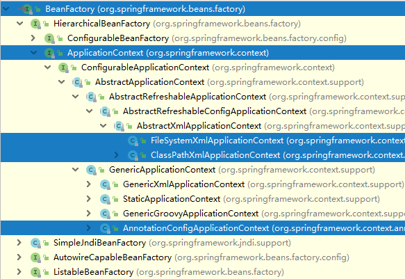

# Day 58笔记

## 一、复杂属性赋值

### 1.1 概述

* 昨天的注入可以解决基本类型、包装类、String的注入
* Array、Set、List、Map、Properties等还无法直接实现

### 1.2 赋值操作

#### 实体类

```java
package com.shine.entity;

import java.util.*;

/**
 * 实体类
 */
public class Student {
    // Array、Set、List、Map、Properties等还无法直接实现
    private String[] names;
    private Set hobby;
    private List subjects;
    private Map phones;
    private Properties friends;

    public Student() {
    }

    public void setNames(String[] names) {
        this.names = names;
    }

    public void setHobby(Set hobby) {
        this.hobby = hobby;
    }

    public void setSubjects(List subjects) {
        this.subjects = subjects;
    }

    public void setPhones(Map phones) {
        this.phones = phones;
    }

    public void setFriends(Properties friends) {
        this.friends = friends;
    }

    @Override
    public String toString() {
        return "Student{" +
                "names=" + Arrays.toString(names) +
                ", hobby=" + hobby +
                ", subjects=" + subjects +
                ", phones=" + phones +
                ", friends=" + friends +
                '}';
    }
}
```

#### applicationContext

```xml
<?xml version="1.0" encoding="UTF-8"?>
<beans xmlns="http://www.springframework.org/schema/beans"
       xmlns:xsi="http://www.w3.org/2001/XMLSchema-instance"
       xsi:schemaLocation="http://www.springframework.org/schema/beans
       http://www.springframework.org/schema/beans/spring-beans.xsd">

    <bean id="student" class="com.shine.entity.Student">
        <property name="names">
            <array>
                <value>周树人</value>
                <value>鲁迅</value>
            </array>
        </property>

        <property name="hobby">
            <set>
                <value>抽烟</value>
                <value>喝酒</value>
                <value>烫头</value>
            </set>
        </property>

        <property name="subjects">
            <list>
                <value>医学</value>
                <value>文学</value>
            </list>
        </property>

        <property name="friends">
            <props>
                <prop key="f01">闰土</prop>
                <prop key="f02">猹</prop>
                <prop key="f03">豆腐西施</prop>
            </props>
        </property>

        <property name="phones">
            <map>
                <entry key="报警" value="110"></entry>
                <entry key="火警" value="119"></entry>
                <entry key="急救" value="120"></entry>
                <entry key="道路救援">
                    <value>122</value>
                </entry>
            </map>
        </property>

    </bean>

</beans>
```

#### TestStudent

```java
    @Test
    public void getStu(){
        ClassPathXmlApplicationContext ioc = 
        	new ClassPathXmlApplicationContext("applicationContext01.xml");

        Student student = ioc.getBean("student", Student.class);
        System.out.println(student);

    }

```

### 1.3 获取连接对象

#### StuDao

```java
public interface StuDao {
    Stu findStuById(Integer id);
}
```

```java
public class StuDaoImpl implements StuDao {

    private DruidDataSource dataSource;

    public DruidDataSource getDataSource() {
        return dataSource;
    }

    public void setDataSource(DruidDataSource dataSource) {
        this.dataSource = dataSource;
    }

    @Override
    public Stu findStuById(Integer id) {
        return null;
    }
}
```

#### applicationContext.xml

```xml
<?xml version="1.0" encoding="UTF-8"?>
<beans xmlns="http://www.springframework.org/schema/beans"
       xmlns:xsi="http://www.w3.org/2001/XMLSchema-instance"
       xmlns:context="http://www.springframework.org/schema/context"
       xsi:schemaLocation="http://www.springframework.org/schema/beans
       http://www.springframework.org/schema/beans/spring-beans.xsd
       http://www.springframework.org/schema/context
       https://www.springframework.org/schema/context/spring-context.xsd">

    <!--
        导入配置文件
        可以使用通配符方式导入全部类型的文件
      -->
    <context:property-placeholder location="classpath*:jdbc.properties"></context:property-placeholder>

    <bean id="stuDao" class="com.shine.dao.impl.StuDaoImpl">
        <property name="dataSource" ref="dataSource"></property>
    </bean>

    <bean id="dataSource" class="com.alibaba.druid.pool.DruidDataSource">
        <property name="url" value="${jdbc.url}"></property>
        <property name="driverClassName" value="${jdbc.driver}"></property>
        <property name="username" value="${jdbc.username}"></property>
        <property name="password" value="${jdbc.password}"></property>
    </bean>

</beans>
```

#### 测试

```java
    @Test
    public void getStu01() throws SQLException {
        ClassPathXmlApplicationContext ioc = 
        	new ClassPathXmlApplicationContext("applicationContext02.xml");
        StuDaoImpl stuDao = ioc.getBean("stuDao", StuDaoImpl.class);
        System.out.println(stuDao.getDataSource().getConnection());
    }

    @Test
    public void getStu02() throws SQLException {
        ClassPathXmlApplicationContext ioc = 
        	new ClassPathXmlApplicationContext("applicationContext02.xml");
        DruidDataSource dataSource = ioc.getBean("dataSource", DruidDataSource.class);
        System.out.println(dataSource.getConnection());
    }
```

## 二、Spring容器继承体系

### 2.1 概述

* 我们现在用的ClassPathXMLApplicationContext实现了一些接口
  * ApplicationContext
  * BeanFactory
* 有一些功能和ClassPathXMLApplicationContext类似的类
  * FileSystemXmlApplicationContext
    * 使用文件系统导入配置
  * AnnotationConfigApplicationContext
    * 使用注解导入配置信息
  * ClassPathXMLApplicationContext
    * 使用xml文件导入配置

### 2.2 继承体系



### 2.3 BeanFactory

-  BeanFactory:负责生产和管理Bean的一个工厂接口，提供一个Spring Ioc容器规范,


### 2.4 FactoryBean

* 接口，获取Bean的接口
* 提供了三个方法
  * getObject
    * 获取对象的方法
    * 注入到Spring容器的时候会被自动调用
  * getObjectType
    * 获取对象的类型
  * isSingleTon
    * 是否是单例

### 2.5 FactoryBean使用

#### SessionFactory

```
package com.shine.factory;

import org.apache.ibatis.io.Resources;
import org.apache.ibatis.session.SqlSession;
import org.apache.ibatis.session.SqlSessionFactory;
import org.apache.ibatis.session.SqlSessionFactoryBuilder;
import org.springframework.beans.factory.FactoryBean;

/**
 * 获取SqlSession对象
 */
public class SessionFactory implements FactoryBean {

    @Override
    public Object getObject() throws Exception {
        SqlSessionFactory sqlSessionFactory = new SqlSessionFactoryBuilder().build(Resources.getResourceAsStream("mybatis-config.xml"));
        SqlSession sqlSession = sqlSessionFactory.openSession();
        return sqlSession;
    }

    @Override
    public Class<?> getObjectType() {
        return SqlSession.class;
    }

    @Override
    public boolean isSingleton() {
        return false;
    }
}
```

#### 配置

```
<?xml version="1.0" encoding="UTF-8"?>
<beans xmlns="http://www.springframework.org/schema/beans"
       xmlns:xsi="http://www.w3.org/2001/XMLSchema-instance"
       xmlns:context="http://www.springframework.org/schema/context"
       xsi:schemaLocation="http://www.springframework.org/schema/beans
       http://www.springframework.org/schema/beans/spring-beans.xsd
       http://www.springframework.org/schema/context
       https://www.springframework.org/schema/context/spring-context.xsd">

    <bean id="session" class="com.shine.factory.SessionFactory"></bean>

</beans>
```

#### 测试

```
public class TestSessionFactory {

    @Test
    public void getSession(){
        ClassPathXmlApplicationContext ioc = new ClassPathXmlApplicationContext("applicationContext03.xml");
        SqlSession session = ioc.getBean("session", SqlSession.class);
        System.out.println(session);
    }
}
```

### 2.6 对比BeanFactory和FactoryBean

1. BeanFactory:负责生产和管理Bean的一个工厂接口，提供一个Spring Ioc容器规范,核心接口
2. FactoryBean: 一种Bean创建的一种方式，对Bean的一种扩展。对于复杂的Bean对象初始化创建使用其可封装对象的创建细节。

## 三、注解开发

### 3.1 概述

* 把注入bean的方式由原来在配置文件中书写改为给类、属性、方法添加注解的方式

### 3.2 类、对象

* @Component
  * 可以给所有的类添加
* @Repository
  * 给Dao层类添加
* @Service
  * 给业务层添加
* @Controller
  * 给控制层添加
* @Bean（获取方法返回的对象）
  * 添加到方法上，把返回的结果注入
* @Scope("singleton")
  * 设置对象创建模式

```java
//@Component
@Repository
public class UserDaoImpl implements UserDao {

    @Bean
    public DataSource dataSource(){
        DruidDataSource dataSource = new DruidDataSource();
        dataSource.setDriverClassName("com.mysql.jdbc.Driver");
        dataSource.setUrl("jdbc:mysql://localhost:3306/java2103?useSSL=false&serverTimezone=GMT&characterEncoding=UTF8&useUnicode=true");
        dataSource.setUsername("root");
        dataSource.setPassword("root");
        return dataSource;
    }

    @Override
    public Integer insertUser(User user) {
        System.out.println("UserDaoImpl...insertUser...");
        return null;
    }
}
```

### 3.3 简单注解赋值

* @Value

  * 可以给基本类型
  * String
  * Date

  ```
  @Value("10011")
  private Integer id;
  
  @Value("宋江")
  private String username;
  
  @Value("sunerniang")
  private String password;
  
  @Value("1988/12/28")
  private Date registerTime;
  ```

### 3.4 对象注解

* 给类中被引用的对象寻找注入的数据

```java
package com.shine.service.impl;

import com.shine.dao.UserDao;
import com.shine.entity.User;
import com.shine.service.UserService;
import org.springframework.beans.factory.annotation.Autowired;
import org.springframework.beans.factory.annotation.Qualifier;
import org.springframework.stereotype.Service;

import javax.annotation.Resource;

//@Service("userService")
@Service
public class UserServiceImpl implements UserService {


    // @Resource(name = "userDao") 查找容器中对象，按照默认规则查找，可以指定名称
    @Autowired
    @Qualifier("userDaoImpl2")
    private UserDao userDao;

    @Override
    public Integer saveUser(User user) {
        System.out.println("UserServiceImpl...saveUser...");
        userDao.insertUser(user);
        return null;
    }
}
```

### 3.5 生命周期相关注解

```java
    @PostConstruct
    public void init(){
        System.out.println("User...init");
    }

    @PreDestroy
    public void destroy(){
        System.out.println("User...destroy");
    }
```

### 3.6 配置相关注解

* @Configuration
  * 把此类标记为配置
* @ComponentScans
  * 扫描文件
* @Import
  * 导入其他的配置类
* @PropertySource
  * 导入配置文件

```java
/**
 * 功能类似配置文件的类
 */
@Configuration
@ComponentScans({
        @ComponentScan("com.shine.config"),
        @ComponentScan("com.shine.dao"),
        @ComponentScan("com.shine.entity"),
        @ComponentScan("com.shine.factory"),
        @ComponentScan("com.shine.service"),
})
@Import(SourceConfig.class)
public class SpringConfig {
}
```

```java
package com.shine.config;

import com.alibaba.druid.pool.DruidDataSource;
import org.springframework.beans.factory.annotation.Value;
import org.springframework.context.annotation.Bean;
import org.springframework.context.annotation.Configuration;
import org.springframework.context.annotation.PropertySource;

import javax.sql.DataSource;

@Configuration
@PropertySource("classpath:jdbc.properties")
public class SourceConfig {
    @Value("${jdbc.url}")
    private String url;

    @Value("${jdbc.driver}")
    private String driverClassName;

    @Value("${jdbc.username}")
    private String username;

    @Value("${jdbc.password}")
    private String password;

    @Bean
    public DataSource dataSource(){
        DruidDataSource dataSource = new DruidDataSource();
        dataSource.setDriverClassName(driverClassName);
        dataSource.setUrl(url);
        dataSource.setUsername(username);
        dataSource.setPassword(password);
        return dataSource;
    }
}
```

## 四、代理模式

### 4.1 概述

* 将核心功能与辅助功能（事务、日志、性能监控代码）分离，达到核心业务功能更纯粹、辅助业务功能可复用。
* 我们把主要功能写在方法中，采用代理的方式给方法添加辅助功能
  * 比如日志
  * 比如事务处理

### 4.2 代理模式

#### 静态代理

* 特点
  * 通过代理类的对象，为原始类的对象（目标类的对象）添加辅助功能，更容易更换代理实现类、利于维护。
* 代理类 = 实现原始类相同接口 + 添加辅助功能 + 调用原始类的业务方法。
* 静态代理的问题
  - 代理类数量过多，不利于项目的管理。
  - 多个代理类的辅助功能代码冗余，修改时，维护性差。

#### 接口

```
/**
 * 公共接口
 *  中介和房东都需完成的方法
 */
public interface ZuFang {
    Integer chuZu(Integer money);
}
```

#### 代理目标

```
public class FangDong implements ZuFang {
    @Override
    public Integer chuZu(Integer money) {
        System.out.println("房东收房租==>" + money);
        return money;
    }
}
```

#### 代理

```
public class ZhongJie implements ZuFang {
    FangDong fangDong = new FangDong();
    @Override
    public Integer chuZu(Integer money) {
        System.out.println("发广告");
        System.out.println("带看房");
        System.out.println("签合同");
        fangDong.chuZu(money-400);
        System.out.println("中介收房租===》" + money);
        System.out.println("修电器...");
        return money;
    }
}
```

#### 测试

```
public class TestStaticProxy {
    @Test
    public void testZu(){
        ZhongJie zhongJie = new ZhongJie();
        Integer zu = zhongJie.chuZu(3600);
    }

}
```


#### 动态代理

* JDK动态代理
* Cglib动态代理

