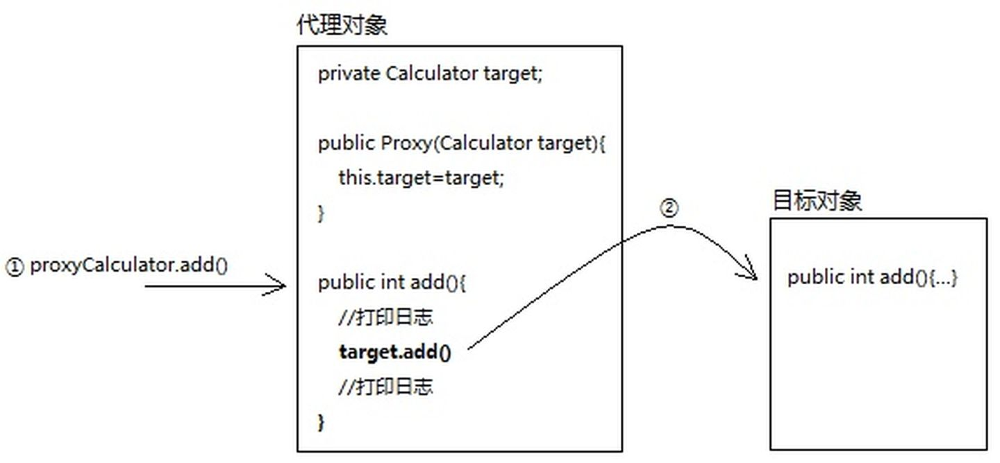
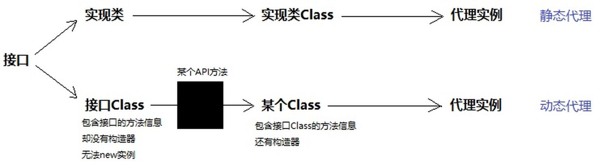
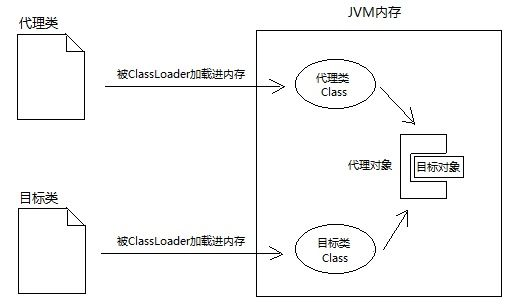
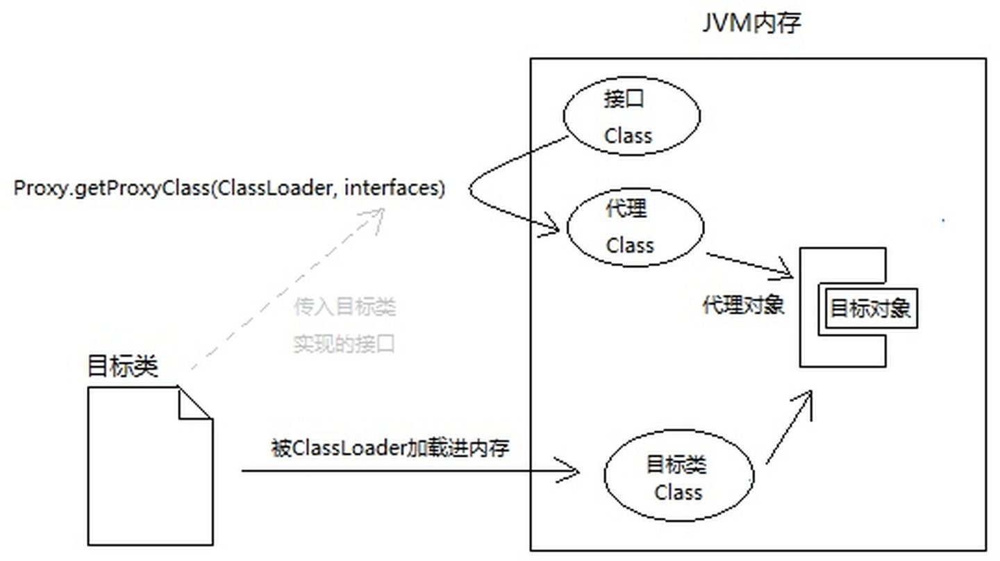
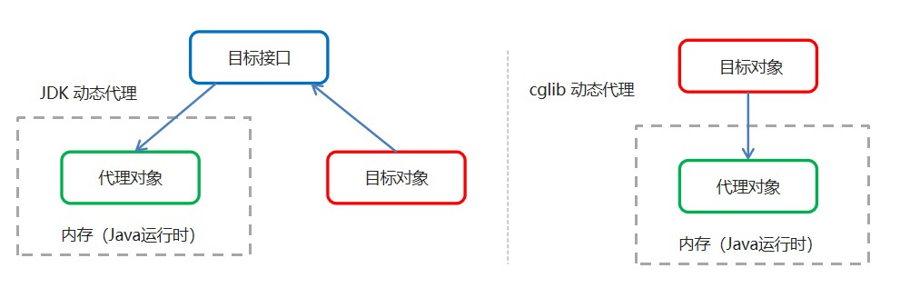
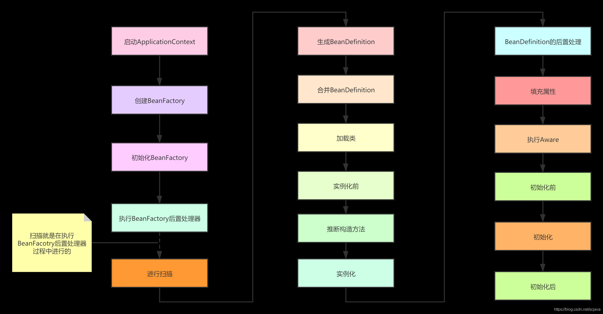
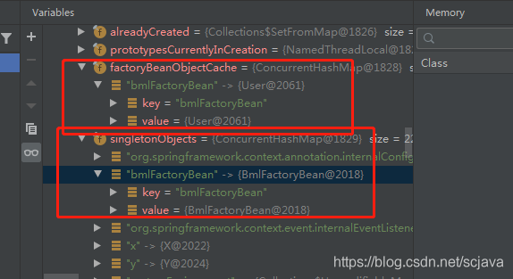
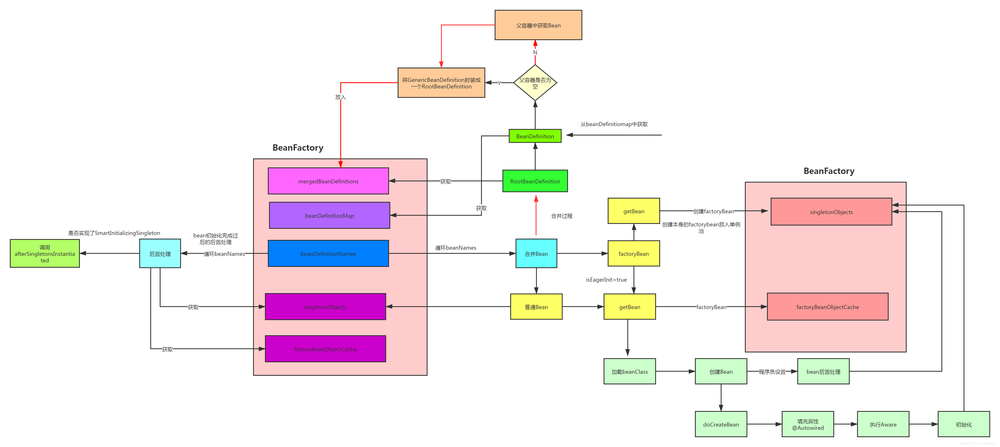

## Spring相关面试题

### 1、说说你对Spring IOC的理解？

##### 	1.1、IoC是什么

　　**Ioc—Inversion of Control，即“控制反转”，不是什么技术，而是一种设计思想。**在Java开发中，**Ioc意味着将你设计好的对象交给容器控制，而不是传统的在你的对象内部直接控制。**

●**谁控制谁，控制什么：**传统Java SE程序设计，我们直接在对象内部通过new进行创建对象，是程序主动去创建依赖对象；而IoC是有专门一个容器来创建这些对象，即由Ioc容器来控制对 象的创建；**谁控制谁？当然是IoC 容器控制了对象；控制什么？那就是主要控制了外部资源获取（不只是对象包括比如文件等）。**

●**为何是反转，哪些方面反转了：**有反转就有正转，传统应用程序是由我们自己在对象中主动控制去直接获取依赖对象，也就是正转；而反转则是由容器来帮忙创建及注入依赖对象；为何是反转？**因为由容器帮我们查找及注入依赖对象，对象只是被动的接受依赖对象，所以是反转；哪些方面反转了？依赖对象的获取被反转了。**

　　用图例说明一下，传统程序设计如图1-1，都是主动去创建相关对象然后再组合起来：


　　当有了IoC/DI的容器后，在客户端类中不再主动去创建这些对象了，如图1-2所示:


##### 1.2、IoC能做什么

　　IoC 不是一种技术，只是一种思想，一个重要的面向对象编程的法则，它能指导我们如何设计出松耦合、更优良的程序。传统应用程序都是由我们在类内部主动创建依赖对象，从而导致类与类之间高耦合，难于测试；有了IoC容器后，把创建和查找依赖对象的控制权交给了容器，由容器进行注入组合对象，所以对象与对象之间是 松散耦合，这样也方便测试，利于功能复用，更重要的是使得程序的整个体系结构变得非常灵活。

　　其实**IoC对编程带来的最大改变不是从代码上，而是从思想上，发生了“主从换位”的变化。应用程序原本是老大，要获取什么资源都是主动出击，但是在IoC/DI思想中，应用程序就变成被动的了，被动的等待IoC容器来创建并注入它所需要的资源了。**

　　**IoC很好的体现了面向对象设计法则之一—— 好莱坞法则：“别找我们，我们找你”；即由IoC容器帮对象找相应的依赖对象并注入，而不是由对象主动去找。**


### 2、IOC跟DI如何理解？

##### 2.1、IoC和DI

　　**DI—Dependency Injection，即“依赖注入”**：**组件之间依赖关系**由容器在运行期决定，形象的说，即**由容器动态的将某个依赖关系注入到组件之中**。**依赖注入的目的并非为软件系统带来更多功能，而是为了提升组件重用的频率，并为系统搭建一个灵活、可扩展的平台。**通过依赖注入机制，我们只需要通过简单的配置，而无需任何代码就可指定目标需要的资源，完成自身的业务逻辑，而不需要关心具体的资源来自何处，由谁实现。

　　理解DI的关键是：“谁依赖谁，为什么需要依赖，谁注入谁，注入了什么”，那我们来深入分析一下：

　　●**谁依赖于谁：**当然是**应用程序依赖于IoC容器**；

　　●**为什么需要依赖：**应用程序需要IoC容器来提供对象需要的外部资源；

　　●**谁注入谁：**很明显是**IoC容器注入应用程序某个对象，应用程序依赖的对象**；

　　**●注入了什么：**就是**注入某个对象所需要的外部资源（包括对象、资源、常量数据）**。

　　**IoC和DI**有什么**关系**呢？其实它们**是同一个概念的不同角度描述**：

| 1、控制反转是一种设计思想而依赖注入是这种思想的具体实现，具体说控制反转就是将创建userDaoImpl对象的控制权反转过来由UserServiceImpl交给了ioc容器，**强调的是一种能力和思想**，ioc容器具有了控制权。 |
| ------------------------------------------------------------ |
| 2、依赖注入就是ioc容器将UserServiceImpl所依赖的对象userDaoImpl，注入给UserServiceImpl，**强调的是一个过程和实现** |


### 3、BeanFactory跟FactoryBean的差别？

标准答案：https://www.cnblogs.com/aspirant/p/9082858.html


1. BeanFactory：以Factory结尾，表示它是一个工厂类(接口)， **它是负责生产和管理bean的一个工厂**。在Spring中，**BeanFactory是IOC容器的核心接口**，提供Spring Ioc容器规范，**在Spring中，所有的Bean都是由BeanFactory(也就是IOC容器)来进行管理的**，

2. FactoryBean： 是一种Bean创建的一种方式，以Bean结尾，表示它是一个Bean，不同于普通Bean的是：它是实现了FactoryBean<T>接口的Bean，根据该Bean的ID从BeanFactory中获取的实际上是FactoryBean的getObject()返回的对象。对于复杂的Bean对象初始化创建使用其可封装对象的创建细节。**这个Bean不是简单的Bean，而是一个能生产或者修饰对象生成的工厂Bean,它的实现与设计模式中的工厂模式和修饰器模式类似** 。

   

### 4、说说你对动态代理的理解？

https://www.zhihu.com/question/40536038/answer/658146278

##### **4.1静态代理**

假设现在项目经理有一个需求：在项目现有所有类的方法前后打印日志。
你如何在不修改已有代码的前提下，完成这个需求？
我首先想到的是静态代理。具体做法是：
1.为现有的每一个类都编写一个对应的**代理类**，并且让它实现和目标类相同的接口（假设都有）


2.在创建代理对象时，通过构造器塞入一个目标对象，然后在代理对象的方法内部调用目标对象同名方
法，并在调用前后打印日志。也就是说，**代理对象 = 增强代码 + 目标对象（原对象**）。有了代理对象后，
就不用原对象了



**静态代理的缺陷**
程序员要手动为每一个目标类编写对应的代理类。如果当前系统已经有成百上千个类，工作量太大了。所
以，现在我们的努力方向是：如何少写或者不写代理类，却能完成代理功能？

##### 4.2JDK动态代理

JDK提供了java.lang.reflect.InvocationHandler接口和 java.lang.reflect.Proxy类，这两个类相互配合，
入口是Proxy，所以我们先聊它。
Proxy有个静态方法：getProxyClass(ClassLoader, interfaces)，只要你给它传入类加载器和一组接口，
它就给你返回代理Class对象。
用通俗的话说，getProxyClass()这个方法，会从你传入的接口Class中，“拷贝”类结构信息到一个新的
Class对象中，但新的Class对象带有构造器，是可以创建对象的。打个比方，一个大内太监（接口
Class），空有一身武艺（类信息），但是无法传给后人。现在江湖上有个妙手神医（Proxy类），发明了
克隆大法（getProxyClass），不仅能克隆太监的一身武艺，还保留了小DD（构造器）...（这到底是道德
の沦丧，还是人性的扭曲，欢迎走进动态代理）
所以，一旦我们明确接口，完全可以通过接口的Class对象，创建一个代理Class，通过代理Class即可创建
代理对象。																						*大体思路 ☝*



​																						*静态代理 ☝*



​																							*动态代理☝*

所以，按我理解，Proxy.getProxyClass()这个方法的本质就是：**以Class造Class。**

代理的代码使用过程一般如下：

1、new一个目标对象

2、new一个InvocationHandler，将目标对象set进去

3、通过CreatProxyedObj创建代理对象，强转为目标对象的接口类型即可使用，实际上生成的代理对象实现了目标接口。

```
Target target = new Target(); 		//创建目标对象
TargetInterface proxy = (TargetInterface) Proxy.newProxyInstance( 		//创建代理对象
  target.getClass().getClassLoader(),			//参数一：目标对象类加载器
  target.getClass().getInterfaces(),			//参数二：目标对象接口
  new InvocationHandler() {            			//参数三：调用处理器
	@Override          
	public Object invoke(Object proxy, Method method, Object[] args) throws Throwable {           System.out.println("前置增强代码...");               
		Object invoke = method.invoke(target, args);              			  		             System.out.println("后置增强代码...");            
		return invoke;            
	}       
  }
);

```

##### 4.3小结

我想了个很骚的比喻，希望能解释清楚：
接口Class对象是大内太监，里面的方法和字段比做他的一身武艺，但是他没有小DD（构造器），所以不
能new实例。一身武艺后继无人。
那怎么办呢？
**正常途径（implements）：**
写一个类，实现该接口。这个就相当于大街上拉了一个人，认他做干爹。一身武艺传给他，只是比他干爹
多了小DD，可以new实例。
**非正常途径（动态代理）：**
通过妙手圣医Proxy的克隆大法（Proxy.getProxyClass()），克隆一个Class，但是有小DD。所以这个克
隆人Class可以创建实例，也就是代理对象。
代理Class其实就是附有构造器的接口Class，一样的类结构信息，却能创建实例。

##### 4.4CGLib动态代理

```java
Target target = new Target();
        Target  proxy = (Target ) Enhancer.create(
                target.getClass(),
                new MethodInterceptor() {
                    /**
                     * @param o             代理对象，一般不用
                     * @param method        被代理方法
                     * @param objects       方法中传入的参数
                     * @param methodProxy   方法代理
                     * @return
                     * @throws Throwable
                     */
                    @Override
                    public Object intercept(Object o, Method method, Object[] objects, MethodProxy methodProxy) throws Throwable {
                        System.out.println("前置方法");
                        Object invoke = method.invoke(target, objects);
                        System.out.println("后置方法");
                        return invoke;
                    }
                }
        );

```


##### 4.5JDK 与 CGLib 动态代理的区别

结合 JDK 动态代理的实现，可以得出下列区别：

| 项目                   | JDK                                | CGLib                             |
| ---------------------- | ---------------------------------- | --------------------------------- |
| 被代理对象的要求       | 必须实现接口(可为 final 类)        | 非final类                         |
| 代理类生成方式         | 继承 Proxy，实现被代理类的所有接口 | 继承被代理类，实现 Factory 接口   |
| 非目标方法是否进行代理 | 不进行代理                         | 可通过 InvocationHandler 进行代理 |

### 5、 Spring AOP？

##### 5.1、Spring 的 AOP 简介

AOP 为 Aspect Oriented Programming 的缩写，意思为面向切面编程，是通过预编译方式和运行期动态代理实现程序功能的统一维护的一种技术。

AOP 是 OOP 的延续，是软件开发中的一个热点，也是Spring框架中的一个重要内容，是函数式编程的一种衍生范型。利用AOP可以对业务逻辑的各个部分进行隔离，从而使得业务逻辑各部分之间的耦合度降低，提高程序的可重用性，同时提高了开发的效率。

##### 5.2、AOP 的作用及其优势

作用：在程序运行期间，在不修改源码的情况下对方法进行功能增强
优势：减少重复代码，提高开发效率，并且便于维护

##### 5.3、 AOP 的底层实现

AOP 的底层是通过 Spring 提供的的动态代理技术实现的。在运行期间，Spring通过动态代理技术动态的生成代理对象，代理对象方法执行时进行增强功能的介入，在去调用目标对象的方法，从而完成功能的增强。

##### 5.4、 AOP 的动态代理技术

常用的动态代理技术
	JDK 代理 : 基于接口的动态代理技术
	cglib 代理：基于父类的动态代理技术

##### 5.5 AOP 相关概念AOP 相关概念

Spring 的 AOP 实现底层就是对上面的动态代理的代码进行了封装，封装后我们只需要对需要关注的部分进行代码编写，并通过配置的方式完成指定目标的方法增强。

-  Target（目标对象）：	代理的目标对象
-  Proxy （代理）：            一个类被 AOP 织入增强后，就产生一个结果代理类
-  Joinpoint（连接点）：   所谓连接点是指那些被拦截到的点。在spring中,这些点指的是方法，因为spring只支持方法类型的连接点
-  Pointcut（切入点）：    所谓切入点是指我们要对哪些 Joinpoint 进行拦截的定义
-  Advice（通知/ 增强）： 所谓通知是指拦截到 Joinpoint 之后所要做的事情就是通知
-  Aspect（切面）：           是切入点和通知（引介）的结合
-  Weaving（织入）：       是指把增强应用到目标对象来创建新的代理对象的过程。spring采用动态代理织入，而AspectJ采用编译期织入和类装载期织入

#####  5.6快速入门

1. 导入 AOP 相关依赖坐标
2. 创建目标接口（可以没有）和目标类（内部有切点）
3. 创建切面类（内部有增强方法）
4. 将目标类和切面类的对象创建权交给 spring
5. 在 applicationContext.xml 中配置织入关系
6. 测试代码

### 6、Spring声明式事务的传播行为？

所谓事务传播行为就是多个事务方法相互调用时，事务如何在这些方法间传播。

在@Transactional注解中，可以propagation属性用来配置事务传播，支持7种不同的传播机制：

1. REQUIRED：业务方法需要在一个事务中运行，如果方法运行时，已处在一个事务中，那么就加入该事务，否则自己创建一个新的事务。这是spring默认的传播行为。
2. NOT_SUPPORTED：声明方法不需要事务。如果方法没有关联到一个事务，容器不会为他开启事务，如果方法在一个事务中被调用，该事务会被挂起，调用结束后，原先的事务会恢复执行。
3. REQUIRESNEW：不管是否存在事务，该方法总会为自己发起一个新的事务。如果方法已经运行在一个事务中，则原有事务挂起，新的事务被创建。
4. MANDATORY：该方法只能在一个已经存在的事务中执行，业务方法不能发起自己的事务。如果在没有事务的环境下被调用，容器抛出例外。
5. SUPPORTS：该方法在某个事务范围内被调用，则方法成为该事务的一部分。如果方法在该事务范围外被调用，该方法就在没有事务的环境下执行。
6. NEVER：该方法绝对不能在事务范围内执行。如果在就抛异常。只有该方法没有关联到任何事务，才正常执行。
7. NESTED：如果一个活动的事务存在，则运行在一个嵌套的事务中。如果没有活动事务，则按REQUIRED属性执行。它使用了一个单独的事务，这个事务拥有多个可以回滚的保存点。内部事务的回滚不会对外部事务造成影响。它只对DataSourceTransactionManager事务管理器起效。

### 7、说说你对Spring的理解？

> 目前学习了IOC和AOP

### 8、Spring Bean的初始化过程？

https://blog.csdn.net/scjava/article/details/109271781

##### 8.1Spring 容器初始化

在spring中，不管是以xml文件的方式配置的Bean还是以注解的方式进行配置，最后都会将单例Bean放入到Spring的容器中，这里说的单例池不是说放入的Bean都是单例的，而是spring在单例池中的Bean都是单例的，只要你从单例池中取Bean对象，那么整个生命周期过程中都只有一个实例，但是你放入单例池的对象Bean它不是单例的，你可以不借助spring而自己产生多例，但是一般都没有这么做，只是时候在概念上要理解单例池和单例类的区别，spring容器的整个启动到初始化过程如下:


##### 8.2 Spring Bean初始化

在spring容器中有两种Bean，一种是普通的Bean，一种是FactoryBean，在介绍Bean的初始化之前，我们要先来理解这两种Bean的区别

BeanFactory和FactoryBean
BeanFactory和FactoryBea的的理解，相信在百度上一搜一大堆，就是说着两个有什么区别呢？
BeanFactory是spring的容器中的Bean工厂，Bean的创建，获取都是它来完成的，也就是说BeanFactory就是spring的容器，里面放入了所有的Bean，包括单例Bean，原型的Bean定义，也就是BeanDefinition,而FactoryBean也是一种Bean，FactoryBean是BeanFactory的一种Bean，是一种特殊的Bean，FactoryBean中是只能放入一种类型的Bean，而BeanFactory中可以放入不同类型的Bean，我们先来看下FactoryBean接口提供的方法，也就是它本身定义了提供了那些功能：

```java
public interface FactoryBean<T> {
    @Nullable
T getObject() throws Exception;

@Nullable
Class<?> getObjectType();

default boolean isSingleton() {
   return true;
}
```

getObject()：该方法就是你通过 放入容器的对象，也就是当你getBean的时候返回的就是spring调用getObject返回的Bean对象；
getObjectType():FactoryBean代表返回对象的类型
isSingleton：这是factoryBean默认的方法，你不需要实现，当然你也可以实现，默认是单例的bean
我们平时开发工程中使用的比较多的Mybatis就是用了FactoryBean，大家可能都知道，Mybatis中的Mapper是一个接口，而接口在spring容器中是不能实例化的，所以Mybatis就是利用了FactoryBean来重新构建了对象（通过反射），我们简单来看下FactoryBean的例子：

```java
@Component
public class BmlFactoryBean<T> implements FactoryBean<T> {

   @SuppressWarnings(value = "unchecked")
   @Override
   public T getObject() throws Exception {
      return (T) new User();
   }

   @Override
   public Class<?> getObjectType() {
      return User.class;
   }
}

AnnotationConfigApplicationContext c = new AnnotationConfigApplicationContext();
c.register(AppConfig.class);
c.refresh();

System.out.println(c.getBean("bmlFactoryBean"));
输出：com.bml.entity.User@6107227e

```

输出的是User对象，所以FactoryBean获取Bean返回的是geteObject返回的对象，在spring容器中存在两个Bean，一个是FactoryBean对应的对象，一个是FactoryBean中getObject返回的对象，所以是有两个Bean，而且如果通过
c.getBean(“bmlFactoryBean”)不管获取几次都是相同的对象，这里有一个重要的概念，我们都知道FactoryBean创建的对象都是单例Bean，但是一般的@Coponent创建的Bean和FactoryBean创建的对象有什么不同吗？
其实在上面的代码中，User对象的真正创建不是在18行代码，而是在20行代码，虽然我们的FactoryBean默认是单例的，但是FactoryBean只有在第一次getBean的时候才会放入到单例池，也就是说FactoryBean默认是懒加载的
而在spring容器中最终会出现两个Bean，比如就上面的代码，那么beanName=bmlFactoryBean是对应的我们的User Bean对象，而beanName=&bmlFactoryBean对应的是我们的FactoryBean本身的Bean对象


看上图，其中BeanFactory中的单例池是singletonObjects是存放了加了@Coponent注解的单例Bean，而上面的代码的FactoryBean是放在了单例池中的，而FactoryBean中getObject返回的对象的Bean是放在了factoryBeanOjectCache中的，看上图几非常清楚了；而我们通过ApplicationContext的getBean去获取FactoryBean的时候，**如果beanName前面加了&就表示获取本身的FactoryBean，而不加&则表示获取FactoryBean中的getObject返回的对象。**

下图是SpringBean初始化底层原理：



##### 总结：生命周期各阶段

> **（默认）单例bean：**singleton
>
> 随工厂（容器）启动[创建]() ==》  [构造方法]()  ==》 [set方法(注入值)]()  ==》 [init(初始化)]()  ==》 [构建完成]() ==》[随工厂关闭销毁]()

> **多例bean：**prototype
>
> 被使用时[创建]() ==》  [构造方法]()  ==》 [set方法(注入值)]()  ==》 [init(初始化)]()  ==》 [构建完成]() ==》[JVM垃圾回收销毁](


### 9、Spring 是如何解决循环依赖问题的？

* 三级缓存

> https://www.jianshu.com/p/6c359768b1dc

