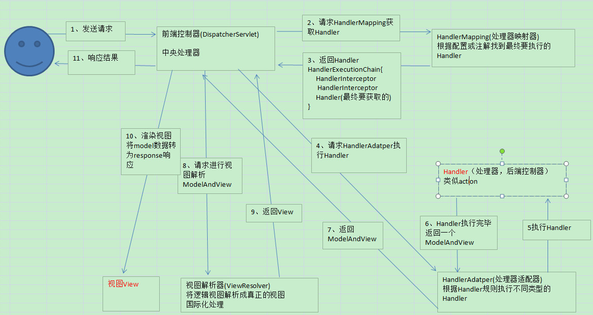

# Day64笔记

## 一、文件下载

### 客户端

```
<%@ page contentType="text/html;charset=UTF-8" language="java" %>
<html>
    <head>
        <title>Title</title>
    </head>
    <body>
        <a href="${pageContext.request.contextPath}/down/down01?filename=threeCountry.txt">下载文件</a>
    </body>
</html>
```

### 服务端

```
package com.shine.controller;

import org.apache.commons.io.IOUtils;
import org.springframework.stereotype.Controller;
import org.springframework.web.bind.annotation.RequestMapping;
import org.springframework.web.multipart.MultipartFile;

import javax.servlet.http.HttpServletResponse;
import javax.servlet.http.HttpSession;
import java.io.File;
import java.io.FileInputStream;
import java.io.IOException;
import java.util.UUID;

@RequestMapping("/down")
@Controller
public class DownloadController {

    /**
     * 下载文件
     * @param multipartFile
     * @return
     */
    @RequestMapping("/down01")
    public void down01(String filename, HttpSession session, HttpServletResponse response) throws IOException {
        // 下载目标文件的名字
        System.out.println("name:"+filename);

        // 获得要下载文件的绝对路径
        String path = session.getServletContext().getRealPath("/files");

        //文件的完整路径
        String real_path = path+"\\"+filename;

        // 设置响应头  告知浏览器，要以附件的形式保存内容   filename=浏览器显示的下载文件名
        response.setHeader("content-disposition","attachment;filename="+filename);

        // 读取目标文件，写出给客户端
        IOUtils.copy(new FileInputStream(real_path), response.getOutputStream());
    }

}
```

## 二、验证码

### 2.1 概述

* 防止机器人频繁访问
* 防止攻击

### 2.2 添加依赖

```
        <!-- Kaptcha -->
        <dependency>
            <groupId>com.github.penggle</groupId>
            <artifactId>kaptcha</artifactId>
            <version>2.3.2</version>
            <exclusions>
                <exclusion>
                    <groupId>javax.servlet</groupId>
                    <artifactId>javax.servlet-api</artifactId>
                </exclusion>
            </exclusions>
        </dependency>
```

### 2.3 配置servlet

```
<!--  验证码  -->
    <servlet>
        <servlet-name>cap</servlet-name>
        <servlet-class>com.google.code.kaptcha.servlet.KaptchaServlet</servlet-class>
        <init-param>
            <param-name>kaptcha.border</param-name>
            <param-value>no</param-value>
        </init-param>
        <init-param>
            <param-name>kaptcha.textproducer.char.length</param-name>
            <param-value>4</param-value>
        </init-param>
        <init-param>
            <param-name>kaptcha.textproducer.char.string</param-name>
            <param-value>abcdefghijklmnopqrstuvwxyzABCDEFGHIJKLMNOPQRSTUVWXYZ0123456789</param-value>
        </init-param>
        <init-param>
            <param-name>kaptcha.background.clear.to</param-name>
            <param-value>211,229,237</param-value>
        </init-param>
        <init-param>
            <!-- session.setAttribute("captcha","验证码") -->
            <param-name>kaptcha.session.key</param-name>
            <param-value>captcha</param-value>
        </init-param>
    </servlet>
    <servlet-mapping>
        <servlet-name>cap</servlet-name>
        <url-pattern>/captcha</url-pattern>
    </servlet-mapping>
```

### 2.4 客户端

```
<%@ page contentType="text/html;charset=UTF-8" language="java" %>
<html>
    <head>
        <title>Title</title>
    </head>
    <body>
        <form action="${pageContext.request.contextPath}/checkCaptcha/check01" method="get">
            
            <br>
            <input type="text" name="captcha">
            <br>

            <input type="submit" value="提交">
        </form>
    </body>
</html>

<script type="text/javascript">
    function refresh() {
        var capImg = document.getElementById("capImg");
        capImg.src = "${pageContext.request.contextPath}/captcha?" + new Date();
    }
</script>
```

### 2.5 服务端

```
package com.shine.controller;

import org.springframework.stereotype.Controller;
import org.springframework.web.bind.annotation.RequestMapping;

import javax.servlet.http.HttpSession;

@RequestMapping("/checkCaptcha")
@Controller
public class CaptchaController {

    /**
     * 验证验证码
     * @param captcha
     * @param session
     * @return
     */
    @RequestMapping("/check01")
    public String check01(String captcha, HttpSession session){
        // 获取存储session中的验证码
        String capCode = (String) session.getAttribute("captcha");

        // 判断
        if (captcha.equalsIgnoreCase(capCode)){
            return "index";
        }
        return "error01";
    }
}
```

## 三、REST

------

### 3.1 开发风格

> 是一种开发风格，遵从此风格开发软件，符合REST风格，则RESTFUL。

> 两个核心要求：
>
> - 每个资源都有唯一的标识(URL)
> - 不同的行为，使用对应的http-method

| 访问标识                                 | 资源            |
| ---------------------------------------- | --------------- |
| http://localhost:8989/xxx/users          | 所有用户        |
| http://localhost:8989/xxx/users/1        | 用户1           |
| http://localhost:8989/xxx/users/1/orders | 用户1的所有订单 |

| 请求方式 | 标识                                     | 意图                        |
| -------- | ---------------------------------------- | --------------------------- |
| GET      | http://localhost:8989/xxx/users          | 查询所有用户                |
| POST     | http://localhost:8989/xxx/users          | 在所有用户中增加一个        |
| PUT      | http://localhost:8989/xxx/users          | 在所有用户中修改一个        |
| DELETE   | http://localhost:8989/xxx/users/1        | 删除用户1                   |
| GET      | http://localhost:8989/xxx/users/1        | 查询用户1                   |
| GET      | http://localhost:8989/xxx/users/1/orders | 查询用户1的所有订单         |
| POST     | http://localhost:8989/xxx/users/1/orders | 在用户1的所有订单中增加一个 |

### 3.2 优点

> - **输出json：

### 3.3 使用

#### 3.3.1 定义Rest风格的 Controller

> @RequestMapping(value="/users",method = RequestMethod.GET)
>
> 等价
>
> @GetMapping("/users")

#### 服务端

```
package com.shine.controller;

import com.shine.entity.User;
import org.springframework.stereotype.Controller;
import org.springframework.web.bind.annotation.*;

import java.util.Arrays;
import java.util.List;

@RequestMapping("/rest")
@Controller
public class RestController {

    /**
     * 查询所有用户
     * @return
     */
    @GetMapping("/users")
    @ResponseBody
    public List<User> queryUsers(){
        System.out.println("查询所有用户...");
        User user01 = new User();
        user01.setId(10011);
        user01.setUsername("宋江");

        User user02 = new User();
        user02.setId(10012);
        user02.setUsername("晁盖");

        List<User> users = Arrays.asList(user01, user02);
        return users;
    }

    /**
     * 查询所有用户
     * @return
     */
    @PutMapping("/users")
    @ResponseBody
    public User updateUsers(){
        System.out.println("修改所有用户...");
        User user01 = new User();
        user01.setId(10011);
        user01.setUsername("宋江");
        return user01;


    }/**
     * 增加用户
     * @return
     */
    @PostMapping("/users")
    @ResponseBody
    public User insertUsers(User user){
        System.out.println("添加用户...");
        User user01 = new User();
        user01.setId(10011);
        user01.setUsername("宋江");
        return user01;
    }

    /**
     * 查询一个用户
     * @param id
     * @return
     */
    @GetMapping("/users/{id}")
    @ResponseBody
    public User queryOneUsers(@PathVariable Integer id){
        System.out.println("查询单个用户...");
        User user01 = new User();
        user01.setId(10011);
        user01.setUsername("宋江");
        return user01;
    }

    /**
     * 查询一个用户
     * @param id
     * @return
     */
    @DeleteMapping("/users/{id}")
    @ResponseBody
    public User deleteOneUsers(@PathVariable Integer id){
        System.out.println("删除单个用户...");
        User user01 = new User();
        user01.setId(10011);
        user01.setUsername("宋江");
        return user01;
    }

}
```

#### 客户端

```
<%--
  Created by IntelliJ IDEA.
  User: Dushine2008
  Date: 2021/7/15
  Time: 11:52
  To change this template use File | Settings | File Templates.
--%>
<%@ page contentType="text/html;charset=UTF-8" language="java" %>
<html>
    <head>
        <title>Title</title>
        <script type="text/javascript" src="js/jquery-3.6.0.js"></script>
    </head>
    <body>
        <button onclick="getUsers()">查询所有</button>
        <button onclick="putUsers()">修改用户</button>
    </body>
</html>

<script type="text/javascript">
    // 接送服务端发来的json数据
    function getUsers() {
        $.ajax({
            type:"get",
            url:"${pageContext.request.contextPath}/rest/users",
            contentType:"application/json",
            success:function (ret) {
                console.log(ret);
            }
        })
    }
    // 接送服务端发来的json数据
    function putUsers() {
        $.ajax({
            type:"put",
            url:"${pageContext.request.contextPath}/rest/users",
            contentType:"application/json",
            success:function (ret) {
                console.log(ret);
            }
        })
    }
</script>
```

## 四、跨域请求

### 4.1 域

* 协议+IP+端口
  - http://localhost:8989
  - http://localhost:8080
  - http://www.baidu.com:80

### 4.2 ajax跨域请求

- Ajax发送请求时，不允许跨域，以防用户信息泄露。
- 当Ajax跨域请求时，响应会被浏览器拦截(同源策略)，并报错。即浏览器默认不允许ajax跨域得到响应内容。
- 互相信任的域之间如果需要ajax访问，(比如前后端分离项目中，前端项目和后端项目之间)，则需要额外的设置才可正常请求。
- 浏览器的同源策略会对此进行拦截

### 4.3 不同服务器之间访问

* 添加注解

  * ```java
    @CrossOrigin(origins = {"http://127.0.0.1:8899","http://localhost:8899"})
    @CrossOrigin   //默认允许所有
    ```

#### 服务端（http://localhost:8080）

```java
package com.shine.controller;

import org.springframework.stereotype.Controller;
import org.springframework.web.bind.annotation.CrossOrigin;
import org.springframework.web.bind.annotation.RequestMapping;

import javax.servlet.http.HttpServletResponse;
import javax.servlet.http.HttpSession;

@RequestMapping("/origin")
@Controller
@CrossOrigin(origins = {"http://127.0.0.1:8899","http://localhost:8899"})
public class OriginController {

    @RequestMapping("/getData01")
    public String getData01(){
        System.out.println("OriginController ==> getData01...");
        return "index";
    }

    @RequestMapping("/getData02")
    public String getData02(HttpSession session, HttpServletResponse response){
        response.setHeader("Access-Control-Allow-Credentials","true");
        System.out.println("OriginController ==> getData02...");
        session.setAttribute("data","Hello Origin");
        return "index";
    }

    @RequestMapping("/getData03")
    public String getData03(HttpSession session,HttpServletResponse response){
        response.setHeader("Access-Control-Allow-Credentials","true");
        System.out.println("OriginController ==> getData03...");
        Object data = session.getAttribute("data");
        System.out.println("data==>" + data);
        return "index";
    }
}
```

#### 客户端（http://locaohost:8899）

```
<%--
  Created by IntelliJ IDEA.
  User: Dushine2008
  Date: 2021/7/15
  Time: 16:43
  To change this template use File | Settings | File Templates.
--%>
<%@ page contentType="text/html;charset=UTF-8" language="java" %>
<script type="text/javascript" src="js/jquery-3.6.0.js"></script>
<html>
    <head>
        <title>Title</title>
    </head>
    <body>
        <button onclick="getData01()">获取数据</button>
        <button onclick="getData02()">设置session数据</button>
        <button onclick="getData03()">获取session数据</button>
    </body>
</html>

<script type="text/javascript">
    function getData01() {
        $.ajax({
            type:"get",
            url:"http://localhost:8080/Day64/origin/getData01",
            success:function (ret) {
                console.log(ret);
            }
        })
    }

    function getData02() {
        $.ajax({
            type:"get",
            url:"http://localhost:8080/Day64/origin/getData02",
            success:function (ret) {
                console.log(ret);
            },
            xhrFields: {
                // 跨域携带cookie
                withCredentials: true
            }
        })
    }

    function getData03() {
        $.ajax({
            type:"get",
            url:"http://localhost:8080/Day64/origin/getData03",
            success:function (ret) {
                console.log(ret);
            },
            xhrFields: {
                // 跨域携带cookie
                withCredentials: true
            }
        })
    }
</script>
```

## 五、SpringMVC执行流程

### 5.1 核心组件

* DispatcherServlet
  * Central dispatcher for HTTP request handlers/controllers
  * HTTP请求处理程序/控制器的中央调度器
  * Spring MVC入口函数请求调度处理器
  * 所有的请求由这个调度器进行处理

## 六、SpringMVC执行流程

### 6.1 核心组件

#### 1、前端控制器 DispatcherServlet

> Spring MVC 的入口，接收请求，响应结果，相当于转发器中央处理器.有了 DispatcherServlet 减少了其它组件之间的耦合度.用户请求到达前端控制器，它就相当于 MVC 模式中的 C，DispatcherServlet 是整个流程控制的中心，由它调用其它组件处理用户的请求，DispatcherServlet 的存在降低了组件之间的耦合性.
>
> “耦合性(Coupling)，也叫耦合度，是对模块间关联程度的度量.耦合的强弱取决于模块间接口的复杂性、调用模块的方式以及通过界面传送数据的多少.模块间的耦合度是指模块之间的依赖关系，包括控制关系、调用关系、数据传递关系.模块间联系越多，其耦合性越强，同时表明其独立性越差( 降低耦合性，可以提高其独立性).软件设计中通常用耦合度和内聚度作为衡量模块独立程度的标准.划分模块的一个准则就是高内聚低耦合.”

#### 2、处理器映射器 HandlerMapping

> 作用：根据请求的 url 查找 Handler.HandlerMapping 负责根据用户请求找到 Handler 即处理器（Controller），SpringMVC 提供了不同的映射器实现不同的映射方式，例如：配置文件方式，实现接口方式，注解方式等.

#### 3、处理器适配器 HandlerAdapter

> 作用：按照特定规则（HandlerAdapter 要求的规则）去执行 Handler.通过 HandlerAdapter 对处理器进行执行，这是适配器模式的应用，通过扩展适配器可以对更多类型的处理器进行执行.

#### 4、处理器 Handler

> 注意：编写 Handler 时按照 HandlerAdapter 的要求去做，这样适配器才可以去正确执行 Handler.Handler 是继 DispatcherServlet 前端控制器的后端控制器，在 DispatcherServlet 的控制下 Handler 对具体的用户请求进行处理.由于 Handler 涉及到具体的用户业务请求，所以一般情况需要工程师根据业务需求开发 Handler.

#### 5、视图解析器 View resolver

> 作用：进行视图解析，根据逻辑视图名解析成真正的视图（View ）.View Resolver 负责将处理结果生成 View 视图，View Resolver 首先根据逻辑视图名解析成物理视图名即具体的页面地址，再生成 View 视图对象，最后对 View 进行渲染将处理结果通过页面展示给用户.SpringMVC 框架提供了很多的 View 视图类型，包括：jstlView、freemarkerView、pdfView 等.一般情况下需要通过页面标签或页面模版技术将模型数据通过页面展示给用户，需要由工程师根据业务需求开发具体的页面.

#### 6、视图 View

> View 是一个接口，实现类支持不同的 View 类型（jsp、freemarker…）.

#### 注意：

- 需要我们开发的
  - 处理器 Handler（也就是我们平常说的 Controller 控制器）
  - 视图层 View 都是需要我们自己手动开发的.
- 框架提供的
  - 前端控制器 DispatcherServlet
  - 处理器映射器 HandlerMapping
  - 处理器适配器 HandlerAdapter 等等都是框架提供给我们的，不需要自己手动开发.

### 6.2 执行流程

```
SpringMVC的原理图：

看到这个图大家可能会有很多的疑惑，现在我们来看一下这个图的步骤：（可以对比MVC的原理图进行理解）

第一步:用户发起请求到前端控制器（DispatcherServlet）

第二步：前端控制器请求处理器映射器（HandlerMappering）去查找处理器（Handle）：通过xml配置或者注解进行查找

第三步：找到以后处理器映射器（HandlerMappering）向前端控制器返回执行链（HandlerExecutionChain）

第四步：前端控制器（DispatcherServlet）调用处理器适配器（HandlerAdapter）去执行处理器（Handler）

第五步：处理器适配器去执行Handler

第六步：Handler执行完给处理器适配器返回ModelAndView

第七步：处理器适配器向前端控制器返回ModelAndView

第八步：前端控制器请求视图解析器（ViewResolver）去进行视图解析

第九步：视图解析器向前端控制器返回View

第十步：前端控制器对视图进行渲染

第十一步：前端控制器向用户响应结果
```

### 6.3 核心组件大白话

- 前端控制器（DispatcherServlet）：
  - 接收请求，响应结果，相当于电脑的CPU。
- 处理器映射器（HandlerMapping）：
  - 根据URL去查找处理器--handler
- 处理器（Handler）：
  - （需要程序员去写代码处理逻辑的）
- 处理器适配器（HandlerAdapter）：
  - 把处理器包装成适配器，这样就可以支持多种类型的处理器，类比笔记本的适配器（适配器模式的应用）
- 视图解析器（ViewResovler）：
  - 进行视图解析，多返回的字符串，进行处理，可以解析成对应的页面

