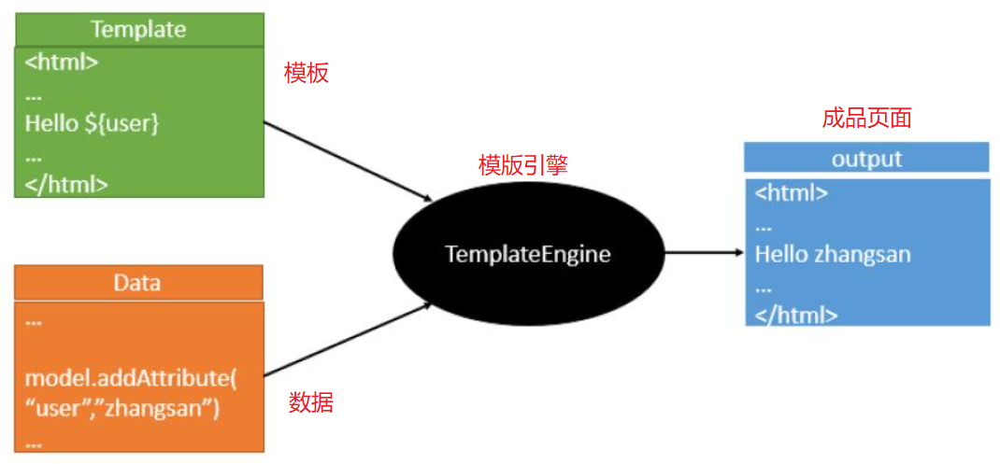
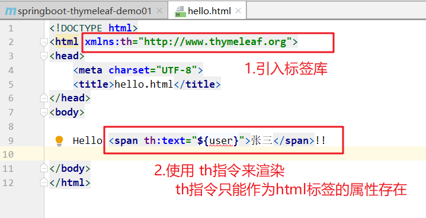
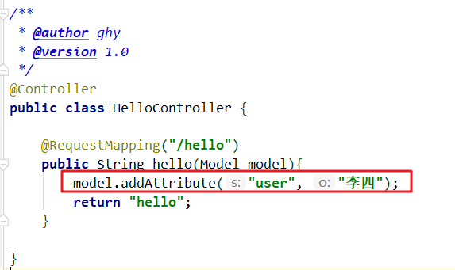
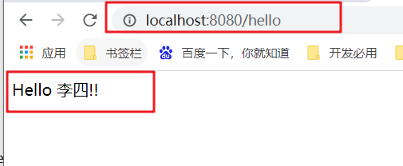
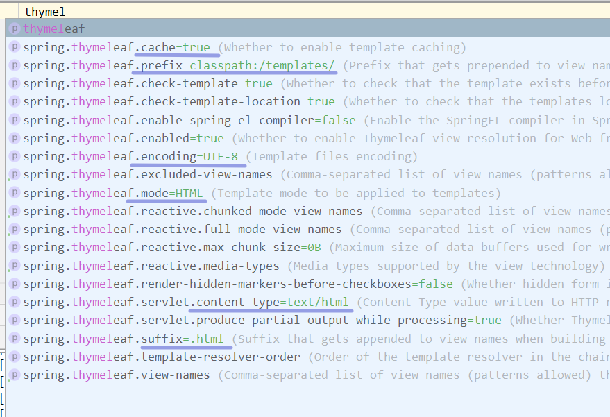

# 一、Thymeleaf概述

> 是一个模版引擎。所谓的模版引擎，就是模版+数据。
>
> 是一个现代的服务器端Java模板引擎，适用于web和独立环境。

## 1、官网

> https://www.thymeleaf.org/

## 2、执行原理

| 执行原理图                                                   |
| ------------------------------------------------------------ |
|  |


# 二、快速入门

## 1、实现步骤

> 1. 创建一个springboot项目
> 2. 引入web起步依赖和Thymeleaf起步依赖
> 3. 编写模板
> 4. 编写controller
> 5. 测试

## 2、具体实现

- 引入web起步依赖和Thymeleaf起步依赖

```xml
<dependency>
    <groupId>org.springframework.boot</groupId>
    <artifactId>spring-boot-starter-thymeleaf</artifactId>
</dependency>
<dependency>
    <groupId>org.springframework.boot</groupId>
    <artifactId>spring-boot-starter-web</artifactId>
</dependency>
```

| 编写模板                                                     |
| ------------------------------------------------------------ |
|  |

| 编写controller                                               |
| ------------------------------------------------------------ |
|  |

| 测试                                                         |
| ------------------------------------------------------------ |
|  |


## 3、细节问题

### 3.1 如果页面${user}中的user没有数据？

- 不会报错，但是就是null
- 如果直接从本地打开这个模板页面，浏览器会忽略解析th指令


### 3.2 为什么只写返回的模板名称，没有html后缀，也可以正常跳转

| springboot整合thymeleaf有默认的配置                          |
| ------------------------------------------------------------ |
|  |


# 三、常见操作

## 1、字符串连接

```html
#推荐使用双   |字符串连接|
Hello <span th:text="|欢迎, ${user}|">张三</span>!!<br/>

Hello <span th:text="欢迎+${user}">张三</span>!!<br/>
```


## 2、if-else

```html
<!-- if -->
<div th:if="${age > 16}">你是大人，可以看很多东西！！</div>
<!-- 等同于else -->
<div th:unless="${age > 16}">你还小，不要急，以后慢慢看！！</div>
```


## 3、三元运算

```html
<div th:text="${age > 16 ? '爽' : '以后爽'}">666</div>
```


## 4、解析html标签

```java
model.addAttribute("msg", "<h1>这是一个消息</h1>");
```

```html
<div th:utext="${msg}"></div>
```


## 5、循环

```java
@Data
@NoArgsConstructor
@AllArgsConstructor
public class Student {

    private Long id;
    private String stuName;
    private Integer gender;
    private Date birth;

}


@RequestMapping("/hello")
public String hello(Model model){
    List<Student> stus = new ArrayList<>();
    stus.add(new Student(10L, "王小小", 1, new Date()));
    stus.add(new Student(13L, "张大大", 2, new Date()));
    stus.add(new Student(8L, "李中中", 1, new Date()));
    model.addAttribute("stus", stus);
    return "hello";
}
```


```html
<table cellpadding="10" cellspacing="0" border="1">
    <tr>
        <td>ID</td>
        <td>姓名</td>
        <td>性别</td>
        <td>生日</td>
    </tr>
    <tr th:each="stu, stuState:${stus}">
        <td th:text="|${stu.id} : ${stuState.index}|">ID</td>
        <td th:text="${stu.stuName}">姓名</td>
        <td th:text="${stu.gender == 1 ? '男' : '女'}">性别</td>
        <td th:text="${#dates.format(stu.birth, 'yyyy-MM-dd')}">生日</td>
    </tr>
</table>
```


## 6、Javascript获取thymeleaf的数据

```javascript
<button onclick="getUser()">js获取thymeleaf的值</button>

<script th:inline="javascript">
    function getUser() {
        alert([[${user}]]);
    }
</script>
```


