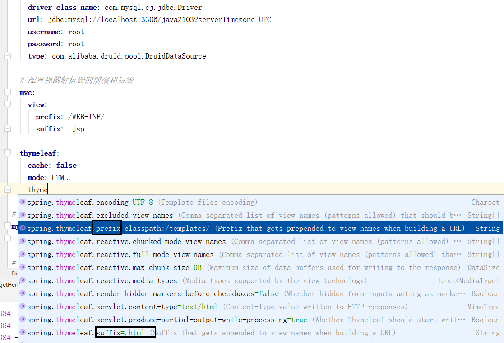

# Day 68笔记

## 一、静态资源

### 1.1 概述

* 所有人访问得到的结果都是一样的
* html、css、js等前端内容

### 1.2 位置

* SpringBoot在选择了web模板的情况下会自动创建static和templates文件夹
* static文件夹是存储静态资源的，可以直接访问，相当于放在项目根目录中

## 二、SpringBoot整合Mybatis

### 2.1 步骤

```
1、建库、建表
2、实体类
3、DAO
4、Mybatis映射文件--Mybatis注解
5、配置SpringBoot
	spring配置
	mybatis配置
6、测试
```

#### HeroDao.xml

```
<?xml version="1.0" encoding="UTF-8" ?>
<!DOCTYPE mapper
        PUBLIC "-//mybatis.org//DTD Mapper 3.0//EN"
        "http://mybatis.org/dtd/mybatis-3-mapper.dtd">

<mapper namespace="com.shine.dao.HeroDao">

<!--
        Integer insertHero(Hero hero);

        Hero selectHeroById(Integer id);
  -->

    <select id="selectHeroById" resultType="com.shine.entity.Hero">
        select * from hero where id = #{id}
    </select>

    <insert id="insertHero" parameterType="com.shine.entity.Hero">
        insert into hero(username, gender, age, addr, info) values (#{username},#{gender},#{age},#{addr},#{info})
    </insert>

    <!--  List<Hero> selectHeroes(Integer id);  -->
    <select id="selectHeroes" resultType="com.shine.entity.Hero">
        select * from hero
    </select>
</mapper>
```

#### 配置文件

```
# spring配置
spring:
  datasource:
    driver-class-name: com.mysql.cj.jdbc.Driver
    url: jdbc:mysql://localhost:3306/java2103?serverTimezone=UTC
    username: root
    password: root
    type: com.alibaba.druid.pool.DruidDataSource

# Mybatis配置
mybatis:
  mapper-locations: classpath*:com/shine/dao/*.xml
```

## 三、SpringBoot整合分页

### 3.1 依赖

```
        <!--    pageHelper依赖    -->
        <dependency>
            <groupId>com.github.pagehelper</groupId>
            <artifactId>pagehelper-spring-boot-starter</artifactId>
            <version>1.2.5</version>
        </dependency>
```


### 3.2 测试

```
    @Test
    public void getHeroes(){
        PageHelper.startPage(2,5);

        List<Hero> heroes = heroDao.selectHeroes();
        heroes.stream().forEach(System.out::println);

        PageInfo pageInfo = new PageInfo(heroes);
        System.out.println(pageInfo);
    }
```

## 四、整合日志

* SpringBoot默认集成了日志功能，只需要在配置文件中设置日志等级和监控包即可

```
# 日志配置:
logging:
  level:
    com.shine: debug
```

## 五、集成JSP

### 5.1 依赖

```
        <!--JSP核心引擎依赖-->
        <dependency>
            <groupId>org.apache.tomcat.embed</groupId>
            <artifactId>tomcat-embed-jasper</artifactId>
        </dependency>
        <!--        JSTL-->
        <dependency>
            <groupId>javax.servlet</groupId>
            <artifactId>jstl</artifactId>
        </dependency>
        <dependency>
            <groupId>org.springframework</groupId>
            <artifactId>spring-web</artifactId>
            <version>5.3.8</version>
            <scope>compile</scope>
        </dependency>
```

### 5.2 配置

```
# spring配置
spring:
  datasource:
    driver-class-name: com.mysql.cj.jdbc.Driver
    url: jdbc:mysql://localhost:3306/java2103?serverTimezone=UTC
    username: root
    password: root
    type: com.alibaba.druid.pool.DruidDataSource

  # 配置视图解析器的前缀和后缀
  mvc:
    view:
      prefix: /WEB-INF/
      suffix: .jsp
```

### 5.3 客户端

* 在main下创建webapp/WEB-INF/index.jsp

```
<%@ page language="java" import="java.util.*" pageEncoding="UTF-8"%>
<html>
    <head>
        <meta charset="utf-8">
        <title></title>
        <link rel="stylesheet" type="text/css" href=""/>
    </head>
    <body>
        Hello,${username}
    </body>
</html>
```

### 5.4 控制器

```
package com.shine.controller;

import org.springframework.stereotype.Controller;
import org.springframework.ui.Model;
import org.springframework.web.bind.annotation.RequestMapping;

@Controller
@RequestMapping("/user")
public class UserController {

    @RequestMapping("/getUser01")
    public String getUser01(Model model){
        model.addAttribute("username","宋思明");
        return "index";
    }
}
```

## 六、Thymeleaf

### 6.1 概述

```
Thymeleaf简介
Thymeleaf是一个流行的模板引擎，该模板引擎采用Java语言开发，模板引擎是一个技术名词，是跨领域跨平台的概念，在Java语言体系下有模板引擎，在C#、PHP语言体系下也有模板引擎。除了thymeleaf之外还有Velocity、FreeMarker等模板引擎，功能类似。

Thymeleaf的主要目标在于提供一种可被浏览器正确显示的、格式良好的模板创建方式，因此也可以用作静态建模。你可以使用它创建经过验证的XML与HTML模板。使用thymeleaf创建的html模板可以在浏览器里面直接打开（展示静态数据），这有利于前后端分离。需要注意的是thymeleaf不是spring旗下的。这里我们使用thymeleaf 3版本。
```

### 6.2 我的第一个Thymeleaf案例

#### 依赖

```
<dependency>
    <groupId>org.springframework.boot</groupId>
    <artifactId>spring-boot-starter-thymeleaf</artifactId>
</dependency>
```

#### 设置

```
thymeleaf:
  cache: false
  mode: HTML
```

#### 客户端

```
<!DOCTYPE html>
<html lang="en" xmlns:th="http://www.thymeleaf.org">
    <head>
        <meta charset="UTF-8">
        <title>Title</title>
    </head>
    <body>
        <p>
            Hello templates Index
        </p>
        <p>Spring boot集成 Thymeleaf<span th:text="${username}"></span></p>
    </body>
</html>
```


#### 服务端

```
package com.shine.controller;

import org.springframework.stereotype.Controller;
import org.springframework.ui.Model;
import org.springframework.web.bind.annotation.RequestMapping;

@RequestMapping("/thymeleaf")
@Controller
public class ThymeleafController {

    @RequestMapping("/hello")
    public String hello(Model model){
        model.addAttribute("username","小班");
        return "index";
    }

}
```

### 6.3 thymeleaf默认设置



### 6.4 传输对象

* 传输一个对象
* 传输对象数组

#### 客户端

```
<!DOCTYPE html>
<html lang="en" xmlns:th="http://www.thymeleaf.org">
    <head>
        <meta charset="UTF-8">
        <title>Title</title>
    </head>
    <body>
        <p>
            Hello templates Index
        </p>
        <p>Spring boot集成 Thymeleaf<span th:text="${username}"></span></p>

        <hr>

        <!--    获取整个对象    -->
        <p th:object="${hero}">hero000</p>
        <p th:text="${hero}">hero000</p>

        <hr>

        <!--    获取对象的属性
        <p th:text="${hero.id}">id</p>
        <p th:text="${hero.username}">id</p>
        <p th:text="${hero.addr}">id</p>
        <p th:text="${hero.info}">id</p>-->

        <hr>

        <p th:text="${heroes}">heroes</p>

        <hr>

        <table border="1px">
            <tr th:each="hero:${heroes}">
                <td th:text="${hero.id}">id</td>
                <td th:text="${hero.username}">id</td>
                <td th:text="${hero.gender}">id</td>
                <td th:text="${hero.age}">id</td>
                <td th:text="${hero.addr}">id</td>
                <td th:text="${hero.info}">id</td>
            </tr>
        </table>

    </body>
</html>
```

#### 服务端

```
package com.shine.controller;

import com.shine.dao.HeroDao;
import com.shine.entity.Hero;
import org.springframework.beans.factory.annotation.Autowired;
import org.springframework.stereotype.Controller;
import org.springframework.ui.Model;
import org.springframework.web.bind.annotation.RequestMapping;

import java.util.List;

@RequestMapping("/hero")
@Controller
public class HeroController {

    @Autowired
    private HeroDao heroDao;

    @RequestMapping("/getHero01")
    public String getHero01(Model model){
        Hero hero = heroDao.selectHeroById(1);
        model.addAttribute("hero",hero);
        return "index";
    }

    @RequestMapping("/getHero02")
    public String getHero02(Model model){
        List<Hero> heroes = heroDao.selectHeroes();
        model.addAttribute("heroes",heroes);
        return "index";
    }
}
```

### 6.5 基本语法--if--unless

#### 客户端

```
        <!--  相当于if...else  -->
        <p th:if="${age>=18}">起航网吧欢迎您</p>
        <p th:unless="${age>=18}">未成年禁止进入</p>

        <hr>

        <p th:if="${age<18}">未成年禁止进入</p>
        <p th:unless="${age<18}">起航网吧欢迎您</p>

```

#### 服务端

```
    @RequestMapping("/testIf")
    public String testIf(Model model){
        model.addAttribute("age",12);
        return "syntax";
    }
```

### 6.6 基本语法--switch...case

#### 客户端

```
<div th:switch="${day}">
    <p th:case="1">今天是星期一,学习java01</p>
    <p th:case="2">今天是星期二,学习java02</p>
    <p th:case="3">今天是星期三,学习java03</p>
    <p th:case="4">今天是星期四,学习java04</p>
    <p th:case="5">今天是星期五,学习java05</p>
    <p th:case="6">今天是星期六,学习java06</p>
    <p th:case="7">今天是星期日,学习java07</p>
</div>
```

#### 服务端

```
// switch
@RequestMapping("/testSwitch")
public String testSwitch(Model model){
    model.addAttribute("day",3);
    return "syntax";
}
```

### 6.7 基本语法--each

#### 客户端


```
<table border="1px">
            <tr>
                <th>id</th>
                <th>姓名</th>
                <th>性别</th>
                <th>年龄</th>
                <th>地址</th>
                <th>信息</th>
            </tr>

            <tr th:each="hero:${heroes}">
                <td th:text="${hero.id}">id</td>
                <td th:text="${hero.username}">id</td>
                <td th:text="${hero.gender}">id</td>
                <td th:text="${hero.age}">age</td>
                <td th:text="${hero.addr}">id</td>
                <td th:text="${hero.info}">id</td>
                <td>
                    <a href="#">修改</a>
                    <a href="#">删除</a>
                </td>
            </tr>
        </table>
```

#### 服务端

```
// each
@RequestMapping("/testEach")
public String testEach(Model model){
    List<Hero> heroes = heroDao.selectHeroes();
    model.addAttribute("heroes",heroes);
    return "syntax";
}
```


### 6.8 基本语法--三元运算符

```
<p th:text="${age>=18 ? '起航网吧欢迎您00':'未成年禁止进入00'}"></p>
```

### 6.9 inline

### 6.10 传输html标签

