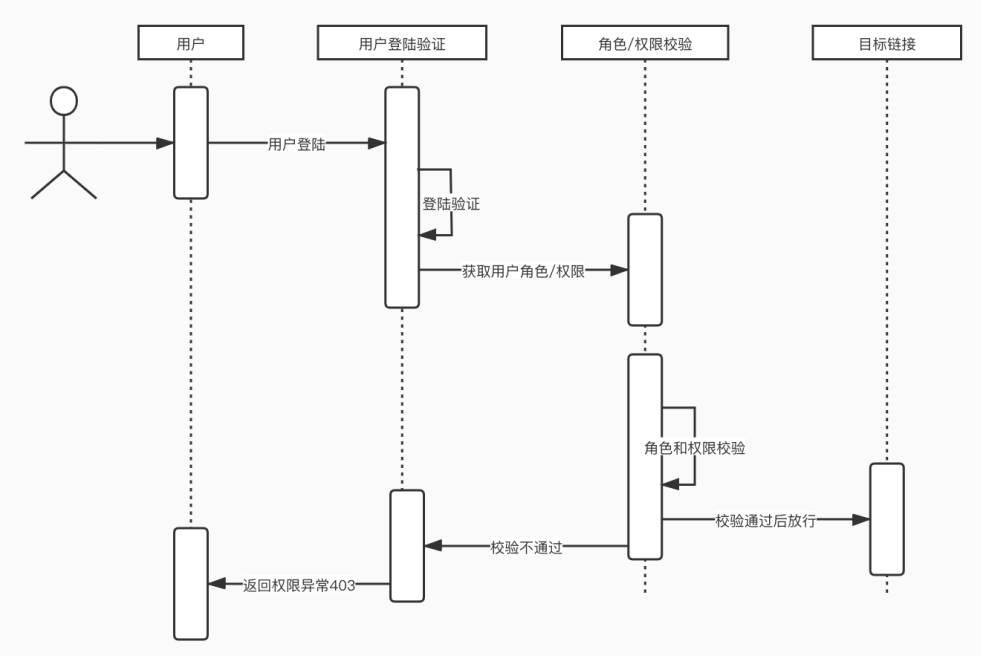

# Day 70笔记

## 一、自定义配置验证登录

## 1.1 自定义配置类--用户名和用户名对应的密码

### 1.1.1 配置类

```java
package com.shine.config;

import com.shine.service.MyUserDetailsService;
import org.springframework.beans.factory.annotation.Autowired;
import org.springframework.context.annotation.Configuration;
import org.springframework.security.config.annotation.authentication.builders.AuthenticationManagerBuilder;
import org.springframework.security.config.annotation.web.configuration.WebSecurityConfigurerAdapter;
import org.springframework.security.crypto.bcrypt.BCryptPasswordEncoder;
import org.springframework.security.crypto.password.PasswordEncoder;

@Configuration
public class SecurityConfig extends WebSecurityConfigurerAdapter {

    @Autowired
    PasswordEncoder passwordEncoder;

    @Autowired
    MyUserDetailsService myUserDetailsService;

    @Override
    protected void configure(AuthenticationManagerBuilder auth) throws Exception {
        // auth.inMemoryAuthentication().withUser("zhangsan").password(passwordEncoder.encode("123123")).roles();
        //
        auth.userDetailsService(myUserDetailsService);
    }
}
```

### 1.1.2 MyUserDetailsService

```java
package com.shine.service;

import com.shine.dao.UserDao;
import org.springframework.beans.factory.annotation.Autowired;
import org.springframework.security.core.GrantedAuthority;
import org.springframework.security.core.authority.AuthorityUtils;
import org.springframework.security.core.userdetails.User;
import org.springframework.security.core.userdetails.UserDetails;
import org.springframework.security.core.userdetails.UserDetailsService;
import org.springframework.security.core.userdetails.UsernameNotFoundException;
import org.springframework.security.crypto.password.PasswordEncoder;
import org.springframework.stereotype.Component;

import java.util.Collection;

@Component
public class MyUserDetailsService implements UserDetailsService {

    @Autowired
    PasswordEncoder passwordEncoder;
    
    @Autowired
    UserDao userDao;

    /**
     *  得到用户设置详细信息的对象
     * @param username
     * @return
     * @throws UsernameNotFoundException
     */
    @Override
    public UserDetails loadUserByUsername(String username) throws UsernameNotFoundException {
        Collection<? extends GrantedAuthority> authorities = AuthorityUtils.commaSeparatedStringToAuthorityList("");

        /**
         * 使用此用户名向数据库发起查询
         *  查询得到此用户的所有信息--密码
         *  把次用户封装成对象
         *
         *  创建user对象的时候传入查询得到的密码
         */
        com.shine.entity.User u = userDao.selectByUsername(username);

        if (u!=null){
            User user = new User(username,passwordEncoder.encode(u.getPassword()),authorities);
            return user;
        }
        return null;
    }
}
```

### 1.1.3 加强版配置类

```java
package com.shine.config;

import com.shine.service.MyUserDetailsService;
import org.springframework.beans.factory.annotation.Autowired;
import org.springframework.context.annotation.Configuration;
import org.springframework.security.config.annotation.authentication.builders.AuthenticationManagerBuilder;
import org.springframework.security.config.annotation.web.builders.HttpSecurity;
import org.springframework.security.config.annotation.web.configuration.WebSecurityConfigurerAdapter;
import org.springframework.security.crypto.bcrypt.BCryptPasswordEncoder;
import org.springframework.security.crypto.password.PasswordEncoder;

@Configuration
public class SecurityConfig extends WebSecurityConfigurerAdapter {

    @Autowired
    PasswordEncoder passwordEncoder;

    @Autowired
    MyUserDetailsService myUserDetailsService;

    @Override
    protected void configure(AuthenticationManagerBuilder auth) throws Exception {
        // auth.inMemoryAuthentication().withUser("zhangsan").password(passwordEncoder.encode("123123")).roles();
        //
        auth.userDetailsService(myUserDetailsService);
    }

    /**
     * 详细请求设置
     * @param http
     * @throws Exception
     */
    @Override
    protected void configure(HttpSecurity http) throws Exception {
        http
                .formLogin()        // 表单登录
                .loginPage("/login.html")           // 登录页面
                .loginProcessingUrl("/user/login")  // 验证登录的Handler
                .defaultSuccessUrl("/index.html")   // 登录成功的默认页面
                .permitAll()                        // 放行
            .and()
                // 设置不拦截的url
                .authorizeRequests()
                .antMatchers("/user/getUser01","/user/getUser02")   // 不验证的url
                .permitAll()            // 放行
            .and()
                // 设置拦截的url
                .authorizeRequests()
                .anyRequest()
                .authenticated()       // 验证

            .and()
                .csrf().disable();    // 禁用跨域伪造请求
    }
}
```

## 二、基于角色和权限的访问控制

### 2.1 概述

* Spring Security提供了四个⽅法⽤于⻆⾊和权限的访问控制。
* 通过这些⽅法，对⽤户是否具有某个或某些权限，进⾏过滤访问。
* 对⽤户是否具备某个或某些⻆⾊，进⾏过滤访问



### 2.2 控制的方法

#### 2.2.1 hasAuthority⽅法
* 判断当前主题是否有指定的权限，有返回true，否则返回false
* 该⽅法适⽤于只拥有⼀个权限的⽤户

#### 2.2.2 hasAuthority⽅法

* 判断当前主题是否有指定的权限，有返回true，否则返回false
* 该⽅法适⽤于只拥有⼀个权限的⽤户

#### 2.2.3 hasRole⽅法

* 如果⽤户具备给定⻆⾊就允许访问，否则报403错误

#### 2.2.4 hasAnyRole⽅法
* 设置多个⻆⾊，多个⻆⾊之间使⽤逗号隔开，只要⽤户具有某⼀个⻆⾊，就能访问。

#### 2.2.5 权限

* 修改的权限
* 删除的权限
* 查询的权限
* ... 

#### 2.2.6 角色

* user
* admin
* manager
* tourist

#### 2.2.7控制验证和访问

```java
package com.shine.config;

import com.shine.service.MyUserDetailsService;
import org.springframework.beans.factory.annotation.Autowired;
import org.springframework.context.annotation.Configuration;
import org.springframework.security.config.annotation.authentication.builders.AuthenticationManagerBuilder;
import org.springframework.security.config.annotation.web.builders.HttpSecurity;
import org.springframework.security.config.annotation.web.configuration.WebSecurityConfigurerAdapter;
import org.springframework.security.crypto.bcrypt.BCryptPasswordEncoder;
import org.springframework.security.crypto.password.PasswordEncoder;

@Configuration
public class SecurityConfig extends WebSecurityConfigurerAdapter {

    @Autowired
    PasswordEncoder passwordEncoder;

    @Autowired
    MyUserDetailsService myUserDetailsService;

    @Override
    protected void configure(AuthenticationManagerBuilder auth) throws Exception {
        // auth.inMemoryAuthentication().withUser("zhangsan").password(passwordEncoder.encode("123123")).roles();
        //
        auth.userDetailsService(myUserDetailsService);
    }

    /**
     * 详细请求设置
     * @param http
     * @throws Exception
     */
    @Override
    protected void configure(HttpSecurity http) throws Exception {
        http
                .formLogin()        // 表单登录
                .loginPage("/login.html")           // 登录页面
                .loginProcessingUrl("/user/login")  // 验证登录的Handler
                .defaultSuccessUrl("/index.html")   // 登录成功的默认页面
                .permitAll()                        // 放行

            .and()
                // 设置不拦截的url
                .authorizeRequests()
                .antMatchers("/user/getUser01","/user/getUser02")   // 不验证的url
                .permitAll()            // 放行

            .and()
                // 验证角色
                .authorizeRequests()
                .antMatchers("/user/getUser03")
                .hasRole("user")

                .antMatchers("/user/getUser04")
                .hasRole("admin")

                .antMatchers("/user/getUser05")
                .hasAnyRole("user","admin")

                // 设置访问权限
                .antMatchers("/user/getUser06")
                .hasAuthority("user_query")

                .antMatchers("/user/getUser07")
                .hasAnyAuthority("user_add","user_query","user_del","user_mod")

                .antMatchers("/user/getUser08","/user/getUser09","/user/getUser10")
                .hasRole("admin")

            .and()
                // 设置拦截的url
                .authorizeRequests()
                .anyRequest()
                .authenticated()       // 验证

            .and()
                .csrf().disable();    // 禁用跨域伪造请求
    }
}
```

#### 2.2.8 设置角色

```java
package com.shine.service;

import com.shine.dao.UserDao;
import org.springframework.beans.factory.annotation.Autowired;
import org.springframework.security.core.GrantedAuthority;
import org.springframework.security.core.authority.AuthorityUtils;
import org.springframework.security.core.userdetails.User;
import org.springframework.security.core.userdetails.UserDetails;
import org.springframework.security.core.userdetails.UserDetailsService;
import org.springframework.security.core.userdetails.UsernameNotFoundException;
import org.springframework.security.crypto.password.PasswordEncoder;
import org.springframework.stereotype.Component;

import java.util.Collection;

@Component
public class MyUserDetailsService implements UserDetailsService {

    @Autowired
    PasswordEncoder passwordEncoder;
    
    @Autowired
    UserDao userDao;

    /**
     *  得到用户设置详细信息的对象
     * @param username
     * @return
     * @throws UsernameNotFoundException
     */
    @Override
    public UserDetails loadUserByUsername(String username) throws UsernameNotFoundException {
        /**
         * 使用此用户名向数据库发起查询
         *  查询得到此用户的所有信息--密码
         *  把次用户封装成对象
         *
         *  创建user对象的时候传入查询得到的密码

         com.shine.entity.User u = userDao.selectByUsername(username);

         if (u!=null){
         User user = new User(username,passwordEncoder.encode(u.getPassword()),authorities);
         return user;
         }
         */
        Collection<? extends GrantedAuthority> authorities = null;
        /**
         *  根据用户名赋予不同的角色和权限
         * zhangsan
         *      ROLE_user
         *      user_query
         * lisi
         *      ROLE_admin
         *      user_add
         */

        if (username.equals("zhangsan")){
            authorities = AuthorityUtils.commaSeparatedStringToAuthorityList("ROLE_user,user_query");
        } else if (username.equals("lisi")){
            authorities = AuthorityUtils.commaSeparatedStringToAuthorityList("ROLE_admin,user_add,user_del,user_mod");
        } else{
            authorities = AuthorityUtils.commaSeparatedStringToAuthorityList("");
        }
        User user = new User(username,passwordEncoder.encode("112233"),authorities);
        return user;
    }
}
```

### 2.3 注解控制验证和访问

* 必须在启动类上添加注解

```
@EnableGlobalMethodSecurity(securedEnabled = true)	// 开启允许全局方法安全注解
```

#### 2.3.1 @Secured注解

* @Secured注解⽤于校验⽤户具有某个角色，才可以访问⽅法

```
    // user角色可以访问
    @Secured("ROLE_user")
    @RequestMapping("/getUser08")
    public String getUser08(){
        return "Hello Login0008";
    }

    // admin角色可以访问
    @Secured("ROLE_admin")
    @RequestMapping("/getUser09")
    public String getUser09(){
        return "Hello Login0009";
    }

    // admin角色可以访问
    @Secured({"ROLE_admin","ROLE_user"})
    @RequestMapping("/getUser10")
    public String getUser10(){
        return "Hello Login0010";
    }
```

#### 2.3.2 @PreAuthorize
* 进⼊⽅法前的权限验证
* 需要在启动类添加注解

```
@EnableGlobalMethodSecurity(securedEnabled = true, prePostEnabled = true)
```

```java
    // admin角色可以访问
    @PreAuthorize("hasRole('ROLE_admin')")
    @RequestMapping("/getUser11")
    public String getUser11(){
        return "Hello Login0011";
    }

    // user角色可以访问
    @PreAuthorize("hasRole('ROLE_user')")
    @RequestMapping("/getUser12")
    public String getUser12(){
        return "Hello Login0012";
    }

    // admin或者user角色可以访问
    @PreAuthorize("hasAnyAuthority('ROLE_user','ROLE_admin')")
    @RequestMapping("/getUser13")
    public String getUser13(){
        return "Hello Login0013";
    }

    // user_add权限可以访问
    @PreAuthorize("hasAuthority('user_add')")
    @RequestMapping("/getUser14")
    public String getUser14(){
        return "Hello Login0014";
    }

    // user_query权限可以访问
    @PreAuthorize("hasAuthority('user_query')")
    @RequestMapping("/getUser15")
    public String getUser15(){
        return "Hello Login0015";
    }

    // user_query或者user_add权限可以访问
    @PreAuthorize("hasAnyAuthority('user_add','user_query')")
    @RequestMapping("/getUser16")
    public String getUser16(){
        return "Hello Login0016";
    }
```


#### 2.3.3 @PostAuthorize

* 在⽅法访问之后进⾏校验，实际使⽤并不多

```java
    // user_add权限可以访问&获取返回值，user_query可以访问
    @PostAuthorize("hasAuthority('user_add')")
    @RequestMapping("/getUser17")
    public String getUser17(){
        System.out.println("Hello Login0017");
        return "Hello Login0017";
    }

    // ROLE_user权限可以访问&获取返回值
    @PostAuthorize("hasRole('ROLE_user')")
    @RequestMapping("/getUser18")
    public String getUser18(){
        return "Hello Login0018";
    }
```


#### 2.3.4 @PostFilter
* 权限验证之后对数据进⾏过滤，只能获取满⾜条件的数据

#### 2.3.5 @PreFilter
* 对传⼊⽅法的数据进⾏过滤

## 四、退出登录

```java
http
    .logout()                       	// 退出登录设置
    .logoutUrl("/user/logout")      	// 退出的url
    .logoutSuccessUrl("/login.html")    // 退出之后转到的页面
    .deleteCookies("JSESSIONID")        // 清除cookie
    .invalidateHttpSession(true);       // 干掉session
```

## 五、获取用户信息

```
    // 获取登录的用户信息
    @PreAuthorize("hasAnyAuthority('ROLE_user','ROLE_admin')")
    @RequestMapping("/getUser19")
    public String getUser19(){
        String name = SecurityContextHolder.getContext().getAuthentication().getName();
        System.out.println("name===>" + name);
        return "Hello Login0019";
    }

    // 获取登录的用户信息
    @RequestMapping("/getUser20")
    public String getUser20(){
        String name = SecurityContextHolder.getContext().getAuthentication().getName();
        System.out.println("name===>" + name);
        return "Hello Login0020";
    }

    // 获取登录的用户信息
    @RequestMapping("/getUser21")
    public String getUser21(){
        Object principal = SecurityContextHolder.getContext().getAuthentication().getPrincipal();
        System.out.println(principal);
        return "Hello Login0021";
    }
```

## 六、Quartz 使用

### 6.1 概述

* Quartz 是 OpenSymphony 开源组织在 Job Scheduling 领域又一个开源项目，它可以与 J2EE 与 J2SE 应用程序相结合也可以单独使用。
* Quartz 可以用来创建简单或为运行十个，百个，甚至是好几万个 Jobs 这样复杂的程序。Jobs 可以做成标准的 Java 组件或 EJBs。
* 能执行定时任务，是一个任务调度框架

### 6.2 cron 表达式

* cron 是 Linux 系统用来设置计划任务的，比如：每天晚上 12 点重启服务器。

### 6.3 格式

一个 cron 表达式具体表现就是一个字符串，这个字符串中包含 6~7 个字段，字段之间是由空格分割的，每个字段可以由任何允许的值以及允许的特殊字符所构成，下面表格列出了每个字段所允许的值和特殊字符

| 字段       | 允许值            | 允许的特殊字符  |
| ---------- | ----------------- | --------------- |
| 秒         | 0-59              | `, - * /`       |
| 分         | 0-59              | `, - * /`       |
| 小时       | 0-23              | `, - * /`       |
| 日期       | 1-31              | `, - * ? / L W` |
| 月份       | 1-12 或者 JAN-DEC | `, - * /`       |
| 星期       | 1-7 或者 SUN-SAT  | `, - * ? / L #` |
| 年（可选） | 留空, 1970-2099   | `, - * /`       |

- `*` 字符被用来指定所有的值。如：`*` 在分钟的字段域里表示“每分钟”。
- `-` 字符被用来指定一个范围。如：`10-12` 在小时域意味着“10点、11点、12点”
- `,` 字符被用来指定另外的值。如：`MON,WED,FRI` 在星期域里表示“星期一、星期三、星期五”.
- `?` 字符只在日期域和星期域中使用。它被用来指定“非明确的值”。当你需要通过在这两个域中的一个来指定一些东西的时候，它是有用的。
- `L` 字符指定在月或者星期中的某天（最后一天）。即 “Last” 的缩写。但是在星期和月中 “Ｌ” 表示不同的意思，如：在月字段中 “L” 指月份的最后一天 “1月31日，2月28日”，如果在星期字段中则简单的表示为“7”或者“SAT”。如果在星期字段中在某个 value 值得后面，则表示 “某月的最后一个星期 value” ,如 “6L” 表示某月的最后一个星期五。
- `W` 字符只能用在日期字段中，该字段指定了离指定日期最近的那个星期日。
- `#` 字符只能用在星期字段，该字段指定了第几个星期 value 在某月中

每一个元素都可以显式地规定一个值（如 6），一个区间（如 9-12 ），一个列表（如 9，11，13 ）或一个通配符（如 *）。“月份中的日期”和“星期中的日期”这两个元素是互斥的，因此应该通过设置一个问号（?）来表明你不想设置的那个字段。

| 表达式                     | 意义                                                         |
| -------------------------- | ------------------------------------------------------------ |
| `0 0 12 * * ?`             | 每天中午 12 点触发                                           |
| `0 15 10 ? * *`            | 每天上午 10:15 触发                                          |
| `0 15 10 * * ?`            | 每天上午 10:15 触发                                          |
| `0 15 10 * * ? *`          | 每天上午 10:15 触发                                          |
| `0 15 10 * * ? 2005`       | 2005 年的每天上午 10:15 触发                                 |
| `0 * 14 * * ?`             | 在每天下午 2 点到下午 2:59 期间的每 1 分钟触发               |
| `0 0/5 14 * * ?`           | 在每天下午 2 点到下午 2:55 期间的每 5 分钟触发               |
| `0 0/5 14,18 * * ?`        | 在每天下午 2 点到 2:55 期间和下午 6 点到 6:55 期间的每 5 分钟触发 |
| `0 0-5 14 * * ?`           | 在每天下午 2 点到下午 2:05 期间的每 1 分钟触发               |
| `0 10,44 14 ? 3 WED`       | 每年三月的星期三的下午 2:10 和 2:44 触发                     |
| `0 15 10 ? * MON-FRI`      | 周一至周五的上午 10:15 触发                                  |
| `0 15 10 15 * ?`           | 每月 15 日上午 10:15 触发                                    |
| `0 15 10 L * ?`            | 每月最后一日的上午 10:15 触发                                |
| `0 15 10 ? * 6L`           | 每月的最后一个星期五上午 10:15 触发                          |
| `0 15 10 ? * 6L 2002-2005` | 2002 年至 2005 年的每月的最后一个星期五上午 10:15 触发       |
| `0 15 10 ? * 6#3`          | 每月的第三个星期五上午 10:15 触发                            |

- 在线生成网址
  - https://qqe2.com/cron
- 母亲节
  - `0 0 8 ? 5 1#2`
    - 每年5月第二个星期日早上8点

### 6.4 案例

* 每间隔5秒/2秒输出一条信息

#### 6.4.1 依赖

```xml
<dependency>
    <groupId>org.springframework.boot</groupId>
    <artifactId>spring-boot-starter-quartz</artifactId>
</dependency>
```

#### 6.4.2 注解

* 需要在启动类添加注解

  * ```
    @EnableScheduling
    ```
    
    

#### 6.4.3 编码

```java
package com.shine.tasks;

import org.springframework.scheduling.annotation.Scheduled;
import org.springframework.stereotype.Component;

import java.text.SimpleDateFormat;
import java.util.Date;

@Component
public class PrintCurrentTimeTask  {

    @Scheduled(cron = "0/5 * * * * ? ")
    public void printCurrentTime(){
        SimpleDateFormat sdf = new SimpleDateFormat("yyyy-MM-dd HH-mm-ss");
        System.out.println(sdf.format(new Date()));
    }
    @Scheduled(cron = "0/2 * * * * ? ")
    public void printCurrentTime02(){
        SimpleDateFormat sdf = new SimpleDateFormat("yyyy-MM-dd HH:mm:ss");
        System.out.println(sdf.format(new Date()));
    }

}
```

