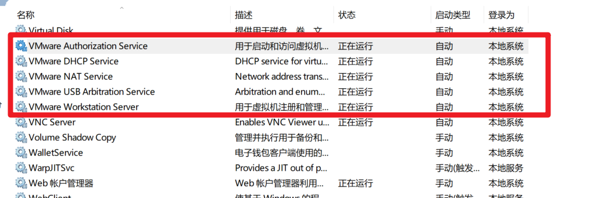
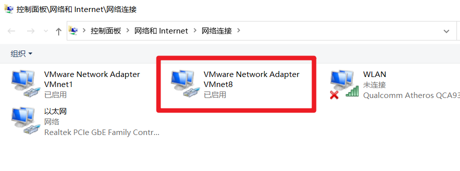
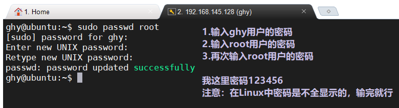
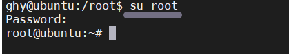
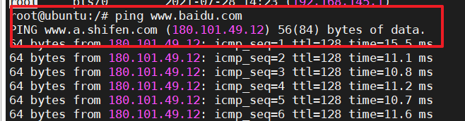
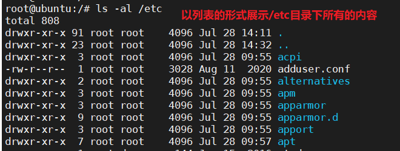
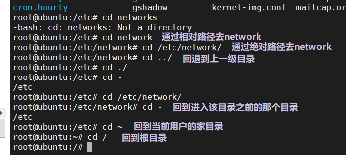
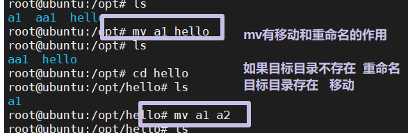
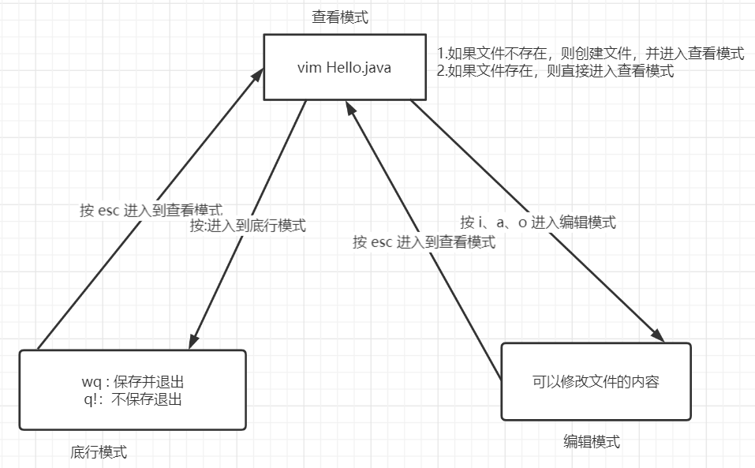

# 一、开发的几种环境

## 1、开发环境【开发】

- 就是我们自己写代码的电脑对应的系统环境，一般都windows和mac


## 2、生产环境【运维】

- 真正部署运行WEB应用的环境，一般选择Linux【centos7、ubuntu】


## 3、测试环境【测试】

- 跟生产环境，是我们开发完后交给测试人员去测试WEB应用


# 二、Linux简介

## 1、作者

- Linus Torvalds


## 2、版本

- 内核

- 发行版：ubuntu、centos7

  

## 3、Linux和windows

- Linux：一个操作系统
  - 作为服务器
  - 安全性高，稳定性好
  - 命令行【也有图形化（基本不用）】
  - 一切皆文件【软件、硬件都是文件】，没有盘符，它的根就是 /
- windows
  - 个人用户
  - 安全性差，稳定性也差
  - 图形化界面
  - 有盘符


# 三、Linux安装

## 1、安装方法

- 直接把电脑系统装成Linux
- 多系统安装
- 虚拟化【在windows系统中虚拟一个Linux系统】---- 选择这种


## 2、虚拟化

- 把母机（主机）的硬件设备分配给Linux系统使用，那么Linux本身是没有硬件，在此硬件之上，需要去安装Linux系统软件。
  - 虚拟一台电脑出来【电脑硬件是由主机分配出来】，在虚拟出来的电脑上去安装Linux系统
    - 虚拟一台电脑？
    - 安装Linux?


## 3、安装

### 3.1 安装一个虚拟化软件

- VMWare【虚拟化工作站】，可以帮我们在本机的系统之上虚拟化一个或多个其他电脑

### 3.2 在VMWare虚拟化出来的电脑上去安装Linux系统软件【ubuntu】

- 必须要有一个 ubuntu.iso 文件

| 主机 -- VMWare -- Linux之间的关系                            |
| ------------------------------------------------------------ |
|  |


## 3.3 安装VMWare

- 安装到一个纯英文的目录
- 安装成功后，到windows的服务列表中开启VMWare服务

| 开启VMWare服务【默认自动开启】                               |
| ------------------------------------------------------------ |
|  |


## 3.4 安装ubuntu

- 先检查当前windows是否支持虚拟化
  - 先安装ubuntu，如果报错了，再去打开虚拟化
  - 根据不同的电脑厂家按不同的键进入bois设置【一般都是F2，F8，F10，F12】
    - 开机之后，马上按对应的快捷键
    - 找到 Configuration
    - Intel Virtualization Technology，把它改成 enabled
    - 按F10保存并退出
- 使用VMWare虚拟出一个ubuntu电脑
- 安装系统
- 重启

## 3.4.1 具体安装

- 使用VMWare虚拟出一个ubuntu电脑
  - 选择稍后安装系统
  - iso文件要选好
  - 网络选NAT
- VMWare中配置NAT网络【默认会自动配置】
  - 检查WMare中的虚拟网卡（VMnet8[NAT]）对应windows中必须也有一块VMnet8的网卡，而且必须是启动的

| VMWare                                                       |
| ------------------------------------------------------------ |
|  |

| windows                                                      |
| ------------------------------------------------------------ |
|  |

- 安装ubuntu系统
  - 根据图片一步步安装
- 重启
  - 输入用户名与密码
    - 用户名可以看得到，密码看不到

| 查看IP地址【ifconfig】                                       |
| ------------------------------------------------------------ |
|  |


## 3.4.2 使用第三方图形化工具连接Linux

| Xterm连接ubuntu                                              |
| ------------------------------------------------------------ |
|  |


# 四、打开ubuntu系统root用户的权限

## 1、设置root用户密码

| sudo passwd root                                             |
| ------------------------------------------------------------ |
|  |

> 需要输入密码和确认密码

## 2、切换到root用户

| su root                                                      |
| ------------------------------------------------------------ |
|  |

## 3、设置允许远程登录 root

### 3.1 修改sshd_config文件

```sh
vim /etc/ssh/sshd_config

#找到如下内容，注释掉【按i进入编辑模式】
#PermitRootLogin without-password
#在这一行下面增加如下内容
PermitRootLogin yes

#保存并退出【按Esc进入底行模式，输入:wq】
```

| 修改sshd_config文件                                          |
| ------------------------------------------------------------ |
|  |

### 3.2 重启服务

```sh
service ssh restart
#如果需要，按回车确认
```


### 3.3 使用Xterm登录root用户


# 五、Linux目录介绍

> - /：是Linux根目录，所有的文件都放在根目录【相当于windows中的此电脑】
>   - root：root用户的家目录，存放root用户的相关信息【不能动，相当于windows用户目录】
>   - home：除root用户之外，其他用户的家目录【不能动】
>   - bin：Linux常用命令【不能动】
>   - boot：这里存放的是启动Linux时的一些核心文件【不能动】
>   - etc：存放系统管理所需要的配置文件和子目录【profile：jdk环境变量就配置到这个文件中】
>   - usr：默认安装软件的目录，类似Windows中的Program Files目录【一般重要的软件我们安装到这里】
>   - opt：普通软件安装的目录【tomcat、mysql、通过docker安装的软件......】

| /root：root用户的家目录                                      |
| ------------------------------------------------------------ |
|  |

|                       Linux目录树状图                       |
| :---------------------------------------------------------: |
|  |


# 六、Linux命令

## 1、基本命令

### 1.1 ifconfig

- 查看当前系统的IP地址

### 1.2 pwd

- 查看当前所在目录

### 1.3 clear

- 清屏

### 1.4 who am i

- 查看当前用户

### 1.5 ping 网址

- 查看当前网否正常

| ping 网址                                                    |
| ------------------------------------------------------------ |
|  |

### 1.7 Ctrl + C

- 强制结束当前命令或者任务


## 2、目录相关命令

### 2.1 ls

- 查看指定目录下的内容
- 语法    ls [参数] [目录选项] 

> 参数：
>
> - -l：以详细列表的形式展示内容
> - -a：展示全部内容【包括隐藏内容】

| ls -al /etc                                                  |
| ------------------------------------------------------------ |
|  |

- 补充：ll ： 以列表的形式查看当前目录下非隐藏的内容【简写命令】


### 2.2 cd

- 切换目录
- 语法     cd 要去的目录

| 特殊符号 | 表达的路径             |
| -------- | ---------------------- |
| .        | 当前目录               |
| ..       | 上一级目录             |
| /        | 根目录                 |
| ~        | 当前登录用户的HOME目录 |
| -        | 返回刚才切换过来的目录 |

| cd                                                           |
| ------------------------------------------------------------ |
|  |


### 2.3 目录相关操作

- 创建目录
  - mkdir -p 要创建的目录名【可以是多级】
    - -p：级联创建【如果父目录不存在，那么就一起创建】
  
  
- 复制目录
  - cp [-r] 源目录 目标目录
    - 目标目录可以不存在
    - -r：代表递归，如上就表示复制源目录中内容及其下面所有目录的内容
    
    
- 移动或重命名目录
  - mv 源目录  目标目录
    - 目标目录不存在，则重命名
    - 目标目录存在，则移动到目标目录下面
  
  
- 删除
  - rm [-rf] 源目录或文件
    - 强制删除源目录及其下面所有的内容并不提示【慎用】


### 2.4 文件相关命令

- 创建空文件
  - touch 文件名
- 编辑文件内容
  - vi 文件名     【vim 文件名】

| vi编辑器工作图                                               |
| ------------------------------------------------------------ |
|  |

- 进入vi底行模式后，可以使用如下方式帮我们快速编辑内容

```shell
# 在vi文件时，在底行命令模式下可以输入以下常用内容
# 行号操作
set nu              # 查看文件的行号
to rownum           # 快速的跳转到指定行
set nonu            # 取消行号
# 在查看模式下，搜索操作
/word               # 类似Windows的Ctrl + F搜索文件中的具体内容所在位置，查看下一个可以输入字母n
# 快速定位
G                   # 快速跳转到最后一行
gg                  # 快速跳转到第一行
dd                  # 快捷删除当前行
```

- 查看文件

```shell
cat 文件名
# 从第一行开始查看文件内容，展示全部

tac 文件名
# 从最后一行开始展示【倒着查看】

nl 文件名
# 显示文件的内容时，展示行号

#掌握
more 文件名        
# 查看大文件时，可以一页一页的向下翻
# 按space向下翻页，退出时按q

less 文件名
# 查看大文件时，可以任意的向上或者向下翻
# 向上或向下翻页按PageUp和PageDown，一行一行查看，摁键盘的↑↓

head 文件名
# 只查看前几行

#掌握
tail 文件名
# 只查看后几行
# tail -f 文件名
```

- 复制文件
  - cp 文件名1 文件名2 目录


## 3、压缩与解压【重点掌握】

> 在Linux，后缀名为 .tar 或者 .tar.gz，这些通常都是压缩包

- 压缩

```shell
tar [-zcvf] 压缩包名称 文件1 文件2 目录1 目录2 ...
# -c： 代表打包
# 其他参数同上
```

- 解压

```
tar [-zxvf] 压缩包名称 [-C 路径]
# -z： 代表压缩包后缀是.gz的
# -x： 代表解压
# -v： 解压时，打印详细信息
# -f： -f选项必须放在所有选项的最后，代表指定文件名称
# -C 路径： 代表将压缩包内容解压到指定路径
```

```
#将 a.tar.gz 解压到/root目录
tar [-zxvf] a.tar.gz -C /root
```


## 4、下载命令

-  apt-get install 命令


## 5、用户&用户组的操作

### 5.1 用户

- 创建用户

```shell
useradd 用户名
```

- 为用户新建密码

```shell
passwd 用户名
#当回车之后，输入两次密码即可
```

- 切换用户

```shell
su 用户名
#如果是高权限用户向低权限用户切换，那么直接切换，无需输入密码。反之需要输入密码
```

- 删除用户

```shell
userdel 用户名
#如果用户正在使用，请使用 exit命令退出当前使用的用户后，再执行删除操作
```


### 5.2 用户组

>  包含一个用户或者多个用户的一个组织，被称为叫用户组

- 创建用户组

```shell
groupadd 用户组名
```

- 修改用户所在的用户组名称【该用户组不能存在】

```shell
groupmod -n 新用户组名称 用户名
#必须具备权限
```

- 修改用户所在的组

```shell
usermod -g 要分配到哪个组对应的名称 用户名
```

- 查看用户在哪个组

```shell
groups 用户名
```

- 删除用户组

```shell
groupdel 用户组
#当前用户组必须没有包含用户，如果有，要先删除用户
```


## 6、文件权限

- 数字授权要掌握

### 6.1 权限分类

- 读：r  ---  4
- 写：w  --- 2
- 可执行：x  --- 1

### 6.2 权限所属

- 用户
- 用户组
- 其他用户

> 如何查看当前文件对应的用户、用户组及其他用户有什么样的权限
>
> ls -l

| 查看文件权限                                                 |
| ------------------------------------------------------------ |
|  |

### 6.3 权限操作

- 数字授权【推荐】

```shell
chmod [-R] 权限数字代表 要授权的文件名或目录名
#-R: 代表为当前目录下所有文件和子目录都授权指定权限【级联授权】
#权限数字代表有三个: 第一个代表当前用户对应的权限，第二个代表当前组对应的权限，第三个代表其他用户对应的权限
#为root组授予写1.txt文件的权限
chmod 777 1.txt
```

- 字母授权【了解】

```shell
u:当前用户
g:当前组
o:其他用户
a:all 全部

#为其他用户授予写1.txt文件的权限
chmod o+w 1.txt

#字母权限可以使用=，+，-来授权
chmod o=w 1.txt
```

- 修改文件对应的所属用户和组

```shell
chown [-R] 用户名:用户组名 文件|目录

#把aa目录及其下所有的内容 修改到 ghy用户组下的ghy用户
chown -R ghy:ghy aa
```


## 7、其他命令

- 查看进程

```shell
#查看全部进程
ps -ef

#通过进程名查看进程信息
#grep 代表管道，后面命令得到的结果作为前面的参数   | 代表连接    -i 代表忽略大小写
ps -ef | grep -i 进程名

#查看进程名叫包含mysql的进程
ps -ef | grep -i mysql
```

- 杀死进程

```shell
kill -9 pid
```

- 查看历史执行过的命令

```shell
history
```

- 端口号查看

```shell
#查看全部端口
netstat -naop

#查看指定端口号对应的进程
netstat -naop | grep 8080
```

- 获取外网数据

```shell
curl 网址

#获取百度内容
curl http://www.baidu.com
```

- 操作系统服务

```
service 服务名 start|stop|restart

#重启mysql服务
service mysql服务名 restart
```

- 查找文件或目录

```shell
find 要查找的路径 -name 文件名

#查找/etc目录下文件名为profile的文件
find /etc -name profile
```

- 关机与重启

```shell
#关机
halt
#重启
reboot
```


# 七、Linux安装软件

## 1、JDK

> 1. 把 jdk-8u261-linux-x64.tar.gz 通过图形化工具上传ubuntu的/usr/local目录下【使用sftp】
> 2. 进入到 /usr/local
> 3. 解压jdk-8u261-linux-x64.tar.gz
>    - tar -zxvf jdk-8u261-linux-x64.tar.gz
> 4. mkdir java
> 5. mv jdk1.8.0_261/ java/jdk8
> 6. 编辑 /etc/profile，把如下内容粘贴到文件的最下面

```shell
export JAVA_HOME=/usr/local/java/jdk8
export JRE_HOME=/usr/local/java/jdk8/jre
export CLASSPATH=$CLASSPATH:$JAVA_HOME/lib:$JAVA_HOME/jre/lib
export PATH=$JAVA_HOME/bin:$JAVA_HOME/jre/bin:$PATH:$HOME/bin
```

> 7. 重新加载 /etc/profile
>    - source /etc/profile
> 8. 测试是否安装
>    - java -version

| java -version                                                |
| ------------------------------------------------------------ |
|  |


## 2、Tomcat

> 1. 上传
> 2. 解压
> 3. 进入tomcat/bin目录
> 4. 运行 ./startup.sh
> 5. 打开浏览器测试

| 192.168.20.129:8080                                          |
| ------------------------------------------------------------ |
|  |

> 动态查看日志

```shell
tail -f apache-tomcat-8.5.57/logs/catalina.out
```


## 3、MySQL

> 1. 更换ubuntu数据源【进入到数据源文件中，删除里面所有的内容】

```shell
vi /etc/apt/sources.list
注释掉里面的内容

复制如下内容到/etc/apt/sources.list中
deb http://mirrors.aliyun.com/ubuntu/ xenial main restricted universe multiverse
deb http://mirrors.aliyun.com/ubuntu/ xenial-security main restricted universe multiverse
deb http://mirrors.aliyun.com/ubuntu/ xenial-updates main restricted universe multiverse
deb http://mirrors.aliyun.com/ubuntu/ xenial-backports main restricted universe multiverse

保存并退出【:wq】
```

> 2. 更新数据源
>    - apt-get update

> 3. 安装mysql
>    - apt-get install mysql-server
>    - 后面出现选项，要按y
>    - 要指定root用户的密码，输入密码就可以【密码:123456】

> 4. 开启远程登陆权限【修改配置文件】
>
>    - vi /etc/mysql/mysql.conf.d/mysqld.cnf
>
>      - 注释掉 bind-address【在前面加#即可】
>
>      - 保存并退出【:wq】

> 5. 重启mysql服务
>    - service mysql restart

> 7. 登陆mysql，授权
>    - mysql -uroot -p 【回车输入密码】
>    - grant all privileges on *.* to 'root'@'%' identified by '自己的密码';


# 八、部署SSM项目

实现步骤

> 1. 把SQL文件导入到ubuntu的mysql数据库中
> 2. 修改ssm项目的配置文件【db.properties】
> 3. 清理ssm项目
> 4. 打包ssm项目，跳过测试
>    - mvn package -Dmaven.test.skip=true
> 5. 把war放到ubuntu的tomcat/webapps下
> 6. 启动tomcat


# 八、ubuntu命令大全

- https://www.cnblogs.com/linuxws/p/9307187.html


