#  一、目前在Linux中有哪些不好的地方？

## 1、安装软件

- 步骤太麻烦
- 不同的Linux的发行版安装同一个软件，方式可能还不同


## 2、部署项目

> - 先安装JDK、Tomcat、MySQL
> - 打包
> - 把war放到Tomcat的webapps下
> - 启动tomcat
> - 测试

- 如果我们要部署10个这样的项目，那么如上的操作是不是就得来10遍


# 二、Docker

- 为了解决上述两个大问题，Docker就应运而生了。
- Docker有一个中央仓库
  - 中央仓库放着很多的镜像【集装箱】，每个镜像都对应不同的功能或者环境或者软件
  - 由镜像可以生成容器，容器是具有隔离性。这个就是它的沙箱机制
  - 容器就是一个正在运行的镜像，可以被外部访问【映射端口】

## 1、虚拟化原理

| 虚拟化原理                                                   |
| ------------------------------------------------------------ |
| 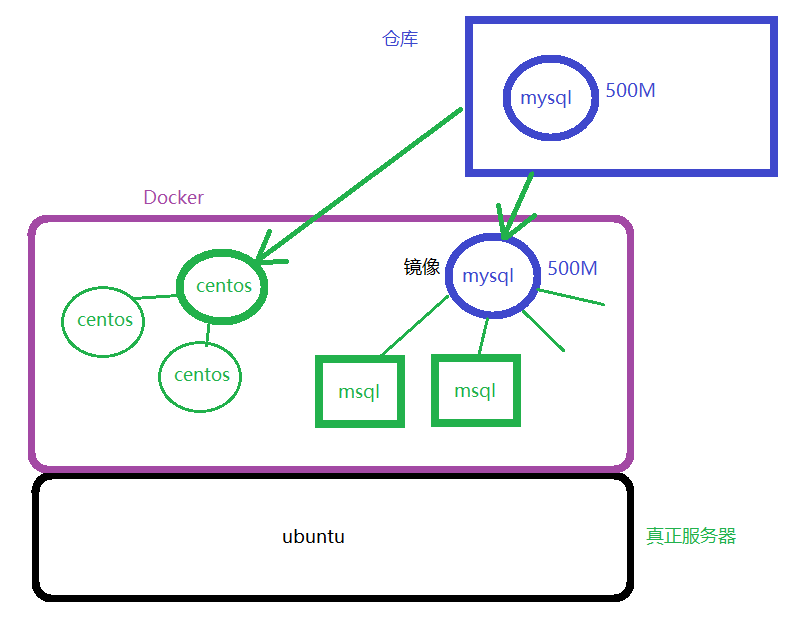 |


## 2、docker和传统虚拟机的比较

| 特性       | Docker容器         | 虚拟机      |
| ---------- | ------------------ | ----------- |
| 启动       | 秒级               | 分钟级      |
| 硬盘使用   | 一般为 `MB`        | 一般为 `GB` |
| 性能       | 接近原生           | 弱于        |
| 系统支持量 | 单机支持上千个容器 | 一般几十个  |


## 3、仓库、镜像、容器

- 仓库：存放镜像的地方
  - 类比内存
  - 分类中央仓库和私有仓库
    - 中央仓库：http://hub.docker.com，http://hub.daocloud.io/
    - 私有仓库：公司搭建的docker仓库，一般需要进行配置使用
- 镜像：一个环境或者一个软件对应的资源
  - 类比模板、类比Java中类、类比windows中的压缩包
- 容器：由镜像运行生成的一个进程
  - 类比对象、类比windows中由压缩包解压出来的东西


# 三、Docker安装

## 1、安装

| apt-get install docker.io                                    |
| ------------------------------------------------------------ |
| 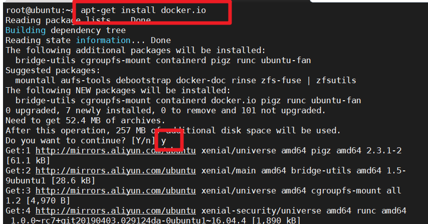 |


## 2、配置镜像加速器

- 编辑该文件`/etc/default/docker`，添加内容
- vi /etc/default/docker

```
{
  "registry-mirrors": ["https://ohfqk9xf.mirror.aliyuncs.com"]
}
```

- 重启服务

```shell
sudo systemctl daemon-reload
sudo systemctl restart docker
```


## 3、确认安装是否成功

| docker -v                                                    |
| ------------------------------------------------------------ |
| 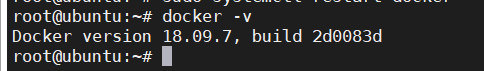 |


## 4、Docker工作原理

- Docker安装完成后，会自带安装Docker服务器和Docker客户端

| Docker工作原理                                               |
| ------------------------------------------------------------ |
| 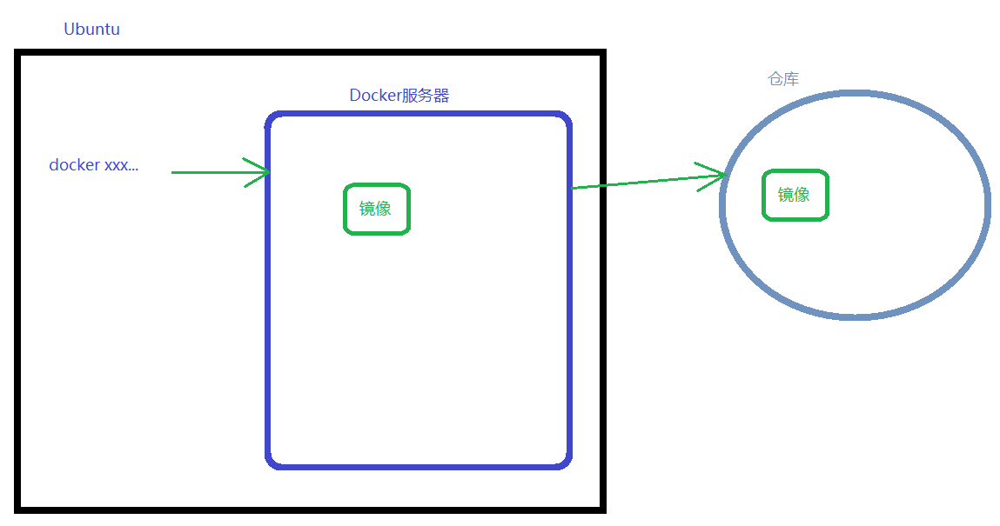 |


# 四、镜像操作

## 1、拉取镜像

```shell
docker pull 镜像名称:版本
#如果没有指定版本，那么拉取的是最新最稳定的版本 latest
```

| docker pull tomcat                                           |
| ------------------------------------------------------------ |
| 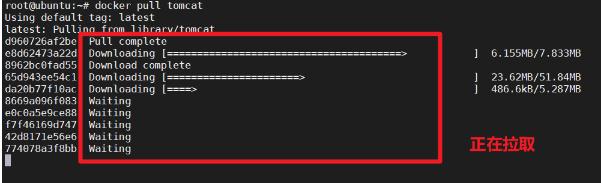 |

| docker pull tomcat:8.5.23                                    |
| ------------------------------------------------------------ |
| 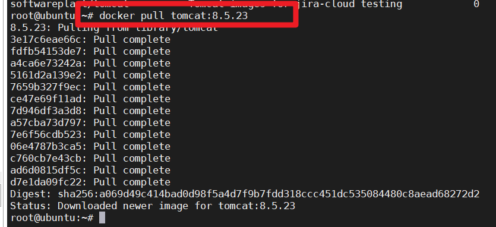 |


## 2、查看本地所有镜像

```shelll
# 查看当前本地所有的镜像
docker images
```

| docker images                                                |
| ------------------------------------------------------------ |
| 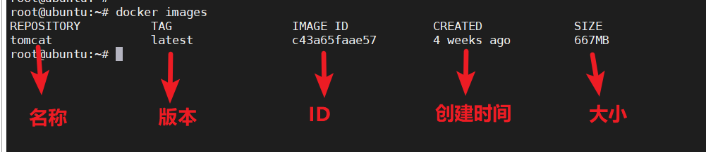 |


## 3、删除镜像

```
docker rmi 镜像ID
#要删除镜像，当前镜像必须没有正在运行的容器【写镜像ID时，只需要写前3位就可以了】
```

| docker rmi c43                                               |
| ------------------------------------------------------------ |
| 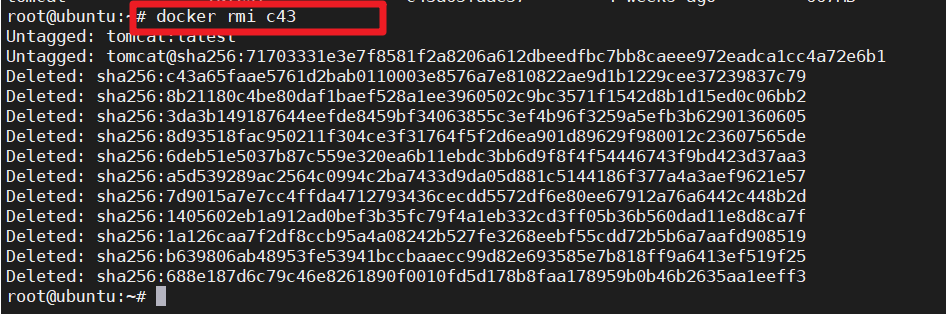 |


## 4、搜索镜像

```shell
docker search 镜像名称
```


# 五、容器操作

## 1、创建容器【了解】

```shell
# 使用镜像创建容器
docker run -p 8080:8080 镜像名称:版本
```

| docker run -p 8080:8080 tomcat:latest                        |
| ------------------------------------------------------------ |
| 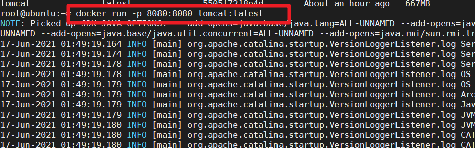 |

| docker run -p 8080:8080 tomcat:8.5.23                        |
| ------------------------------------------------------------ |
| 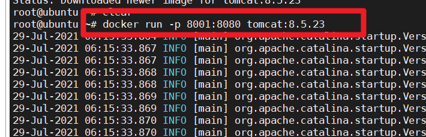 |


## 2、创建一个后台运行的容器并指定名称

```shell
docker run -d -p 8001:8080 --name mytomcat tomcat:8.5.23
-d : 代表后台运行
```

| docker run -d -p 8001:8080 --name mytomcat tomcat:8.5.23     |
| ------------------------------------------------------------ |
| 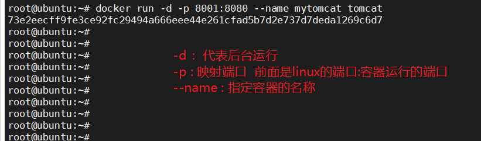 |


### 2.1 进入正在运行的容器内部

```shell
docker exec -it 容器ID bash
```


## 3、创建容器并指定参数

```shell
docker run -it -p 8003:8080 --name mytomcat8003 --rm tomcat:8.5.23 bash
#创建一个名称为mytomcat8003，端口为8003的tomcat容器，并以交互方式进入容器内部，当退出容器时删除容器

#-it : 以交互式终端的方式进入到容器内部
#--name : 为容器起一个名称
#--rm : 退出容器后，该容器会被删除
#bash : shell命令， bash是shell命令（中文）中的一种语言（普通话）
```


## 4、查看容器

```shell
#查看正在运行的容器
docker ps

#查看全部容器
docker ps -a
```

| docker ps                                                    |
| ------------------------------------------------------------ |
| 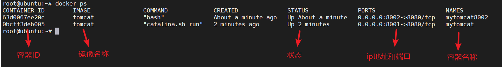 |


## 5、删除停止运行的容器

```
docker rm 容器ID
```

| docker rm 容器ID                                             |
| ------------------------------------------------------------ |
| 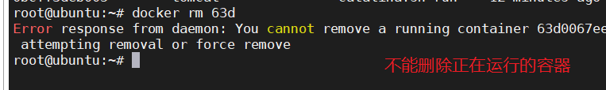 |

```shell
#删除全部容器
docker rm $(docker ps -qa)
```


## 6、启动、重启、停止容器

```shell
docker start|stop|restart 容器ID
```


## 7、复制主机的文件到容器中

```shell
docker cp 主机文件地址 容器ID:容器地址
```

| docker cp ROOT 容器ID:/usr/local/tomcat/webapps              |
| ------------------------------------------------------------ |
| 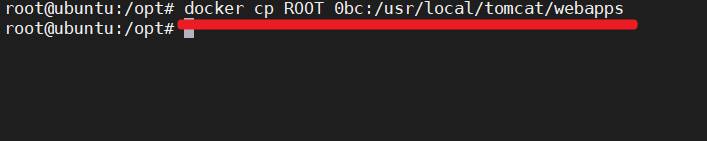 |

> 把ubuntu中的ROOT目录复制到tomcat容器的webapps目录下


## 8、Docker工作原理

| Docker的工作原理                                             |
| ------------------------------------------------------------ |
| 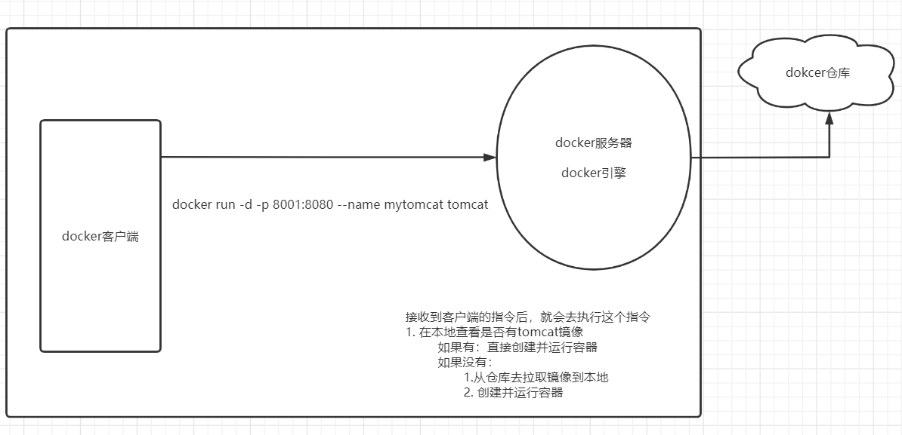 |
| 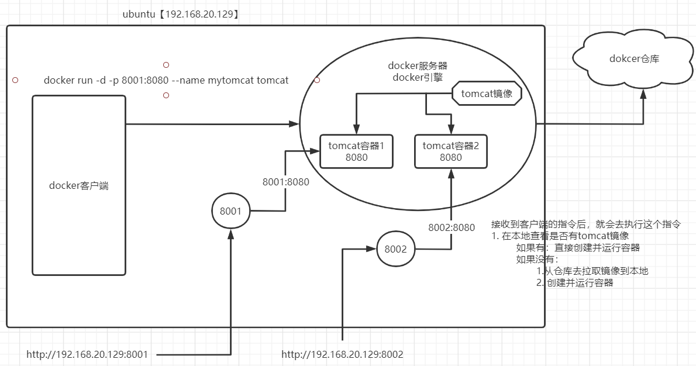 |


# 六、练习

- 使用docker安装mysql数据库

```shell
docker run -d -p 3001:3306 --name mysql3001 -e MYSQL_ROOT_PASSWORD=123456 mysql:5.7.25

#就可以在外机【windows】去通过客户端工具连接mysql
```

```shell
#下面是使用数据卷
docker run -p 3001:3306 --name mysql \
-v /usr/local/docker/mysql/conf:/etc/mysql \
-v /usr/local/docker/mysql/logs:/var/log/mysql \
-v /usr/local/docker/mysql/data:/var/lib/mysql \
-e MYSQL_ROOT_PASSWORD=123456 \
-d mysql:5.7.25
```


# 七、数据卷

- 我们如果要把项目在docker中的tomcat容器中部署，那么就需要把你的war包放到tomcat容器中，而中间隔着docker，所以我们把war包放进去的时候，需要使用docker cp命令进行复制。那如果后期修改，就需要重新做这个的操作，特别麻烦


## 1、概述

- 数据卷就是一个目录
  - 宿主机【ubuntu】中的一个目录
  - 这个目录可以映射到容器内部的目录。对这个目录进行修改就是在修改容器内部的目录

| 数据卷的工作原理                                             |
| ------------------------------------------------------------ |
| 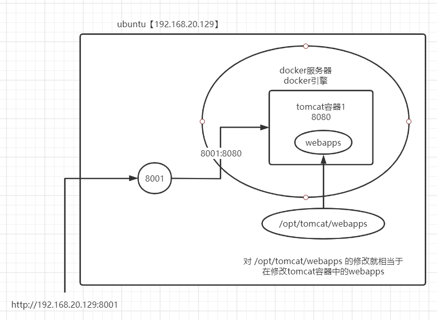 |


## 2、通过路径直接完成创建容器时完成数据卷的映射

```shell
docker run -d -p 8001:8080 -v /opt/tomcat/webapps/:/usr/local/tomcat/webapps/ --name tomcat8001 镜像ID

#-v volume : 指定数据卷
```

```
docker run -p 3002:3306 --name mysql3002 \
-v /opt/mysql/conf:/etc/mysql \
-v /opt/mysql/logs:/var/log/mysql \
-v /opt/mysql/data:/var/lib/mysql \
-e MYSQL_ROOT_PASSWORD=123456 \
-d mysql:5.7.25
```


# 八、Dockerfile

## 1、问题

- 上述我们已经掌握了通过创建容器时映射数据卷可以完成一个项目部署
  - 如果我现在要部署多个项目，需要重复执行docker run 命令，而且命令很多而且参数也很多，不方便记忆。


## 2、使用Dockerfile完成自定义镜像

- 需求：直接创建一个容器，这个容器就直接成功部署我的ssm项目


## 3、如何实现

### 3.1 实现步骤

> 1. 准备一个ssm项目对应的war包
> 2. 编写一个Dockerfile文件
>    - 在Dockerfile文件中编写实现部署ssm项目的步骤
> 3. 构建一个自定义镜像
> 4. 基于自定义镜像创建容器

- Dockerfile

```dockerfile
#基于基础镜像去构建
from tomcat:8.5.23
#把当前目录下的 ssm.war 复制 容器内部的/usr/local/tomcat/webapps/
copy ssm.war /usr/local/tomcat/webapps/
```

- 构建一个自定义镜像

```shell
docker build -t 自定义镜像名:版本 .
```

- 运行自定义镜像

```shell
docker run -d -p 7001:8080 --name ssm7001 自定义镜像名:版本
```


### 3.2 Dockerfile其它命令

```dockerfile
FROM  指定基础镜像
WORKDIR 指定工作路径
RUN  运行shell命令
COPY 复制当前路径下的文件内容到镜像里面
ADD  复制当前路径下的文件内容到镜像里面，先解压，然后删除压缩包

EXPOSE: 镜像创建容器后，容器暴露出的端口，用于被宿主机映射
CMD 容器启动时执行的命令, 比如 容器启动时运行tomcat，这个命令在dockerfile中只能使用一次
ENTRYPOINT  如果让容器启动时执行多条命令。cmd只能执行一次，但是ENTRYPOINT可以执行多次
ENV 设置环境变量
VOLUME 数据卷
```


# 九、Docker Compose

## 1、Dockerfile

- 可以让我们自定义一个镜像，也可以省去很多的Docker命令，方便我们去基于镜像运行容器。
- 必须先构建一个镜像，然后再创建容器


## 2、Docker Compose概述

- `Docker Compose` 是 Docker官方提供容器编排（Orchestration）项目之一，负责快速的部署分布式应用。
- 实际上就是对容器的编排


## 3、Docker Compose安装

- 安装

```shell
sudo curl -L https://github.com/docker/compose/releases/download/1.24.0-rc1/docker-compose-`uname -s`-`uname -m` -o /usr/local/bin/docker-compose
```

- 授权

```shell
sudo chmod +x /usr/local/bin/docker-compose
```

- 查看版本

```shell
docker-compose --version

docker-compose -v
```


## 4、克隆虚拟机

- 为了保证在操作过程中，可能有失误，那么会导致ubuntu崩溃，我们可以基于原虚拟机克隆出其他虚拟机，那么我们操作其他虚拟机就可以避免误操作。通过链接克隆的方式是最方便的，克隆出来新的虚拟机具备自己的IP。


## 5、Docker Compose核心配置文件

### 5.1 概述

- 名字：docker-compose.yml
- 语法很严谨
- 作用：就是用来编排项目

### 5.2 快速入门

- 编写一个docker-compose.yml文件

```yml
version: "3.1"   #docker-compose的版本决定了docker-compose.yml文件对应的版本
services:  #代表服务们
  #服务名，可以自己定义
  ssm1:
    image: tomcat:8.5.23   #基础镜像
    container_name: tomcat8081 #容器名称
    restart: always  #主机重启后，这个docker-compose编排的容器会自动重启
    volumes:  #数据卷映射
      - /opt/tomcat/webapps/:/usr/local/tomcat/webapps
    ports:  #端口映射
      - 8081:8080
  ssm2:
    image: tomcat:8.5.23   #基础镜像
    container_name: tomcat8082 #容器名称
    restart: always  #主机重启后，这个docker-compose编排的容器会自动重启
    volumes:  #数据卷映射
      - /opt/tomcat/webapps/:/usr/local/tomcat/webapps
    ports:  #端口映射
      - 8082:8080
```

- 启动docker-compose

```
在 docker-compose.yml 文件同目录下执行一个命令`docker-compose up -d`

#-d : 代表后台运行
```


### 5.3 常用命令

- 启动

```shell
docker-compose up -d
```

- 停止

```shell
docker-compose stop
```

- 重启

```shell
docker-compose restart
```

- 停止并删除容器

```shell
docker-compose down
```

- 查看容器

```shell
docker-compose ps [-a]
```

- 动态查看日志

```
docker-compose logs -f
```


