# 课程介绍

- 了解Mybatis-Plus

- 整合Mybatis-Plus

- 通用CRUD

- Mybatis-Plus的配置

- 条件构造器

- Sql注入器

- 逻辑删除

- 插件

- 代码生成器

  

|                          Java架构栈                          |
| :----------------------------------------------------------: |
|  |


个人介绍：

> 郭欢洋


# 一 、了解Mybatis-Plus

## 1、简介

MyBatis-Plus（简称 MP）是一个 MyBatis 的增强工具，在 MyBatis 的基础上只做增强不做改变，为简化开发、提高效率而生。

官网： https://mybatis.plus/ 或 https://mp.baomidou.com/


## 2、愿景

> https://mybatis.plus/guide/

我们的愿景是成为 MyBatis 最好的搭档，就像 [魂斗罗](https://mp.baomidou.com/img/contra.jpg) 中的 1P、2P，基友搭配，效率翻倍。


## 3、特性

- **无侵入**：只做增强不做改变，引入它不会对现有工程产生影响，如丝般顺滑
- **损耗小**：启动即会自动注入基本 CURD，性能基本无损耗，直接面向对象操作
- **强大的 CRUD 操作**：内置通用 Mapper、通用 Service，仅仅通过少量配置即可实现单表大部分 CRUD 操作，更有强大的条件构造器，满足各类使用需求
- **支持 Lambda 形式调用**：通过 Lambda 表达式，方便的编写各类查询条件，无需再担心字段写错
- **支持主键自动生成**：支持多达 4 种主键策略（内含分布式唯一 ID 生成器 - Sequence），可自由配置，完美解决主键问题
- **支持 ActiveRecord 模式**：支持 ActiveRecord 形式调用，实体类只需继承 Model 类即可进行强大的 CRUD 操作
- **支持自定义全局通用操作**：支持全局通用方法注入（ Write once, use anywhere ）
- **内置代码生成器**：采用代码或者 Maven 插件可快速生成 Mapper 、 Model 、 Service 、 Controller 层代码，支持模板引擎，更有超多自定义配置等您来使用
- **内置分页插件**：基于 MyBatis 物理分页，开发者无需关心具体操作，配置好插件之后，写分页等同于普通 List 查询
- **分页插件支持多种数据库**：支持 MySQL、MariaDB、Oracle、DB2、H2、HSQL、SQLite、Postgre、SQLServer 等多种数据库
- **内置性能分析插件**：可输出 Sql 语句以及其执行时间，建议开发测试时启用该功能，能快速揪出慢查询
- **内置全局拦截插件**：提供全表 delete 、 update 操作智能分析阻断，也可自定义拦截规则，预防误操作


## 4、支持数据库

- mysql 、 mariadb 、 oracle 、 db2 、 h2 、 hsql 、 sqlite 、 postgresql 、 sqlserver
- 达梦数据库 、 虚谷数据库 、 人大金仓数据库


## 5、框架结构

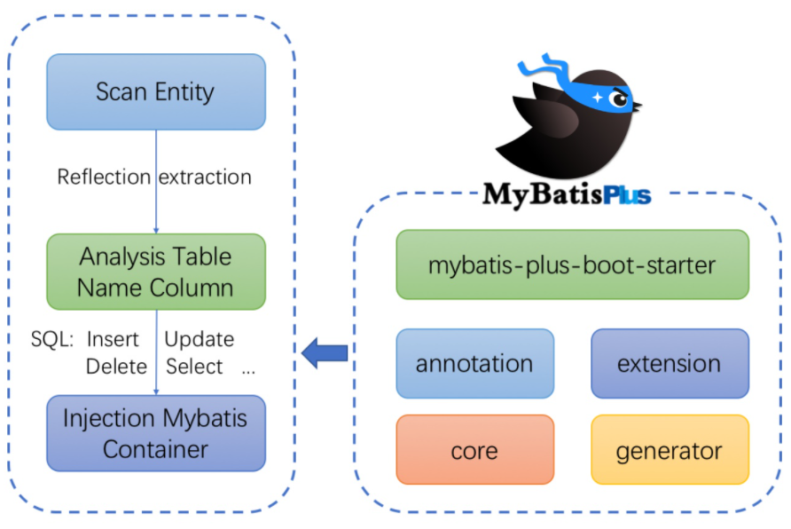


## 6、代码托管

- Github： https://github.com/baomidou/mybatis-plus

- Gitee： https://gitee.com/baomidou/mybatis-plus


## 7、作者

Mybatis-Plus是由baomidou（苞米豆）组织开发并且开源的，目前该组织大概有人左右。
码云地址：https://gitee.com/organizations/baomidou

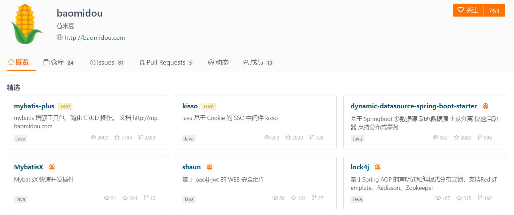


# 二、整合Mybatis-Plus

对于 Mybatis整合MP有常常有三种用法：

- Mybatis+MP
- Spring+Mybatis+MP
- SpringBoot+Mybatis+MP。

> 前置知识：Maven、Mybatis、Spring、SpringBoot


## 1、创建数据库以及表

```sql
CREATE DATABASE `mybatisplus`;

USE `mybatisplus`;

CREATE TABLE `tb_user` (
  `id` bigint(20) NOT NULL AUTO_INCREMENT COMMENT '主键ID',
  `user_name` varchar(20) NOT NULL COMMENT '用户名',
  `password` varchar(20) NOT NULL COMMENT '密码',
  `name` varchar(30) DEFAULT NULL COMMENT '姓名',
  `age` int(11) DEFAULT NULL COMMENT '年龄',
  `email` varchar(50) DEFAULT NULL COMMENT '邮箱',
  PRIMARY KEY (`id`)
) ENGINE=InnoDB AUTO_INCREMENT=6 DEFAULT CHARSET=utf8;

insert  into `tb_user`(`id`,`user_name`,`password`,`name`,`age`,`email`) values (1,'zhangsan','123456','张三',18,'zhangsan@163.com'),(2,'lisi','123456','李四',20,'lisi@163.com'),(3,'wangwu','123456','王五',28,'wangwu@163.com'),(4,'zhaoliu','123456','赵六',21,'zhaoliu@163.com'),(5,'sunqi','123456','孙七',24,'sunqi@163.com');
```


## 2、创建工程【mybatis-plus-simple】

### 2.1 打包方式为jar


### 2.2 导入依赖

- pom.xml

```xml
<?xml version="1.0" encoding="UTF-8"?>
<project xmlns="http://maven.apache.org/POM/4.0.0"
         xmlns:xsi="http://www.w3.org/2001/XMLSchema-instance"
         xsi:schemaLocation="http://maven.apache.org/POM/4.0.0 http://maven.apache.org/xsd/maven-4.0.0.xsd">
    <modelVersion>4.0.0</modelVersion>

    <groupId>com.qf</groupId>
    <artifactId>mybatis-plus-simple</artifactId>
    <version>1.0-SNAPSHOT</version>

    <dependencies>
        <!-- mybatis-plus插件依赖 -->
        <dependency>
            <groupId>com.baomidou</groupId>
            <artifactId>mybatis-plus</artifactId>
            <version>3.1.1</version>
        </dependency>
        <!-- MySql -->
        <dependency>
            <groupId>mysql</groupId>
            <artifactId>mysql-connector-java</artifactId>
            <version>5.1.47</version>
        </dependency>
        <!-- 连接池 -->
        <dependency>
            <groupId>com.alibaba</groupId>
            <artifactId>druid</artifactId>
            <version>1.0.11</version>
        </dependency>
        <!--简化bean代码的工具包-->
        <dependency>
            <groupId>org.projectlombok</groupId>
            <artifactId>lombok</artifactId>
            <optional>true</optional>
            <version>1.18.4</version>
        </dependency>
        <dependency>
            <groupId>junit</groupId>
            <artifactId>junit</artifactId>
            <version>4.12</version>
        </dependency>
        <dependency>
            <groupId>org.slf4j</groupId>
            <artifactId>slf4j-log4j12</artifactId>
            <version>1.6.4</version>
        </dependency>
    </dependencies>

    <build>
        <plugins>
            <plugin>
                <groupId>org.apache.maven.plugins</groupId>
                <artifactId>maven-compiler-plugin</artifactId>
                <version>3.5.1</version>
                <configuration>
                    <source>1.8</source>
                    <target>1.8</target>
                </configuration>
            </plugin>
        </plugins>
    </build>
    
</project>
```


### 2.3 搭建mybatis开发环境

#### 2.3.1 实体类与接口

> 使用lombok进行bean操作

- User.java

  ```java
  package com.qf.mybatisplus.pojo;
  
  import lombok.AllArgsConstructor;
  import lombok.Data;
  import lombok.NoArgsConstructor;
  
  /**
   * @author ghy
   * @version 1.0
   */
  @Data
  @NoArgsConstructor
  @AllArgsConstructor
  public class User {
  
      private Long id;
      private String userName;
      private String password;
      private String name;
      private Integer age;
      private String email;
  
  }
  
  ```
  
  
  
- UserMapper.java

  ```java
  package com.qf.mybatisplus.mapper;
  
  import com.qf.mybatisplus.pojo.User;
  
  import java.util.List;
  
  /**
   * @author ghy
   * @version 1.0
   */
  public interface UserMapper {
      
      List<User> findAll();
  }
  ```
  


#### 2.3.2 配置文件

- log4j.properties

  ```properties
  # Set root category priority to INFO and its only appender to CONSOLE.
  #log4j.rootCategory=INFO, CONSOLE            debug   info   warn error fatal
  # 日志等级,输出目的地1,目的地2
  log4j.rootLogger=debug, CONSOLE, LOGFILE
  #log4j.rootCategory=info, CONSOLE, LOGFILE
  
  # Set the enterprise logger category to FATAL and its only appender to CONSOLE.
  log4j.logger.org.apache.axis.enterprise=FATAL, CONSOLE
  
  # CONSOLE is set to be a ConsoleAppender using a PatternLayout.
  #输出到控制台
  log4j.appender.CONSOLE=org.apache.log4j.ConsoleAppender
  #输出格式布局 PatternLayout 自定义布局
  log4j.appender.CONSOLE.layout=org.apache.log4j.PatternLayout
  #布局格式 ConversionPattern
  # %d 时间    %-
  log4j.appender.CONSOLE.layout.ConversionPattern=%d{ISO8601} %-6r [%15.15t] %-5p %30.30c %x - %m\n
  
  # LOGFILE is set to be a File appender using a PatternLayout.
  log4j.appender.LOGFILE=org.apache.log4j.FileAppender
  log4j.appender.LOGFILE.File=d:/mp.log
  log4j.appender.LOGFILE.Append=true
  log4j.appender.LOGFILE.layout=org.apache.log4j.PatternLayout
  log4j.appender.LOGFILE.layout.ConversionPattern=%d{ISO8601} %-6r [%15.15t] %-5p %30.30c %x - %m\n
  ```

- jdbc.properties

  ```properties
  jdbc.driver=com.mysql.jdbc.Driver
  jdbc.url=jdbc:mysql://localhost:3306/mybatisplus?useUnicode=true&characterEncoding=utf8&serverTimezone=GMT%2B8
  jdbc.username=root
  jdbc.password=root
  ```

- UserMapper.xml

  > resources/mapper目录下
  
  ```xml
  <?xml version="1.0" encoding="UTF-8" ?>
  <!DOCTYPE mapper PUBLIC "-//mybatis.org//DTD Mapper 3.0//EN"
          "http://mybatis.org/dtd/mybatis-3-mapper.dtd">
  <mapper namespace="com.qf.mybatisplus.mapper.UserMapper">
      <!-- List<User> findAll(); -->
      <select id="findAll" resultType="com.qf.mybatisplus.pojo.User">
          SELECT * FROM tb_user
      </select>
  </mapper>
  ```

- mybatis-config.xml

  ```xml
  <?xml version="1.0" encoding="UTF-8" ?>
  <!DOCTYPE configuration PUBLIC "-//mybatis.org//DTD Config 3.0//EN"
          "http://mybatis.org/dtd/mybatis-3-config.dtd">
  <configuration>
      <!-- 读取外部properties配置文件 -->
      <properties resource="jdbc.properties"></properties>
  
      <!-- 配置数据库环境 -->
      <environments default="development">
          <environment id="development">
              <transactionManager type="JDBC"/>
              <dataSource type="POOLED">
                  <property name="driver" value="${jdbc.driver}"/>
                  <property name="url" value="${jdbc.url}"/>
                  <property name="username" value="${jdbc.username}"/>
                  <property name="password" value="${jdbc.password}"/>
              </dataSource>
          </environment>
      </environments>
  
      <mappers>
          <!-- 加载Mapper.xml映射文件 -->
          <mapper resource="mapper/UserMapper.xml"/>
      </mappers>
  </configuration>
  ```

#### 2.3.3 测试

```java
package com.qf.mybatisplus.test;

import com.qf.mybatisplus.mapper.UserMapper;
import com.qf.mybatisplus.pojo.User;
import org.apache.ibatis.io.Resources;
import org.apache.ibatis.session.SqlSession;
import org.apache.ibatis.session.SqlSessionFactory;
import org.apache.ibatis.session.SqlSessionFactoryBuilder;
import org.junit.Test;

import java.io.InputStream;
import java.util.List;

/**
 * @author ghy
 * @version 1.0
 */
public class MybatisTest {

    /**
     * 测试mybatis开发环境
     */
    @Test
    public void testFindAll() throws Exception {

        InputStream in = Resources.getResourceAsStream("mybatis-config.xml");
        SqlSessionFactory sqlSessionFactory = new SqlSessionFactoryBuilder().build(in);
        SqlSession sqlSession = sqlSessionFactory.openSession();

        UserMapper userMapper = sqlSession.getMapper(UserMapper.class);
        List<User> userList = userMapper.findAll();
        for (User user : userList) {
            System.out.println(user);
        }
        sqlSession.close();

    }

}
```

结果

```xml
2021-04-15 16:39:37,237 273    [           main] DEBUG source.pooled.PooledDataSource  - Created connection 1027007693.
2021-04-15 16:39:37,237 273    [           main] DEBUG ansaction.jdbc.JdbcTransaction  - Setting autocommit to false on JDBC Connection [com.mysql.jdbc.JDBC4Connection@3d36e4cd]
2021-04-15 16:39:37,244 280    [           main] DEBUG plus.mapper.UserMapper.findAll  - ==>  Preparing: SELECT * FROM tb_user 
2021-04-15 16:39:37,262 298    [           main] DEBUG plus.mapper.UserMapper.findAll  - ==> Parameters: 
2021-04-15 16:39:37,274 310    [           main] DEBUG plus.mapper.UserMapper.findAll  - <==      Total: 5
User(id=1, userName=null, password=123456, name=张三, age=18, email=zhangsan@163.com)
User(id=2, userName=null, password=123456, name=李四, age=20, email=lisi@163.com)
User(id=3, userName=null, password=123456, name=王五, age=28, email=wangwu@163.com)
User(id=4, userName=null, password=123456, name=赵六, age=21, email=zhaoliu@163.com)
User(id=5, userName=null, password=123456, name=孙七, age=24, email=sunqi@163.com)
```

> 注意:Mybatis-Plus的依赖中已经包含了mybatis及依赖spring与mybatis整合的依赖，所以无需再单独单入mybatis的依赖了


## 3、Mybatis整合MP

### 3.1 修改User实体类

- User实体类上标记==注解@TableName("tb_user")==

> 进行实体类与表的映射，若表名与实体类名一致，则可以不加该注解

```java
import com.baomidou.mybatisplus.annotation.TableName;

@TableName("tb_user")
public class User {
	//属性及方法
}
```

- 如果不加该注解，实体类与表名又不一致，则会报错【表不存在】
  - 默认映射的表名为类名首字母小写

```properties
Caused by: com.mysql.jdbc.exceptions.jdbc4.MySQLSyntaxErrorException: Table 'mybatisplus.user' doesn't exist
	at sun.reflect.NativeConstructorAccessorImpl.newInstance0(Native Method)
	at sun.reflect.NativeConstructorAccessorImpl.newInstance(NativeConstructorAccessorImpl.java:62)
	at sun.reflect.DelegatingConstructorAccessorImpl.newInstance(DelegatingConstructorAccessorImpl.java:45)
	at java.lang.reflect.Constructor.newInstance(Constructor.java:408)
	at com.mysql.jdbc.Util.handleNewInstance(Util.java:425)
	at com.mysql.jdbc.Util.getInstance(Util.java:408)
	at com.mysql.jdbc.SQLError.createSQLException(SQLError.java:944)
	at com.mysql.jdbc.MysqlIO.checkErrorPacket(MysqlIO.java:3978)
	at com.mysql.jdbc.MysqlIO.checkErrorPacket(MysqlIO.java:3914)
	at com.mysql.jdbc.MysqlIO.sendCommand(MysqlIO.java:2530)
	at com.mysql.jdbc.MysqlIO.sqlQueryDirect(MysqlIO.java:2683)
	at com.mysql.jdbc.ConnectionImpl.execSQL(ConnectionImpl.java:2495)
	at com.mysql.jdbc.PreparedStatement.executeInternal(PreparedStatement.java:1903)
	at com.mysql.jdbc.PreparedStatement.execute(PreparedStatement.java:1242)
	at sun.reflect.NativeMethodAccessorImpl.invoke0(Native Method)
	at sun.reflect.NativeMethodAccessorImpl.invoke(NativeMethodAccessorImpl.java:62)
	at sun.reflect.DelegatingMethodAccessorImpl.invoke(DelegatingMethodAccessorImpl.java:43)
	at java.lang.reflect.Method.invoke(Method.java:483)
	at org.apache.ibatis.logging.jdbc.PreparedStatementLogger.invoke(PreparedStatementLogger.java:59)
	at com.sun.proxy.$Proxy8.execute(Unknown Source)
	at org.apache.ibatis.executor.statement.PreparedStatementHandler.query(PreparedStatementHandler.java:64)
	at org.apache.ibatis.executor.statement.RoutingStatementHandler.query(RoutingStatementHandler.java:79)
	at com.baomidou.mybatisplus.core.executor.MybatisSimpleExecutor.doQuery(MybatisSimpleExecutor.java:67)
	at org.apache.ibatis.executor.BaseExecutor.queryFromDatabase(BaseExecutor.java:324)
	at org.apache.ibatis.executor.BaseExecutor.query(BaseExecutor.java:156)
	at org.apache.ibatis.executor.CachingExecutor.query(CachingExecutor.java:109)
	at org.apache.ibatis.executor.CachingExecutor.query(CachingExecutor.java:83)
	at org.apache.ibatis.session.defaults.DefaultSqlSession.selectList(DefaultSqlSession.java:147)
	... 28 more
```


### 3.2 修改UserMapper接口

- UserMapper接口==继承BaseMapper接口==

> UserMapper将会有BaseMapper中所有的方法
>
> ==注意：BaseMapper是在mybatisplus包下的==

```java
package com.qf.mybatisplus.mapper;

import com.baomidou.mybatisplus.core.mapper.BaseMapper;
import com.qf.mybatisplus.pojo.User;

import java.util.List;

/**
 * @author ghy
 * @version 1.0
 */
public interface UserMapper extends BaseMapper<User> {

    List<User> findAll();
}
```


### 3.3 修改测试类

增加测试方法

- 修改 SqlSessionFactoryBuilder 构建器为 ==MybatisSqlSessionFactoryBuilder==

> 由于使用了 MybatisSqlSessionFactoryBuilder进行了构建，继承的BaseMapper中的方法就载入到了SqlSession中，所以就可以直接使用相关的方法`

- 修改测试findAll方法为==selectList方法==，一样实现查询所有功能

```java
/**
 * 测试mybatis开发环境
 */
@Test
public void testFindAllUseMybatisPlus() throws Exception {

    InputStream in = Resources.getResourceAsStream("mybatis-config.xml");
    SqlSessionFactory sqlSessionFactory = new MybatisSqlSessionFactoryBuilder().build(in);
    SqlSession sqlSession = sqlSessionFactory.openSession();

    UserMapper userMapper = sqlSession.getMapper(UserMapper.class);
    List<User> userList = userMapper.selectList(null);
    for (User user : userList) {
        System.out.println(user);
    }
    sqlSession.close();

}

```

结果

```
2021-04-15 16:46:10,118 743    [           main] DEBUG source.pooled.PooledDataSource  - Created connection 2005733474.
2021-04-15 16:46:10,118 743    [           main] DEBUG ansaction.jdbc.JdbcTransaction  - Setting autocommit to false on JDBC Connection [com.mysql.jdbc.JDBC4Connection@778d1062]
2021-04-15 16:46:10,121 746    [           main] DEBUG s.mapper.UserMapper.selectList  - ==>  Preparing: SELECT id,user_name,password,name,age,email FROM tb_user 
2021-04-15 16:46:10,140 765    [           main] DEBUG s.mapper.UserMapper.selectList  - ==> Parameters: 
2021-04-15 16:46:10,152 777    [           main] DEBUG s.mapper.UserMapper.selectList  - <==      Total: 5
User(id=1, userName=zhangsan, password=123456, name=张三, age=18, email=zhangsan@163.com)
User(id=2, userName=lisi, password=123456, name=李四, age=20, email=lisi@163.com)
User(id=3, userName=wangwu, password=123456, name=王五, age=28, email=wangwu@163.com)
User(id=4, userName=zhaoliu, password=123456, name=赵六, age=21, email=zhaoliu@163.com)
User(id=5, userName=sunqi, password=123456, name=孙七, age=24, email=sunqi@163.com)
```


- 原理

> 继承过来的方法都被封装在SqlSession的configuration的MappedStatements对象中

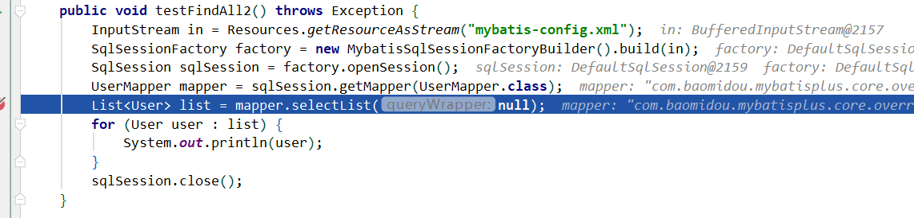

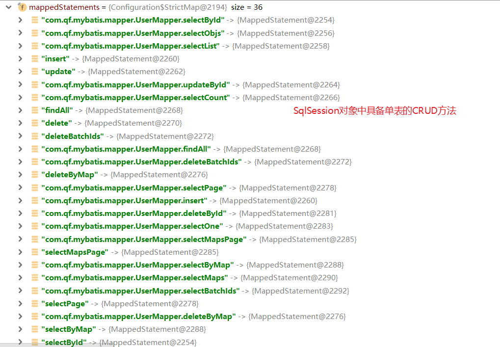


## 4、Spring + Mybatis + MP

### 4.1 新创建一个工程【mybatis-plus-spring】

- 打包方式：jar

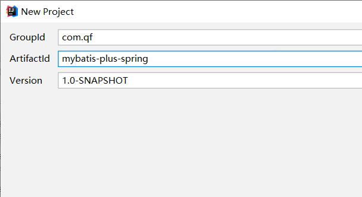

### 4.2 导入依赖

- pom.xml

```xml
<?xml version="1.0" encoding="UTF-8"?>
<project xmlns="http://maven.apache.org/POM/4.0.0"
         xmlns:xsi="http://www.w3.org/2001/XMLSchema-instance"
         xsi:schemaLocation="http://maven.apache.org/POM/4.0.0 http://maven.apache.org/xsd/maven-4.0.0.xsd">
    <modelVersion>4.0.0</modelVersion>

    <groupId>com.qf</groupId>
    <artifactId>mybatis-plus-spring</artifactId>
    <version>1.0-SNAPSHOT</version>

    <properties>
        <spring.version>5.1.6.RELEASE</spring.version>
    </properties>

    <dependencies>
        <!-- mybatis-plus插件依赖 -->
        <dependency>
            <groupId>com.baomidou</groupId>
            <artifactId>mybatis-plus</artifactId>
            <version>3.1.1</version>
        </dependency>
        <!-- MySql -->
        <dependency>
            <groupId>mysql</groupId>
            <artifactId>mysql-connector-java</artifactId>
            <version>5.1.47</version>
        </dependency>
        <!-- 连接池 -->
        <dependency>
            <groupId>com.alibaba</groupId>
            <artifactId>druid</artifactId>
            <version>1.0.11</version>
        </dependency>
        <!--简化bean代码的工具包-->
        <dependency>
            <groupId>org.projectlombok</groupId>
            <artifactId>lombok</artifactId>
            <optional>true</optional>
            <version>1.18.4</version>
        </dependency>
        <dependency>
            <groupId>junit</groupId>
            <artifactId>junit</artifactId>
            <version>4.12</version>
        </dependency>
        <dependency>
            <groupId>org.slf4j</groupId>
            <artifactId>slf4j-log4j12</artifactId>
            <version>1.6.4</version>
        </dependency>

        <dependency>
            <groupId>org.springframework</groupId>
            <artifactId>spring-webmvc</artifactId>
            <version>${spring.version}</version>
        </dependency>
        <dependency>
            <groupId>org.springframework</groupId>
            <artifactId>spring-jdbc</artifactId>
            <version>${spring.version}</version>
        </dependency>
        <dependency>
            <groupId>org.springframework</groupId>
            <artifactId>spring-test</artifactId>
            <version>${spring.version}</version>
        </dependency>

    </dependencies>

    <build>
        <plugins>
            <plugin>
                <groupId>org.apache.maven.plugins</groupId>
                <artifactId>maven-compiler-plugin</artifactId>
                <version>3.5.1</version>
                <configuration>
                    <source>1.8</source>
                    <target>1.8</target>
                </configuration>
            </plugin>
        </plugins>
    </build>


</project>
```


### 4.3 配置文件

- 复制 mybatis-plus-simple 工程中的代码及配置文件
  - User实体类
  - UserMapper接口
  - jdbc.properties、log4j.properties、mybatis-config.xml
- 删除UserMapper中的所有方法


- 增加 applicationContext.xml

  > 把 SqlSessionFactoryBean 改成 ==MybatisSqlSessionFactoryBean==

```xml
<?xml version="1.0" encoding="UTF-8"?>
<beans xmlns="http://www.springframework.org/schema/beans"
       xmlns:xsi="http://www.w3.org/2001/XMLSchema-instance"
       xmlns:context="http://www.springframework.org/schema/context"
       xsi:schemaLocation="http://www.springframework.org/schema/beans
		http://www.springframework.org/schema/beans/spring-beans.xsd
        http://www.springframework.org/schema/context
        http://www.springframework.org/schema/context/spring-context.xsd">

    <context:property-placeholder location="classpath*:*.properties"/>

    <!-- 定义数据源 -->
    <bean id="dataSource" class="com.alibaba.druid.pool.DruidDataSource" destroy-method="close">
        <property name="url" value="${jdbc.url}"/>
        <property name="username" value="${jdbc.username}"/>
        <property name="password" value="${jdbc.password}"/>
        <property name="driverClassName" value="${jdbc.driver}"/>
        <property name="maxActive" value="10"/>
        <property name="minIdle" value="5"/>
    </bean>

    <!--这里使用MP提供的sqlSessionFactory，完成了Spring与MP的整合-->
    <bean id="sqlSessionFactory" class="com.baomidou.mybatisplus.extension.spring.MybatisSqlSessionFactoryBean">
        <property name="dataSource" ref="dataSource"/>
    </bean>

    <!--扫描mapper接口，使用的依然是Mybatis原生的扫描器-->
    <bean class="org.mybatis.spring.mapper.MapperScannerConfigurer">
        <property name="basePackage" value="com.qf.mybatis.mapper"/>
    </bean>

</beans>
```


### 4.4 测试

- 测试类

```java
package com.qf.mybatisplus.test;

import com.qf.mybatisplus.mapper.UserMapper;
import com.qf.mybatisplus.pojo.User;
import org.junit.Test;
import org.junit.runner.RunWith;
import org.springframework.beans.factory.annotation.Autowired;
import org.springframework.test.context.ContextConfiguration;
import org.springframework.test.context.junit4.SpringJUnit4ClassRunner;

import java.util.List;

/**
 * @author ghy
 * @version 1.0
 */
@RunWith(SpringJUnit4ClassRunner.class)
@ContextConfiguration({"classpath:applicationContext.xml"})
public class MybatisPlusSpringTest {

    @Autowired
    private UserMapper userMapper;

    /**
     * 测试spring整合mp
     */
    @Test
    public void testSelectList() throws Exception {
        List<User> userList = userMapper.selectList(null);
        for (User user : userList) {
            System.out.println(user);
        }
    }

}

```

- 结果

```mysql
2021-04-15 16:59:28,130 1842   [           main] DEBUG mybatis.spring.SqlSessionUtils  - Creating a new SqlSession
2021-04-15 16:59:28,135 1847   [           main] DEBUG mybatis.spring.SqlSessionUtils  - SqlSession [org.apache.ibatis.session.defaults.DefaultSqlSession@536dbea0] was not registered for synchronization because synchronization is not active
2021-04-15 16:59:28,171 1883   [           main] DEBUG dbc.datasource.DataSourceUtils  - Fetching JDBC Connection from DataSource
2021-04-15 16:59:28,171 1883   [           main] DEBUG ction.SpringManagedTransaction  - JDBC Connection [com.mysql.jdbc.JDBC4Connection@4f4c4b1a] will not be managed by Spring
2021-04-15 16:59:28,180 1892   [           main] DEBUG s.mapper.UserMapper.selectList  - ==>  Preparing: SELECT id,user_name,password,name,age,email FROM tb_user 
2021-04-15 16:59:28,213 1925   [           main] DEBUG s.mapper.UserMapper.selectList  - ==> Parameters: 
2021-04-15 16:59:28,237 1949   [           main] DEBUG s.mapper.UserMapper.selectList  - <==      Total: 5
2021-04-15 16:59:28,238 1950   [           main] DEBUG mybatis.spring.SqlSessionUtils  - Closing non transactional SqlSession [org.apache.ibatis.session.defaults.DefaultSqlSession@536dbea0]
User(id=1, userName=zhangsan, password=123456, name=张三, age=18, email=zhangsan@163.com)
User(id=2, userName=lisi, password=123456, name=李四, age=20, email=lisi@163.com)
User(id=3, userName=wangwu, password=123456, name=王五, age=28, email=wangwu@163.com)
User(id=4, userName=zhaoliu, password=123456, name=赵六, age=21, email=zhaoliu@163.com)
User(id=5, userName=sunqi, password=123456, name=孙七, age=24, email=sunqi@163.com)
```


## 5、SpringBoot + Mybatis + MP

### 5.1 创建一个工程【mybatis-plus-springboot】

> 因为是springboot工程，需要继承springboot-parent
>

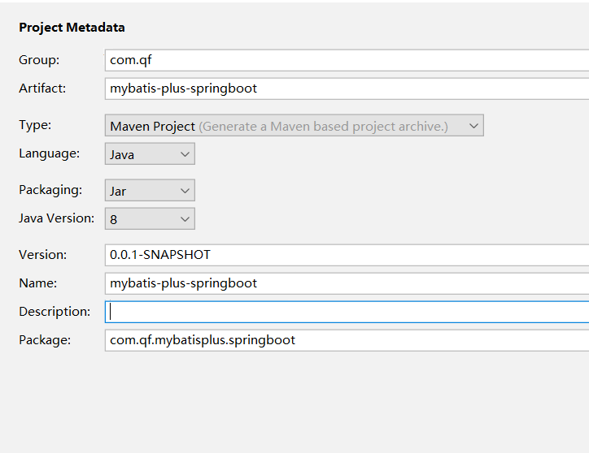

### 5.2 导入依赖

- pom.xml

```xml
<?xml version="1.0" encoding="UTF-8"?>
<project xmlns="http://maven.apache.org/POM/4.0.0" xmlns:xsi="http://www.w3.org/2001/XMLSchema-instance"
         xsi:schemaLocation="http://maven.apache.org/POM/4.0.0 https://maven.apache.org/xsd/maven-4.0.0.xsd">
    <modelVersion>4.0.0</modelVersion>
    <parent>
        <groupId>org.springframework.boot</groupId>
        <artifactId>spring-boot-starter-parent</artifactId>
        <version>2.2.9.RELEASE</version>
        <relativePath/> <!-- lookup parent from repository -->
    </parent>
    <groupId>com.qf</groupId>
    <artifactId>mybatis-plus-springboot</artifactId>
    <version>0.0.1-SNAPSHOT</version>
    <name>mybatis-plus-springboot</name>
    <description>Demo project for Spring Boot</description>
    <properties>
        <java.version>1.8</java.version>
    </properties>
    <dependencies>
        <dependency>
            <groupId>org.springframework.boot</groupId>
            <artifactId>spring-boot-starter</artifactId>
            <exclusions>
                <exclusion>
                    <groupId>org.springframework.boot</groupId>
                    <artifactId>spring-boot-starter-logging</artifactId>
                </exclusion>
            </exclusions>
        </dependency>
        <dependency>
            <groupId>org.springframework.boot</groupId>
            <artifactId>spring-boot-starter-test</artifactId>
            <scope>test</scope>
        </dependency>

        <!--简化代码的工具包-->
        <dependency>
            <groupId>org.projectlombok</groupId>
            <artifactId>lombok</artifactId>
            <optional>true</optional>
        </dependency>
        <!--mybatis-plus的springboot支持-->
        <dependency>
            <groupId>com.baomidou</groupId>
            <artifactId>mybatis-plus-boot-starter</artifactId>
            <version>3.1.1</version>
        </dependency>
        <!--mysql驱动-->
        <dependency>
            <groupId>mysql</groupId>
            <artifactId>mysql-connector-java</artifactId>
        </dependency>

        <!-- druid数据源的起步依赖 -->
        <dependency>
            <groupId>com.alibaba</groupId>
            <artifactId>druid-spring-boot-starter</artifactId>
            <version>1.1.10</version>
        </dependency>

        <!-- 日志 -->
        <dependency>
            <groupId>org.slf4j</groupId>
            <artifactId>slf4j-log4j12</artifactId>
        </dependency>

    </dependencies>

    <build>
        <plugins>
            <plugin>
                <groupId>org.springframework.boot</groupId>
                <artifactId>spring-boot-maven-plugin</artifactId>
            </plugin>
        </plugins>
    </build>

</project>

```


### 5.3 配置文件

- 复制 mybatis-plus-spring 工程中的代码及配置文件
  - User实体类
  - UserMapper接口
  - log4j.properties

  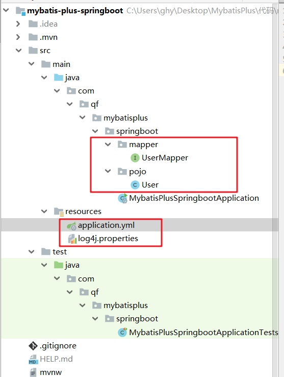
  
- 编写启动引导类

```java
package com.qf.mybatisplusspringboot;

import org.mybatis.spring.annotation.MapperScan;
import org.springframework.boot.SpringApplication;
import org.springframework.boot.autoconfigure.SpringBootApplication;

@SpringBootApplication

public class MybatisPlusSpringbootApplication {

    public static void main(String[] args) {
        SpringApplication.run(MybatisPlusSpringbootApplication.class, args);
    }

}
```

- 增加 application.yml

```yaml
spring:
  datasource:
    driver-class-name: com.mysql.cj.jdbc.Driver
    url: jdbc:mysql://localhost:3306/mybatisplus?useUnicode=true&characterEncoding=utf8&serverTimezone=GMT%2B8
    username: root
    password: root
  application:
    name: mybatis-plus-springboot
```

### 5.4 测试

- 测试类

```java
package com.qf.mybatisplus.springboot;

import com.qf.mybatisplus.springboot.mapper.UserMapper;
import com.qf.mybatisplus.springboot.pojo.User;
import org.junit.jupiter.api.Test;
import org.springframework.beans.factory.annotation.Autowired;
import org.springframework.boot.test.context.SpringBootTest;

import java.util.List;

@SpringBootTest
class MybatisPlusSpringbootApplicationTests {

    @Autowired
    UserMapper userMapper;

    @Test
    void test1() {

        List<User> userList = userMapper.selectList(null);
        for (User user : userList) {
            System.out.println(user);
        }

    }

}
```

- 结果

```
2021-04-15 17:52:29,693 2721   [           main] DEBUG mybatis.spring.SqlSessionUtils  - Creating a new SqlSession
2021-04-15 17:52:29,698 2726   [           main] DEBUG mybatis.spring.SqlSessionUtils  - SqlSession [org.apache.ibatis.session.defaults.DefaultSqlSession@77134e08] was not registered for synchronization because synchronization is not active
2021-04-15 17:52:29,729 2757   [           main] DEBUG dbc.datasource.DataSourceUtils  - Fetching JDBC Connection from DataSource
2021-04-15 17:52:29,729 2757   [           main] DEBUG ction.SpringManagedTransaction  - JDBC Connection [com.alibaba.druid.proxy.jdbc.ConnectionProxyImpl@3b95d13c] will not be managed by Spring
2021-04-15 17:52:29,734 2762   [           main] DEBUG t.mapper.UserMapper.selectList  - ==>  Preparing: SELECT id,user_name,password,name,age,email FROM tb_user 
2021-04-15 17:52:29,775 2803   [           main] DEBUG t.mapper.UserMapper.selectList  - ==> Parameters: 
2021-04-15 17:52:29,809 2837   [           main] DEBUG t.mapper.UserMapper.selectList  - <==      Total: 5
2021-04-15 17:52:29,810 2838   [           main] DEBUG mybatis.spring.SqlSessionUtils  - Closing non transactional SqlSession [org.apache.ibatis.session.defaults.DefaultSqlSession@77134e08]
User(id=1, userName=zhangsan, password=123456, name=张三, age=18, email=zhangsan@163.com)
User(id=2, userName=lisi, password=123456, name=李四, age=20, email=lisi@163.com)
User(id=3, userName=wangwu, password=123456, name=王五, age=28, email=wangwu@163.com)
User(id=4, userName=zhaoliu, password=123456, name=赵六, age=21, email=zhaoliu@163.com)
User(id=5, userName=sunqi, password=123456, name=孙七, age=24, email=sunqi@163.com)
```


# 三、通用CRUD

通过前面的学习，我们了解到通过继承BaseMapper就可以获取到各种各样的单表操作，接下来我们将详细讲解这些操作

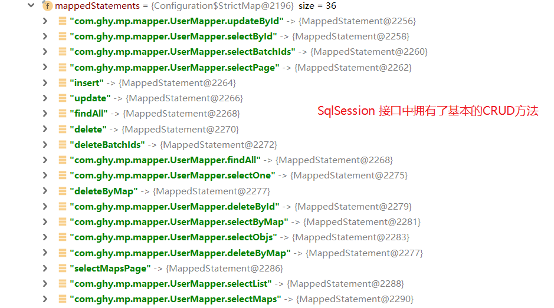

## 1、增加

### 1.1 方法定义

```java
/**
 * 插入一条记录
 *
 * @param entity 实体对象
 */
int insert(T entity);
```


### 1.2 测试方法

```java
/**
 * 增加
 * @throws Exception
 */
@Test
public void insertTest() throws Exception {
    User user = new User();
    user.setName("刘备");
    user.setPassword("123456");
    user.setEmail("liubei@163.com");
    user.setAge(35);
    user.setUserName("liubei");
    int count = userMapper.insert(user);
    System.out.println("影响行数:" + count);
    System.out.println("返回的主键值:" + user.getId());
}
```


### 1.3 测试结果


> 发现记录插入到数据库没有问题，但是返回的主键ID值并没有根据主键自增来生成，而是生成了一个新的ID,该ID由mybatis-plus底层通过算法自动计算出来的。通过控制台的SQL也可以发现，ID的值是先计算出来，再插入到数据库。

> 如何让插入记录的ID使用mysql数据库的自增特性呢？


### 1.4 Id生成策略

#### 1.4.1 MP的主键生成策略

```java
package com.baomidou.mybatisplus.annotation;

import lombok.Getter;

/**
 * 生成ID类型枚举类
 *
 * @author 
 * @since 2015-11-10
 */
@Getter
public enum IdType {
    /**
     * 数据库ID自增
     */
    AUTO(0),
    /**
     * 该类型为未设置主键类型
     */
    NONE(1),
    /**
     * 用户输入ID
     * <p>该类型可以通过自己注册自动填充插件进行填充</p>
     */
    INPUT(2),

    /* 以下3种类型、只有当插入对象ID 为空，才自动填充。 */
    /**
     * 全局唯一ID (idWorker)
     */
    ID_WORKER(3),
    /**
     * 全局唯一ID (UUID)
     */
    UUID(4),
    /**
     * 字符串全局唯一ID (idWorker 的字符串表示)
     */
    ID_WORKER_STR(5);

    private final int key;

    IdType(int key) {
        this.key = key;
    }
}
```


#### 1.4.2 修改User类

`id属性上标记注解@TableId(type= IdType.AUTO)`

```java
package com.ghy.mp.pojo;

import com.baomidou.mybatisplus.annotation.IdType;
import com.baomidou.mybatisplus.annotation.TableId;
import com.baomidou.mybatisplus.annotation.TableName;
import lombok.AllArgsConstructor;
import lombok.Data;
import lombok.NoArgsConstructor;
import lombok.experimental.Accessors;

/**
 * @author ghy
 * @version 1.0
 */
@Data
@NoArgsConstructor
@AllArgsConstructor
@TableName("tb_user")
public class User {

    @TableId(type= IdType.AUTO)
    private Long id;
    private String userName;
    private String password;
    private String name;
    private Integer age;
    private String email;

}

```

` 查看TableId的源码，我们发现默认使用的IdType为IdType.NONE`

```java
package com.baomidou.mybatisplus.annotation;

import java.lang.annotation.*;

/**
 * 表主键标识
 *
 * @author 
 * @since 2016-01-23
 */
@Documented
@Retention(RetentionPolicy.RUNTIME)
@Target(ElementType.FIELD)
public @interface TableId {

    /**
     * 字段值（驼峰命名方式，该值可无）
     */
    String value() default "";

    /**
     * 主键ID
     * {@link IdType}
     */
    IdType type() default IdType.NONE;
}
```


#### 1.4.3 再次进行测试

- 删除刚才增加的记录
- 还原数据库主键的自增值

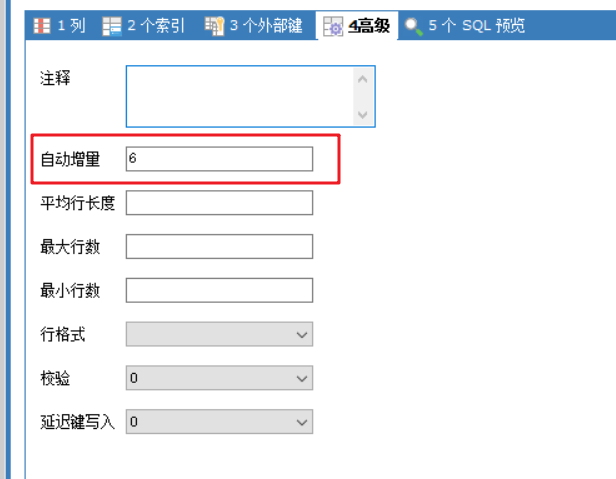

`注意：因为之前已经有记录插入了，所以要是直接测试，插入记录主键ID的值为最后一条插入记录ID的值+1，我们删除掉数据库，再导入一下sql文件，成功之后，再次测试，看看效果`

修改一下测试数据

```java
/**
 * 增加
 * @throws Exception
 */
@Test
public void insertTest() throws Exception {
    User user = new User();
    user.setName("关羽");
    user.setPassword("123456");
    user.setEmail("guanyu@163.com");
    user.setAge(33);
    user.setUserName("guanyu");
    int count = userMapper.insert(user);
    System.out.println("影响行数:" + count);
    System.out.println("返回的主键值:" + user.getId());
}
```

结果

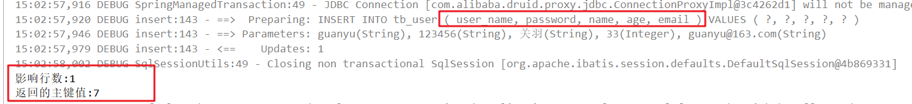

`发现增加的SQL语句中没有了ID字段，而插入记录的主键ID也实现了数据库自增，同时数据也成功插入到了数据库表中。`


### 1.5 @TableFiled

在MP中通过@TableField注解可以指定字段的一些属性，常常解决的问题有2个：

- 1、对象中的属性名和字段名不一致的问题（非驼峰命名的字段）
- 2、对象中的属性字段在表中不存在的问题（当关联表时，要映射对象或者集合，明显就不合适）

```java
/*
 * Copyright (c) 2011-2020, baomidou (jobob@qq.com).
 * <p>
 * Licensed under the Apache License, Version 2.0 (the "License"); you may not
 * use this file except in compliance with the License. You may obtain a copy of
 * the License at
 * <p>
 * https://www.apache.org/licenses/LICENSE-2.0
 * <p>
 * Unless required by applicable law or agreed to in writing, software
 * distributed under the License is distributed on an "AS IS" BASIS, WITHOUT
 * WARRANTIES OR CONDITIONS OF ANY KIND, either express or implied. See the
 * License for the specific language governing permissions and limitations under
 * the License.
 */
package com.baomidou.mybatisplus.annotation;

import java.lang.annotation.*;


/**
 * 表字段标识
 *
 * @author  sjy tantan
 * @since 2016-09-09
 */
@Documented
@Retention(RetentionPolicy.RUNTIME)
@Target(ElementType.FIELD)
public @interface TableField {

    /**
     * 字段值（驼峰命名方式，该值可无）
     */
    String value() default "";

    /**
     * 当该Field为类对象时, 可使用#{对象.属性}来映射到数据表.
     * <p>支持：@TableField(el = "role, jdbcType=BIGINT)</p>
     * <p>支持：@TableField(el = "role, typeHandler=com.baomidou.springcloud.typehandler.PhoneTypeHandler")</p>
     */
    String el() default "";

    /**
     * 是否为数据库表字段
     * <p>默认 true 存在，false 不存在</p>
     */
    boolean exist() default true;

    /**
     * 字段 where 实体查询比较条件
     * <p>默认 `=` 等值</p>
     */
    String condition() default "";

    /**
     * 字段 update set 部分注入, 该注解优于 el 注解使用
     * <p>例如：@TableField(.. , update="%s+1") 其中 %s 会填充为字段</p>
     * <p>输出 SQL 为：update 表 set 字段=字段+1 where ...</p>
     * <p>例如：@TableField(.. , update="now()") 使用数据库时间</p>
     * <p>输出 SQL 为：update 表 set 字段=now() where ...</p>
     */
    String update() default "";

    /**
     * 字段验证策略
     * <p>默认追随全局配置</p>
     */
    FieldStrategy strategy() default FieldStrategy.DEFAULT;

    /**
     * 字段自动填充策略
     */
    FieldFill fill() default FieldFill.DEFAULT;

    /**
     * 是否进行 select 查询
     * <p>大字段可设置为 false 不加入 select 查询范围</p>
     */
    boolean select() default true;

    /**
     * 是否保持使用全局的 Format 的值
     * <p> 只生效于 既设置了全局的 Format 也设置了上面 {@link #value()} 的值 </p>
     * <li> 如果是 false , 全局的 Format 不生效 </li>
     *
     * @since 3.1.1
     */
    boolean keepGlobalFormat() default false;
}

```

#### 1.5.1 指定不查询password字段

##### 1.5.1.1 修改User.java

```java
public class User {
	//...
    private String userName;
    
    @TableField(select = false)
    private String password;
}
```

##### 1.5.1.2 测试selectList方法

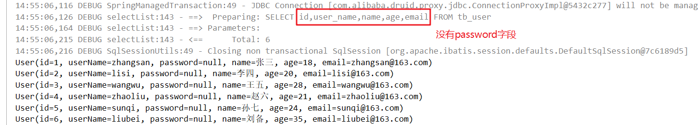


#### 1.5.2 指定属性名与字段名不一致时

##### 1.5.2.1 修改User.java

```java
public class User {
	//...
    @TableField(value = "email")
    private String mail;   //修改原生的email属性为mail,指定要映射的字段名
}
```

##### 1.5.2.2 测试insert方法

`因为修改了email字段为mail字段，所以程序已经在报错了，修改一下即可，修改测试数据，再测试`

```java
/**
 * 增加
 * @throws Exception
 */
@Test
public void insertTest() throws Exception {
    User user = new User();
    user.setName("张飞");
    user.setPassword("123456");
    //user.setEmail("guanyu@163.com");
    user.setMail("zhangfei@163.com");
    user.setAge(30);
    user.setUserName("zhangfei");
    int count = userMapper.insert(user);
    System.out.println("影响行数:" + count);
    System.out.println("返回的主键值:" + user.getId());
}
```

- 结果

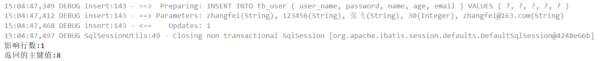


#### 1.5.3 忽略属性名【当数据库没有对应的匹配的字段时】

##### 1.5.3.1 修改User.java

- 增加address字段

```java
public class User {
	//...
    //该属性在数据库中没有对应的字段名
	private String address;
}
```

##### 1.5.3.2 修改增加方法

- 设置address属性值

```java
/**
 * 增加
 * @throws Exception
 */
@Test
public void insertTest() throws Exception {
    User user = new User();
    user.setName("赵云");
    user.setPassword("123456");
    //user.setEmail("guanyu@163.com");
    user.setMail("zhaoyun@163.com");
    user.setAge(30);
    user.setUserName("zhaoyun");
    
    user.setAddress("hangzhou");
    
    int count = userMapper.insert(user);
    System.out.println("影响行数:" + count);
    System.out.println("返回的主键值:" + user.getId());
}
```

##### 1.5.3.3 测试增加方法

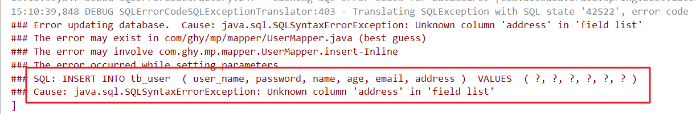

##### 1.5.3.4 指定属性不进行映射

- 修改User.java

```java
//该属性在数据库中没有对应的字段名
@TableField(exist = false)
private String address;
```

##### 1.5.3.5 再测试增加方法

- 测试通过

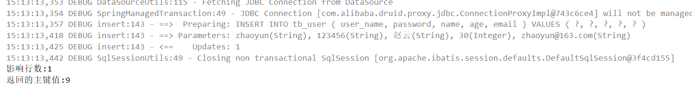


## 2、删除

### 2.1 deleteById

#### 2.1.1 方法定义

```java
/**
 * 根据 ID 删除
 *
 * @param id 主键ID
 */
int deleteById(Serializable id);
```

#### 2.1.2 测试方法

```java
/**
 * 根据ID删除
 * @throws Exception
 */
@Test
public void deleteByIdTest() throws Exception {
    int count = userMapper.deleteById(1);
    System.out.println("影响行数:" + count);
}
```

#### 2.1.3 测试结果

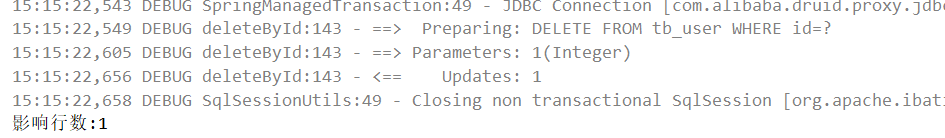


### 2.2 deleteByMap

#### 2.2.1 方法定义

```java
/**
 * 根据 columnMap 条件，删除记录
 *
 * @param columnMap 表字段 map 对象
 */
int deleteByMap(@Param(Constants.COLUMN_MAP) Map<String, Object> columnMap);
```

#### 2.2.2 测试方法

```java
/**
 * 删除，条件为Map
 *
 * @throws Exception
 */
@Test
public void deleteByMapTest() throws Exception {
    Map<String, Object> map = new HashMap<>();
    map.put("user_name", "sunqi");
    map.put("password", "123456");
    int count = userMapper.deleteByMap(map);
    System.out.println("影响行数:" + count);
}
```

#### 2.2.3 测试结果

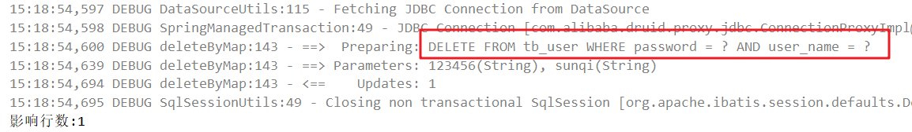


### 2.3 delete

#### 2.3.1 方法定义

```java
/**
 * 根据 entity 条件，删除记录
 *
 * @param wrapper 实体对象封装操作类（可以为 null）
 */
int delete(@Param(Constants.WRAPPER) Wrapper<T> wrapper);
```

查看参数类型的源码

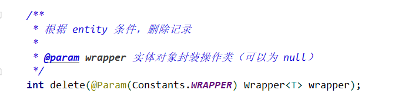

#### 2.3.2 测试方法

```java
/**
 * 删除，条件为Wrapper
 * @throws Exception
 */
@Test
public void deleteTest() throws Exception {
    User user = new User();
    user.setName("李四");
    Wrapper<User> wrapper = new QueryWrapper<>(user);
    int count = userMapper.delete(wrapper);
    System.out.println("影响行数:" + count);
}
```

#### 2.3.3 测试结果

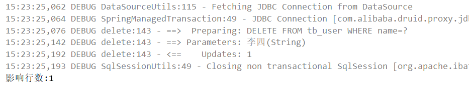


### 2.4 deleteBatchIds

#### 2.4.1 方法定义

```java
/**
 * 删除（根据ID 批量删除）
 *
 * @param idList 主键ID列表(不能为 null 以及 empty)
 */
int deleteBatchIds(@Param(Constants.COLLECTION) Collection<? extends Serializable> idList);
```

#### 2.4.2 测试方法

```java
/**
 * 根据ID 批量删除
 */
@Test
public void deleteBatchIdsTest() throws Exception {
    int row = userMapper.deleteBatchIds(Arrays.asList(3,4));
    System.out.println(row);
}
```

#### 2.4.3 测试结果

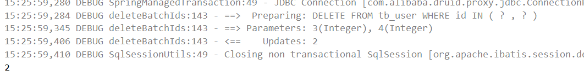


## 3、更新

### 3.1 updateById

#### 3.1.1 方法定义

```java
/**
 * 根据 ID 修改
 *
 * @param entity 实体对象
 */
int updateById(@Param(Constants.ENTITY) T entity);
```

#### 3.1.2 测试方法

```java
/**
 * 根据ID更新
 */
@Test
public void updateByIdTest() throws Exception {
    User user = new User();
    user.setId(7L);
    user.setName("更新");
    int row = userMapper.updateById(user);
    System.out.println(row);
}
```

#### 3.1.3 测试结果

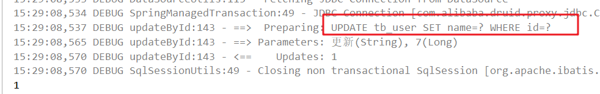

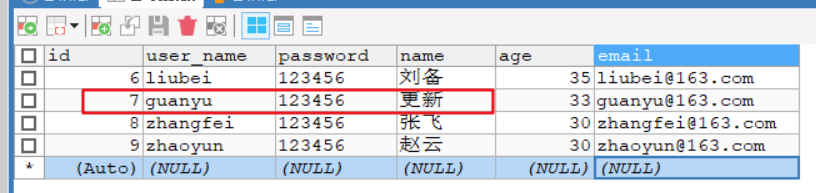


### 3.2 update

#### 3.2.1 方法定义

```java
/**
 * 根据 whereEntity 条件，更新记录
 *
 * @param entity        实体对象 (set 条件值,可以为 null)
 * @param updateWrapper 实体对象封装操作类（可以为 null,里面的 entity 用于生成 where 语句）
 */
int update(@Param(Constants.ENTITY) T entity, @Param(Constants.WRAPPER) Wrapper<T> updateWrapper);
```

#### 3.2.2 测试

##### 3.2.2.1 方式一

```java
/**
 * UpdateWrapper
 */
@Test
public void updateTest() throws Exception {
    UpdateWrapper<User> wrapper = new UpdateWrapper<>();
    wrapper.eq("id", 7L)
            .set("name", "update wrapper");
    int row = userMapper.update(null, wrapper);
    System.out.println(row);
}
```


##### 3.2.2.1 方式二

- 测试方法

```java
/**
 * QueryWrapper
 */
@Test
public void update2Test() throws Exception {
    User user = new User();
    user.setName("queryWrapper update");
    QueryWrapper<User> wrapper = new QueryWrapper<>();
    wrapper.eq("id", 7L);
    int row = userMapper.update(user, wrapper);
    System.out.println(row);
}
```


## 4、查询

> 因为查询的方法很多，可以重新创建一个测试类

### 4.1 selectById

#### 4.1.1 方法定义

```java
/**
 * 根据 ID 查询
 *
 * @param id 主键ID
 */
T selectById(Serializable id);
```

#### 4.1.2 测试方法

```java
/**
 * 根据ID查询
 * @throws Exception
 */
@Test
public void selectByIdTest() throws Exception {
    User user = userMapper.selectById(7L);
    System.out.println(user);
}
```

#### 4.1.3 测试结果

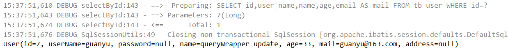


### 4.2 selectBatchIds

#### 4.2.1 方法定义

```java
/**
 * 查询（根据ID 批量查询）
 *
 * @param idList 主键ID列表(不能为 null 以及 empty)
 */
List<T> selectBatchIds(@Param(Constants.COLLECTION) Collection<? extends Serializable> idList);
```

#### 4.2.2 测试方法

```java
/**
 * 根据ID集合查询
 */
@Test
public void selectBatchIdsTest() throws Exception {
    List<User> userList = userMapper.selectBatchIds(Arrays.asList(1, 2, 3, 7, 8, 9));
    for (User user : userList) {
        System.out.println(user);
    }
}
```

#### 4.2.3 测试结果

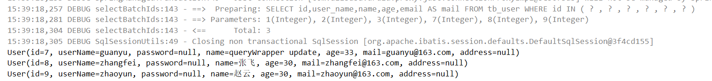


### 4.3 selectByMap

#### 4.3.1 方法定义

```java
/**
 * 查询（根据 columnMap 条件）
 *
 * @param columnMap 表字段 map 对象
 */
List<T> selectByMap(@Param(Constants.COLUMN_MAP) Map<String, Object> columnMap);
```

#### 4.3.2 测试方法

```java
/**
 * 查询（根据 columnMap 条件）
 */
@Test
public void selectByMapTest() throws Exception {
    Map<String, Object> map = new HashMap<>();
    map.put("user_name","guanyu");
    map.put("age",33);
    List<User> userList = userMapper.selectByMap(map);
    for (User user : userList) {
        System.out.println(user);
    }
}
```

#### 4.3.3 测试结果

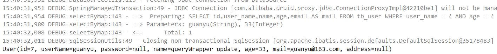


### 4.4 selectOne

#### 4.4.1 方法定义

```java
/**
 * 根据 entity 条件，查询一条记录
 *
 * @param queryWrapper 实体对象封装操作类（可以为 null）
 */
T selectOne(@Param(Constants.WRAPPER) Wrapper<T> queryWrapper);
```

#### 4.4.2 测试方法

```java
/**
 * 根据 entity 条件，查询一条记录
 */
@Test
public void selectOneTest() throws Exception {
    QueryWrapper<User> wrapper = new QueryWrapper<>();
    wrapper.eq("user_name","liubei");
    wrapper.eq("password","123456");
    User user = userMapper.selectOne(wrapper);
    System.out.println(user);
}
```

#### 4.4.3 测试结果

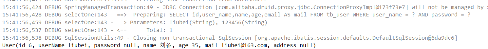


### 4.5 selectCount

#### 4.5.1 方法定义

```java
/**
 * 根据 Wrapper 条件，查询总记录数
 *
 * @param queryWrapper 实体对象封装操作类（可以为 null）
 */
Integer selectCount(@Param(Constants.WRAPPER) Wrapper<T> queryWrapper);
```

#### 4.5.2 测试方法

```java
/**
 * 根据 Wrapper 条件，查询总记录数
 */
@Test
public void selectCountTest() throws Exception {
    QueryWrapper<User> wrapper = new QueryWrapper<>();
    wrapper.eq("user_name","liubei");
    wrapper.eq("password","123456");
    int count = userMapper.selectCount(wrapper);
    System.out.println(count);
}
```

#### 4.5.3 测试结果

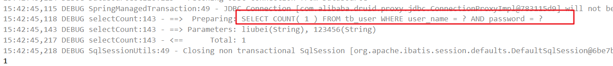


### 4.6 selectList

#### 4.6.1 方法定义

```java
/**
 * 根据 entity 条件，查询全部记录
 *
 * @param queryWrapper 实体对象封装操作类（可以为 null）
 */
List<T> selectList(@Param(Constants.WRAPPER) Wrapper<T> queryWrapper);
```

#### 4.6.2 测试方法

```java
/**
 * 根据 entity 条件，查询全部记录
 */
@Test
public void selectListTest() throws Exception {
    QueryWrapper<User> wrapper = new QueryWrapper<>();
    wrapper.ge("age","15");
    wrapper.like("email","163");
    List<User> userList = userMapper.selectList(wrapper);
    for (User user : userList) {
        System.out.println(user);
    }
}
```

#### 4.6.3 测试结果

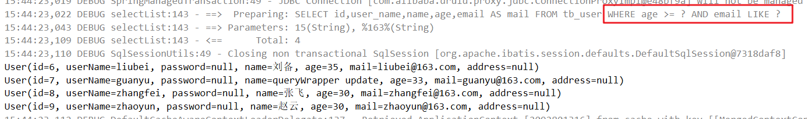


### 4.7 selectMaps

#### 4.7.1 方法定义

```java
/**
  * 根据 Wrapper 条件，查询全部记录
  *
  * @param queryWrapper 实体对象封装操作类（可以为 null）
  */
List<Map<String, Object>> selectMaps(@Param(Constants.WRAPPER) Wrapper<T> queryWrapper);
```

#### 4.7.2 测试方法

```java
/**
 * 根据 Wrapper 条件，查询全部记录
 * 结果封装成map
 */
@Test
public void selectMapsTest() throws Exception {

    QueryWrapper<User> wrapper = new QueryWrapper<>();
    wrapper.ge("age","15");
    wrapper.like("email","163");
    //返回结果，List中放的是map
    List<Map<String, Object>> maps = userMapper.selectMaps(wrapper);

    for (Map map : maps) {
        System.out.println(map);
    }
}
```

#### 4.7.3 测试结果

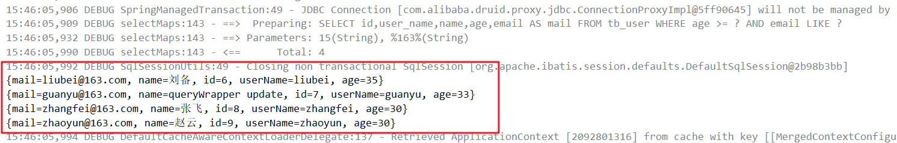


### 4.8 selectPage

> 该方法需要分页插件的支持，mybatis-plus已经有了分页插件的支持，只需要配置即可

#### 4.8.1 方法定义

```java
/**
 * 根据 entity 条件，查询全部记录（并翻页）
 *
 * @param page         分页查询条件（可以为 RowBounds.DEFAULT）
 * @param queryWrapper 实体对象封装操作类（可以为 null）
 */
IPage<T> selectPage(IPage<T> page, @Param(Constants.WRAPPER) Wrapper<T> queryWrapper);
```

#### 4.8.2 测试方法

`为了测试分页效果，提供一些测试的数据`

```sql
INSERT  INTO `tb_user`(`user_name`,`password`,`name`,`age`,`email`) VALUES ('AA','123456','aa',19,'aa@163.com');
INSERT  INTO `tb_user`(`user_name`,`password`,`name`,`age`,`email`) VALUES ('BB','123456','bb',29,'bb@163.com');
INSERT  INTO `tb_user`(`user_name`,`password`,`name`,`age`,`email`) VALUES ('CC','123456','cc',55,'cc@163.com');
INSERT  INTO `tb_user`(`user_name`,`password`,`name`,`age`,`email`) VALUES ('DD','123456','dd',34,'dd@163.com');
INSERT  INTO `tb_user`(`user_name`,`password`,`name`,`age`,`email`) VALUES ('EE','123456','ee',12,'ee@163.com');
INSERT  INTO `tb_user`(`user_name`,`password`,`name`,`age`,`email`) VALUES ('FF','123456','ff',39,'ff@163.com');
INSERT  INTO `tb_user`(`user_name`,`password`,`name`,`age`,`email`) VALUES ('GG','123456','gg',66,'gg@163.com');
INSERT  INTO `tb_user`(`user_name`,`password`,`name`,`age`,`email`) VALUES ('HH','123456','hh',22,'hh@163.com');
```


- 配置分页插件
  - 创建配置类MybatisPlusConfig

```java
package com.ghy.mp.config;

import com.baomidou.mybatisplus.extension.plugins.PaginationInterceptor;
import org.springframework.context.annotation.Bean;
import org.springframework.context.annotation.Configuration;

/**
 * mybatis-plus配置类
 * @author ghy
 * @version 1.0
 */
@Configuration
public class MybatisPlusConfig {

    /**
     * 分页插件
     * @return
     */
    @Bean
    public PaginationInterceptor paginationInterceptor(){
        return new PaginationInterceptor();
    }
    
}

```


```java
/**
 * 条件 + 分页
 */
@Test
public void testSelectPage() throws Exception {

    IPage<User> page = new Page<>();
    page.setCurrent(2);
    page.setSize(3);

    QueryWrapper<User> wrapper = new QueryWrapper<>();
    wrapper.le("age",50);

    IPage<User> result = userMapper.selectPage(page, wrapper);
    System.out.println("总条数:" + result.getTotal());
    System.out.println("总页数:" + result.getPages());
    System.out.println("当前页:" + result.getCurrent());
    System.out.println("每页结果条数:" + result.getSize());
    System.out.println("结果集:" + result.getRecords());
}
```

#### 4.8.3 测试结果

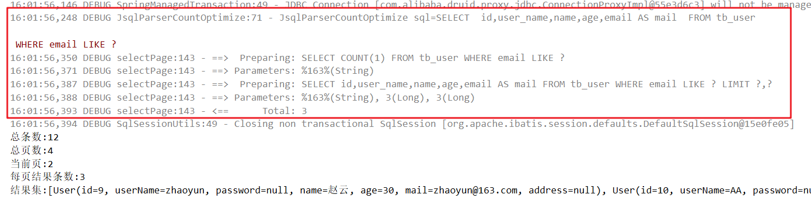


# 四、Mybatis-Plus的配置

在MP中有大量的配置，其中有一部分是Mybatis原生的配置，另一部分是MP的配置，详情：https://mybatis.plus/config/

下面我们对常用的配置做讲解

## 1、基本配置

### 1.1 configLocation

- 类型：`String`
- 默认值：`null`

MyBatis 配置文件位置，如果您有单独的 MyBatis 配置，请将其路径配置到 configLocation 中。 MyBatis Configuration 的具体内容请参考MyBatis 官方文档

#### 1.1.1 SpringBoot

application.yml

```yml
mybatis-plus:
  # mybatis全局配置文件
  config-location: classpath:mybatis-config.xml
```

mybatis-config.xml 增加分页插件

```xml
<?xml version="1.0" encoding="UTF-8" ?>
<!DOCTYPE configuration PUBLIC "-//mybatis.org//DTD Config 3.0//EN"
        "http://mybatis.org/dtd/mybatis-3-config.dtd">
<configuration>
    
    <plugins>
        <plugin interceptor="com.baomidou.mybatisplus.extension.plugins.PaginationInterceptor"></plugin>
    </plugins>
    
</configuration>
```

注释掉MybatisPlusConfig中分页的Bean配置 

```java
@Configuration
public class MybatisPlusConfig {

    /*@Bean
    public PaginationInterceptor paginationInterceptor(){
        return new PaginationInterceptor();
    }*/

}
```

测试分页方法即可 【testSelectPage】


#### 1.1.2 Spring

```xml
<bean id="sqlSessionFactory" class="com.baomidou.mybatisplus.extension.spring.MybatisSqlSessionFactoryBean">
    <property name="configLocation" value="classpath:mybatis-config.xml"/>
</bean>
```


### 1.2 mapperLocations

- 类型：`String[]`
- 默认值：`[]`

MyBatis Mapper 所对应的 XML 文件位置，如果您在 Mapper 中有自定义方法（XML 中有自定义实现），需要进行该配置，告诉 Mapper 所对应的 XML 文件位置。

#### 1.2.1 SpringBoot

application.yml

```yml
mybatis-plus:
  # mapper映射文件
  mapper-locations: classpath*:mapper/*Mapper.xml
```

mapper.xml

`resources目录下创建mapper/UserMapper.xml`

```xml
<?xml version="1.0" encoding="UTF-8" ?>
<!DOCTYPE mapper PUBLIC "-//mybatis.org//DTD Mapper 3.0//EN"
        "http://mybatis.org/dtd/mybatis-3-mapper.dtd">
<mapper namespace="com.qf.mybatisplus.springboot.mapper.UserMapper">
    <!-- List<User> findAll(); -->
    <select id="findAll" resultType="com.qf.mybatisplus.springboot.pojo.User">
        SELECT * FROM `tb_user`
    </select>
</mapper>
```

UserMapper.java

```java
public interface UserMapper extends BaseMapper<User> {
    List<User> findAll();
}
```

测试方法

```java
/**
  * 测试mapper.xml
  */
 @Test
 public void testFindAll() throws Exception {
     List<User> userList = userMapper.findAll();
     for (User user : userList) {
         System.out.println(user);
     }
 }
```


#### 1.2.2 Spring

```xml 
<bean id="sqlSessionFactory" class="com.baomidou.mybatisplus.extension.spring.MybatisSqlSessionFactoryBean">
    <property name="mapperLocations" value="classpath*:mapper/*.xml"/>
</bean>
```

Maven  多模块项目的扫描路径需以  classpath*: 开头 （即加载多个 jar 包下的 XML 文件）

`UserMapper.xml、UserMapper.java、测试方法跟SpringBoot项目一样`


### 1.3 typeAliasesPackage

- 类型：`String`
- 默认值：`null`

MyBaits 别名包扫描路径，通过该属性可以给包中的类注册别名，注册后在 Mapper 对应的 XML 文件中可以直接使用类名，而不用使用全限定的类名（即 XML 中调用的时候不用包含包名）。

#### 1.3.1 SpringBoot

application.yml

```yml
mybatis-plus:
  # 别名包扫描器【批量注册别名】
  type-aliases-package: com.qf.mybatisplus.springboot.pojo
```

UserMapper.xml

`resultType 使用别名`

```xml
<?xml version="1.0" encoding="UTF-8" ?>
<!DOCTYPE mapper PUBLIC "-//mybatis.org//DTD Mapper 3.0//EN"
        "http://mybatis.org/dtd/mybatis-3-mapper.dtd">
<mapper namespace="com.qf.mybatisplus.springboot.mapper.UserMapper">
    <!-- List<User> findAll(); -->
    <select id="findAll" resultType="User">
        SELECT * FROM `tb_user`
    </select>
</mapper>
```

测试 testFindAll 方法即可


#### 1.3.2 Spring

```xml 
<bean id="sqlSessionFactory" class="com.baomidou.mybatisplus.extension.spring.MybatisSqlSessionFactoryBean">
    <property name="typeAliasesPackage" value="com.qf.mybatisplus.springboot.pojo"/>
</bean>
```


## 2、进阶配置

本部分（Configuration）的配置大都为 MyBatis 原生支持的配置，这意味着您可以通过 MyBatis XML 配置文件的形式进行配置。

### 2.1 mapUnderscoreToCamelCase

- 类型：`boolean`
- 默认值：`true`

是否开启自动驼峰命名规则（camel case）映射，即从经典数据库列名 A_COLUMN（下划线命名） 到经典 Java 属性名 aColumn（驼峰命名） 的类似映射。

`注意:此属性在 MyBatis 中原默认值为 false，在 MyBatis-Plus 中，此属性也将用于生成最终的 SQL 的 select body，如果您的数据库命名符合规则无需使用 @TableField 注解指定数据库字段名`

#### 2.1.1 SpringBoot

```yml
mybatis-plus:
  # mybatis全局配置文件
  # config-location: classpath:mybatis-config.xml
  configuration:
    # 关闭自动驼峰映射，configuration参数不能和mybatis-plus.config-location同时存在，否则会报错
    map-underscore-to-camel-case: false
```

测试 testFindAll 方法，发现用户名属性没有被映射上

```properties
2020-03-03 10:01:44,809 3551   [           main] DEBUG a.mp.mapper.UserMapper.findAll  - ==>  Preparing: SELECT * FROM `tb_user` 
2020-03-03 10:01:44,837 3579   [           main] DEBUG a.mp.mapper.UserMapper.findAll  - ==> Parameters: 
2020-03-03 10:01:44,861 3603   [           main] DEBUG a.mp.mapper.UserMapper.findAll  - <==      Total: 10
2020-03-03 10:01:44,862 3604   [           main] DEBUG mybatis.spring.SqlSessionUtils  - Closing non transactional SqlSession [org.apache.ibatis.session.defaults.DefaultSqlSession@7a799159]
User(id=1, userName=null, password=123456, name=张三, age=18, mail=null, address=null)
User(id=7, userName=null, password=123456, name=update2, age=42, mail=null, address=null)
User(id=8, userName=null, password=123456, name=aa, age=19, mail=null, address=null)
User(id=9, userName=null, password=123456, name=bb, age=29, mail=null, address=null)
User(id=10, userName=null, password=123456, name=cc, age=55, mail=null, address=null)
User(id=11, userName=null, password=123456, name=dd, age=34, mail=null, address=null)
User(id=12, userName=null, password=123456, name=ee, age=12, mail=null, address=null)
User(id=13, userName=null, password=123456, name=ff, age=39, mail=null, address=null)
User(id=14, userName=null, password=123456, name=gg, age=66, mail=null, address=null)
User(id=15, userName=null, password=123456, name=hh, age=22, mail=null, address=null)
```


#### 2.1.2 Spring

```xml
<bean id="sqlSessionFactory" class="com.baomidou.mybatisplus.extension.spring.MybatisSqlSessionFactoryBean">
    <property name="dataSource" ref="dataSource"/>
    <!--<property name="configLocation" value="classpath:mybatis-config.xml"/>-->
    <property name="mapperLocations" value="classpath*:mapper/*.xml"/>
    <property name="typeAliasesPackage" value="com.ghy.mp.pojo"/>
    <property name="configuration" ref="mybatisConfiguration"></property>
</bean>

<bean id="mybatisConfiguration" class="com.baomidou.mybatisplus.core.MybatisConfiguration">
    <property name="mapUnderscoreToCamelCase" value="false"/>
</bean>
```


### 2.2 cacheEnabled

- 类型：`boolean`
- 默认值：`true`

全局地开启或关闭配置文件中的所有映射器已经配置的任何缓存

#### 2.2.1 SpringBoot

```yml
mybatis-plus:
  # mybatis全局配置文件
  # config-location: classpath:mybatis-config.xml
  configuration:
  	# 关闭缓存
    cache-enabled: false
```

#### 2.2.2 SpringMVC

```xml
<bean id="sqlSessionFactory" class="com.baomidou.mybatisplus.extension.spring.MybatisSqlSessionFactoryBean">
    <property name="dataSource" ref="dataSource"/>
    <!--<property name="configLocation" value="classpath:mybatis-config.xml"/>-->
    <property name="mapperLocations" value="classpath*:mapper/*.xml"/>
    <property name="typeAliasesPackage" value="com.ghy.mp.pojo"/>
    <property name="configuration" ref="mybatisConfiguration"></property>
</bean>

<bean id="mybatisConfiguration" class="com.baomidou.mybatisplus.core.MybatisConfiguration">
    <property name="cacheEnabled" value="false"/>
</bean>
```

`注意:实际开发中，一般都会开启驼峰命名映射和开启缓存，默认值为true,我们注释掉原先的配置即可`


## 3、DB策略配置

### 3.1 IdType

- 类型：`com.baomidou.mybatisplus.annotation.IdType`
- 默认值：`ID_WORKER`

全局默认主键类型，设置后，即可省略实体对象中的@TableId(type = IdType.AUTO)配置

#### 3.1.1 SpringBoot

```yml
mybatis-plus:
  global-config:
    db-config:
      # 主键生成策略
      id-type: auto
```

#### 3.1.2 SpringMVC

```xml
<!--这里使用MP提供的sqlSessionFactory，完成了Spring与MP的整合-->
<bean id="sqlSessionFactory" class="com.baomidou.mybatisplus.extension.spring.MybatisSqlSessionFactoryBean">
    <property name="globalConfig">
        <bean class="com.baomidou.mybatisplus.core.config.GlobalConfig">
            <property name="dbConfig">
                <bean class="com.baomidou.mybatisplus.core.config.GlobalConfig$DbConfig">
                    <!--主键生成策略-->
                    <property name="idType" value="AUTO"/>
                </bean>
            </property>
        </bean>
    </property>
</bean>
```


注释掉实体类ID属性上的主键生成策略注解，进行增加测试

```java
@Data
@NoArgsConstructor
@AllArgsConstructor
@Accessors(chain = true) //支持链式编程
@TableName("tb_user")
public class User {

    //@TableId(type= IdType.AUTO)
    private Long id;
    //...............

}

```

测试方法

```java
/**
 * 测试增加
 * insert()
 */
@Test
public void testInsert() throws Exception {
    User user = new User().setUserName("zhaoyun").setPassword("123456")
            .setName("赵云").setAge(25).setMail("zhaoyun@163.com");
    int row = userMapper.insert(user);//返回影响行数
    System.out.println(row);
    System.out.println(user.getId());//获取插入记录的主键ID值
}
```

测试结果

```properties
2020-03-03 10:26:46,871 3543   [           main] DEBUG ma.mp.mapper.UserMapper.insert  - ==>  Preparing: INSERT INTO tb_user ( user_name, password, name, age, email ) VALUES ( ?, ?, ?, ?, ? ) 
2020-03-03 10:26:46,906 3578   [           main] DEBUG ma.mp.mapper.UserMapper.insert  - ==> Parameters: zhaoyun(String), 123456(String), 赵云(String), 25(Integer), zhaoyun@163.com(String)
2020-03-03 10:26:46,916 3588   [           main] DEBUG ma.mp.mapper.UserMapper.insert  - <==    Updates: 1
2020-03-03 10:26:46,924 3596   [           main] DEBUG mybatis.spring.SqlSessionUtils  - Closing non transactional SqlSession [org.apache.ibatis.session.defaults.DefaultSqlSession@5dc3fcb7]
1
16
```


### 3.2 tablePrefix

- 类型：`String`
- 默认值：`null`

表名前缀，全局配置后可省略 @TableName()配置

#### 3.2.1 SpringBoot

```yml
mybatis-plus:
  global-config:
    db-config:
      # 表名前缀
      table-prefix: tb_
```

#### 3.2.2 Spring

```xml
<!--这里使用MP提供的sqlSessionFactory，完成了Spring与MP的整合-->
<bean id="sqlSessionFactory" class="com.baomidou.mybatisplus.extension.spring.MybatisSqlSessionFactoryBean">
    <property name="globalConfig">
        <bean class="com.baomidou.mybatisplus.core.config.GlobalConfig">
            <property name="dbConfig">
                <bean class="com.baomidou.mybatisplus.core.config.GlobalConfig$DbConfig">
                    <!--表名前缀-->
                    <property name="tablePrefix" value="tb_"/>
                </bean>
            </property>
        </bean>
    </property>
</bean>
```


注释掉实体类上的映射表名注解

```java
@Data
@NoArgsConstructor
@AllArgsConstructor
//@TableName("tb_user")
public class User {
	//...............

}

```

测试查询方法即可


# 五、条件构造器

在MP中，Wrapper接口的实现类关系如下：

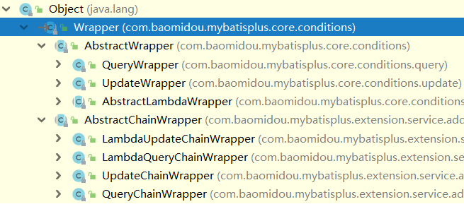

> 可以看到， AbstractWrapper和AbstractChainWrapper是重点实现，接下来我们重点学习AbstractWrapper以及其子类。

> 说明:QueryWrapper(LambdaQueryWrapper) 和 UpdateWrapper(LambdaUpdateWrapper) 的父类 用于生成 sql的 where 条件, entity 属性也用于生成 sql 的 where 条件。注意: entity 生成的 where 条件与使用各个 api 生成的 where 条件没有任何关联行为
>
> 官网文档地址： https://mybatis.plus/guide/wrapper.htm


## 1、allEq

### 1.1 说明

```java
allEq (Map<R, V> params)
allEq(Map<R, V> params, boolean null2IsNull)
allEq(boolean condition, Map<R, V> params, boolean null2IsNull)
```

- 全部eq(或个别isNull )

``` java
个别参数说明
	params :  key 为数据库字段名, value 为字段值  
	null2IsNull : 为 true，则在 map 的 value 为 null 时调用 isNull 方法,
			为 false 时则忽略 value 为 null 的
			
	例 1:  allEq({id:1,name:"老王",age:null}) 
		---> id = 1 and name = '老王' and age is null
	例 2:  allEq({id:1,name:"老王",age:null}, false) 
		---> id = 1 and name = ' 老王'
```


### 1.2 测试

- SQL

`增加一条测试记录`

```sql
INSERT  INTO `tb_user`(`user_name`,`password`,`name`,`age`) VALUES ('caocao','123456','曹操',45);
```

- 测试方法

  `复制一个测试类`

```java
package com.ghy.mp;

import com.baomidou.mybatisplus.core.conditions.query.QueryWrapper;
import com.baomidou.mybatisplus.core.conditions.update.UpdateWrapper;
import com.baomidou.mybatisplus.core.metadata.IPage;
import com.baomidou.mybatisplus.extension.plugins.pagination.Page;
import com.ghy.mp.mapper.UserMapper;
import com.ghy.mp.pojo.User;
import org.junit.Test;
import org.junit.runner.RunWith;
import org.springframework.beans.factory.annotation.Autowired;
import org.springframework.boot.test.context.SpringBootTest;
import org.springframework.test.context.junit4.SpringRunner;

import java.util.Arrays;
import java.util.HashMap;
import java.util.List;
import java.util.Map;

@SpringBootTest
public class MybatisPlusApplicationSelectTest {

    @Autowired
    private UserMapper userMapper;

    /**
     * 测试 allEq
     */
    @Test
    public void testSelectList() throws Exception {
        QueryWrapper<User> wrapper = new QueryWrapper<>();
        Map<String, Object> map = new HashMap<>();
        map.put("user_name","caocao");
        map.put("age",45);
        map.put("email",null);

        //SELECT id,user_name,name,age,email AS mail FROM tb_user WHERE user_name = ? AND age = ? AND email IS NULL
        wrapper.allEq(map);

        //SELECT id,user_name,name,age,email AS mail FROM tb_user WHERE user_name = ? AND age = ?
        //wrapper.allEq(map,false);

        List<User> userList = userMapper.selectList(wrapper);
        for (User user : userList) {
            System.out.println(user);
        }
    }

}
```


## 2、基本比较操作

### 2.1 说明

- eq 【等于 =】
- ne【不等于 !=】
- gt【大于 >】
- ge【大于等于 >=】
- lt【小于 <】
- le 【小于等于 <=】
- between【BETWEEN 值1 AND 值2】
- notBetween【NOT BETWEEN 值1 AND 值2】
- in【字段 IN value1, value2】
- notIn【字段 NOT IN value1, value2】

### 2.2 测试

- 测试方法

```java
/**
 * 测试 比较操作
 */
@Test
public void test() throws Exception {
    QueryWrapper<User> wrapper = new QueryWrapper<>();
    wrapper.eq("password","123456");
    wrapper.ge("age",20);
    wrapper.in("id",10,11,12,13);
    List<User> userList = userMapper.selectList(wrapper);
    for (User user : userList) {
        System.out.println(user);
    }
}
```

- 结果

```properties
2020-03-03 15:39:30,370 3793   [           main] DEBUG p.mapper.UserMapper.selectList  - ==>  Preparing: SELECT id,user_name,name,age,email AS mail FROM tb_user WHERE password = ? AND age >= ? AND id IN (?,?,?,?) 
2020-03-03 15:39:30,416 3839   [           main] DEBUG p.mapper.UserMapper.selectList  - ==> Parameters: 123456(String), 20(Integer), 10(Integer), 11(Integer), 12(Integer), 13(Integer)
2020-03-03 15:39:30,436 3859   [           main] DEBUG p.mapper.UserMapper.selectList  - <==      Total: 3
2020-03-03 15:39:30,436 3859   [           main] DEBUG mybatis.spring.SqlSessionUtils  - Closing non transactional SqlSession [org.apache.ibatis.session.defaults.DefaultSqlSession@5bfc257]
User(id=10, userName=CC, password=null, name=cc, age=55, mail=cc@163.com, address=null)
User(id=11, userName=DD, password=null, name=dd, age=34, mail=dd@163.com, address=null)
User(id=13, userName=FF, password=null, name=ff, age=39, mail=ff@163.com, address=null)
```


## 3、模糊查询

### 3.1 说明

- like【 like '%值%'】
- notLike【 not like '%值%'】
- likeLeft【 like '%值'】
- likeRight【 like '值%'】

### 3.2 测试

- 测试方法

```java
/**
 * 测试 模糊查询
 */
@Test
public void testLike() throws Exception {
    QueryWrapper<User> wrapper = new QueryWrapper<>();
    wrapper.like("user_name","a");
    wrapper.likeLeft("email","163.com");
    List<User> userList = userMapper.selectList(wrapper);
    for (User user : userList) {
        System.out.println(user);
    }
}
```

- 结果

```properties
2020-03-03 15:45:41,064 3497   [           main] DEBUG p.mapper.UserMapper.selectList  - ==>  Preparing: SELECT id,user_name,name,age,email AS mail FROM tb_user WHERE user_name LIKE ? AND email LIKE ? 
2020-03-03 15:45:41,092 3525   [           main] DEBUG p.mapper.UserMapper.selectList  - ==> Parameters: %a%(String), %163.com(String)
2020-03-03 15:45:41,110 3543   [           main] DEBUG p.mapper.UserMapper.selectList  - <==      Total: 4
2020-03-03 15:45:41,110 3543   [           main] DEBUG mybatis.spring.SqlSessionUtils  - Closing non transactional SqlSession [org.apache.ibatis.session.defaults.DefaultSqlSession@34523d46]
User(id=1, userName=zhangsan, password=null, name=张三, age=18, mail=test1@163.com, address=null)
User(id=7, userName=update_name, password=null, name=update2, age=42, mail=zhangfei@163.com, address=null)
User(id=8, userName=AA, password=null, name=aa, age=19, mail=aa@163.com, address=null)
User(id=16, userName=zhaoyun, password=null, name=赵云, age=25, mail=zhaoyun@163.com, address=null)
```


## 4、排序

### 4.1 说明

```
orderBy(boolean condition, boolean isAsc, R... columns)  //指定是否排序，是升序还是降序
orderByAsc(R... columns)  //升序
orderByDesc(R... columns)  //降序
```

```
个别参数说明
	condition :  是否排序
	isAsc : 是否升序
```


### 4.2 测试

- 测试方法

```java
/**
 * 测试 排序
 */
@Test
public void testOrder() throws Exception {
    QueryWrapper<User> wrapper = new QueryWrapper<>();
    //SELECT id,user_name,name,age,email AS mail FROM tb_user ORDER BY age ASC
    //wrapper.orderBy(true, true, "age");

    //SELECT id,user_name,name,age,email AS mail FROM tb_user
    //wrapper.orderBy(false, true, "age");

    //SELECT id,user_name,name,age,email AS mail FROM tb_user ORDER BY age ASC
    //wrapper.orderByAsc("age");

    //SELECT id,user_name,name,age,email AS mail FROM tb_user ORDER BY age DESC
    wrapper.orderByDesc("age");

    List<User> userList = userMapper.selectList(wrapper);
    for (User user : userList) {
        System.out.println(user);
    }
}
```


## 5、逻辑查询

### 5.1 说明

- and【并且，多条件默认为and】
- or【或者，主动调用 or 表示紧接着下一个方法不是用 and 连接!(不调用 or 则默认为使用 and 连接)】

### 5.2 测试

- 方法

```java
/**
 * 测试 Or
 */
@Test
public void testOr() throws Exception {
    QueryWrapper<User> wrapper = new QueryWrapper<>();
    wrapper.like("email","qf");
    wrapper.or().between("age",10,30);
    List<User> userList = userMapper.selectList(wrapper);
    for (User user : userList) {
        System.out.println(user);
    }
}
```

- 结果

```properties
2020-03-03 16:10:13,879 3761   [           main] DEBUG p.mapper.UserMapper.selectList  - ==>  Preparing: SELECT id,user_name,name,age,email AS mail FROM tb_user WHERE email LIKE ? OR age BETWEEN ? AND ? 
2020-03-03 16:10:13,909 3791   [           main] DEBUG p.mapper.UserMapper.selectList  - ==> Parameters: %qf%(String), 10(Integer), 30(Integer)
2020-03-03 16:10:13,930 3812   [           main] DEBUG p.mapper.UserMapper.selectList  - <==      Total: 11
2020-03-03 16:10:13,930 3812   [           main] DEBUG mybatis.spring.SqlSessionUtils  - Closing non transactional SqlSession [org.apache.ibatis.session.defaults.DefaultSqlSession@3af356f]
User(id=1, userName=zhangsan, password=null, name=张三, age=18, mail=test1@163.com, address=null)
User(id=7, userName=update_name, password=null, name=update2, age=42, mail=zhangfei@163.com, address=null)
User(id=8, userName=AA, password=null, name=aa, age=19, mail=aa@163.com, address=null)
User(id=9, userName=BB, password=null, name=bb, age=29, mail=bb@163.com, address=null)
User(id=10, userName=CC, password=null, name=cc, age=55, mail=cc@163.com, address=null)
User(id=11, userName=DD, password=null, name=dd, age=34, mail=dd@163.com, address=null)
User(id=12, userName=EE, password=null, name=ee, age=12, mail=ee@163.com, address=null)
User(id=13, userName=FF, password=null, name=ff, age=39, mail=ff@163.com, address=null)
User(id=14, userName=GG, password=null, name=gg, age=66, mail=gg@163.com, address=null)
User(id=15, userName=HH, password=null, name=hh, age=22, mail=hh@163.com, address=null)
User(id=16, userName=zhaoyun, password=null, name=赵云, age=25, mail=zhaoyun@163.com, address=null)
```


## 6、select

在MP查询中，默认查询所有的字段，如果有需要也可以通过select方法进行指定字段。

### 6.1 说明

使用 select 指定查询字段

```java
select(String... columns)
```

### 6.2 测试

- 方法

```java
/**
 * 测试 select
 */
@Test
public void testSelect() throws Exception {
    QueryWrapper<User> wrapper = new QueryWrapper<>();
    wrapper.like("email","qf");
    wrapper.or().between("age",10,30);
    wrapper.select("id","email","age");
    List<User> userList = userMapper.selectList(wrapper);
    for (User user : userList) {
        System.out.println(user);
    }
}
```

- 结果

```properties
2020-03-03 16:14:26,838 4044   [           main] DEBUG p.mapper.UserMapper.selectList  - ==>  Preparing: SELECT id,email,age FROM tb_user WHERE email LIKE ? OR age BETWEEN ? AND ? 
2020-03-03 16:14:26,869 4075   [           main] DEBUG p.mapper.UserMapper.selectList  - ==> Parameters: %qf%(String), 10(Integer), 30(Integer)
2020-03-03 16:14:26,897 4103   [           main] DEBUG p.mapper.UserMapper.selectList  - <==      Total: 11
2020-03-03 16:14:26,897 4103   [           main] DEBUG mybatis.spring.SqlSessionUtils  - Closing non transactional SqlSession [org.apache.ibatis.session.defaults.DefaultSqlSession@7e46d648]
User(id=1, userName=null, password=null, name=null, age=18, mail=null, address=null)
User(id=7, userName=null, password=null, name=null, age=42, mail=null, address=null)
User(id=8, userName=null, password=null, name=null, age=19, mail=null, address=null)
User(id=9, userName=null, password=null, name=null, age=29, mail=null, address=null)
User(id=10, userName=null, password=null, name=null, age=55, mail=null, address=null)
User(id=11, userName=null, password=null, name=null, age=34, mail=null, address=null)
User(id=12, userName=null, password=null, name=null, age=12, mail=null, address=null)
User(id=13, userName=null, password=null, name=null, age=39, mail=null, address=null)
User(id=14, userName=null, password=null, name=null, age=66, mail=null, address=null)
User(id=15, userName=null, password=null, name=null, age=22, mail=null, address=null)
User(id=16, userName=null, password=null, name=null, age=25, mail=null, address=null)
```


#  六、Sql注入器

## 1、SQL注入的原理

```
前面我们已经知道，MP在启动后会将BaseMapper中的一系列的方法注册到meppedStatements中，那么究竟是如
何注入的呢？流程又是怎么样的？下面我们将一起来分析下。
```

在MP中，ISqlInjector负责SQL的注入工作，它是一个接口，AbstractSqlInjector是它的实现类。


在 AbstractSqlInjector中，主要是由inspectInject()方法进行注入的，如下

```java
@Override
public void inspectInject(MapperBuilderAssistant builderAssistant, Class<?> mapperClass) {
	Class<?> modelClass = extractModelClass(mapperClass);
	if (modelClass != null) {
		String className = mapperClass.toString();
		Set<String> mapperRegistryCache = GlobalConfigUtils.getMapperRegistryCache(builderAssistant.getConfiguration());
		if (!mapperRegistryCache.contains(className)) {
			List<AbstractMethod> methodList = this.getMethodList();
			if (CollectionUtils.isNotEmpty(methodList)) {
				TableInfo tableInfo = TableInfoHelper.initTableInfo(builderAssistant, modelClass);
				// 循环注入自定义方法
				methodList.forEach(m -> m.inject(builderAssistant, mapperClass, modelClass, tableInfo));
			} else {
				logger.debug(mapperClass.toString() + ", No effective injection method was found.");
			}
			mapperRegistryCache.add(className);
		}
	}
}
```

在实现方法中，

`methodList.forEach(m -> m.inject(builderAssistant, mapperClass, modelClass,tableInfo)); `

是关键，循环遍历方法，进行注入。最终调用抽象方法injectMappedStatement进行真正的注入：

```java
/**
     * 注入自定义方法
     */
    public void inject(MapperBuilderAssistant builderAssistant, Class<?> mapperClass, Class<?> modelClass, TableInfo tableInfo) {
        this.configuration = builderAssistant.getConfiguration();
        this.builderAssistant = builderAssistant;
        this.languageDriver = configuration.getDefaultScriptingLanguageInstance();
        /* 注入自定义方法 */
        injectMappedStatement(mapperClass, modelClass, tableInfo);
    }
```

```java
/**
 * 注入自定义 MappedStatement
 *
 * @param mapperClass mapper 接口
 * @param modelClass  mapper 泛型
 * @param tableInfo   数据库表反射信息
 * @return MappedStatement
 */
public abstract MappedStatement injectMappedStatement(Class<?> mapperClass, Class<?> modelClass, TableInfo tableInfo);
```

查看该方法的实现


以 SelectById为例查看

```java
package com.baomidou.mybatisplus.core.injector.methods;

import com.baomidou.mybatisplus.core.enums.SqlMethod;
import com.baomidou.mybatisplus.core.injector.AbstractMethod;
import com.baomidou.mybatisplus.core.metadata.TableInfo;
import org.apache.ibatis.mapping.MappedStatement;
import org.apache.ibatis.mapping.SqlSource;
import org.apache.ibatis.scripting.defaults.RawSqlSource;

/**
 * 根据ID 查询一条数据
 *
 * @author 
 * @since 2018-04-06
 */
public class SelectById extends AbstractMethod {

    @Override
    public MappedStatement injectMappedStatement(Class<?> mapperClass, Class<?> modelClass, TableInfo tableInfo) {
        SqlMethod sqlMethod = SqlMethod.LOGIC_SELECT_BY_ID;
        SqlSource sqlSource = new RawSqlSource(configuration, String.format(sqlMethod.getSql(),
            sqlSelectColumns(tableInfo, false),
            tableInfo.getTableName(), tableInfo.getKeyColumn(), tableInfo.getKeyProperty(),
            tableInfo.getLogicDeleteSql(true, false)), Object.class);
        return this.addSelectMappedStatement(mapperClass, sqlMethod.getMethod(), sqlSource, modelClass, tableInfo);
    }
}
```

可以看到，生成了SqlSource对象，再将SQL通过addSelectMappedStatement方法添加到meppedStatements中。


## 2、自定义SQL注入器

`自己编写一个SQL注入器，实现查询所有功能，方法名为queryAll`

### 2.1 编写MyBaseMapper

> 作用：扩展BaseMapper接口，提供更多的方法（自定义方法），后期自己的Mapper就可以继承MyBaseMapper

```java
package com.ghy.mp.mapper;

import com.baomidou.mybatisplus.core.mapper.BaseMapper;

import java.util.List;

/**
 * @Company www.ghy.com
 * @Author ghy
 */
public interface MyBaseMapper<T> extends BaseMapper<T> {

    List<T> queryAll();

}
```

2.2 让UserMapper继承MyBaseMapper

```java
public interface UserMapper extends MyBaseMapper<User> {
}
```


### 2.2 编写MySqlInjector

如果直接继承AbstractSqlInjector的话，原有的BaseMapper中的方法将失效，所以我们选择继承DefaultSqlInjector进行扩展。

```java
package com.ghy.mp.sqlinjector;

import com.baomidou.mybatisplus.core.injector.AbstractMethod;
import com.baomidou.mybatisplus.core.injector.DefaultSqlInjector;

import java.util.ArrayList;
import java.util.List;

/**
 * @Company www.ghy.com
 * @Author ghy
 */
public class MySqlInjector extends DefaultSqlInjector {

    @Override
    public List<AbstractMethod> getMethodList() {
        //所有要注入的方法的集合
        List<AbstractMethod> methods = new ArrayList<>();
        //调用父类方法，获取BaseMapper中的方法
        methods.addAll(super.getMethodList());
        //把自定义的SQL所对应的方法增加到集合中
        methods.add(new QueryAll());
        
        return methods;
    }

}

```

### 2.3 编写QueryAll

```java
package com.ghy.mp.sqlinjector;

import com.baomidou.mybatisplus.core.injector.AbstractMethod;
import com.baomidou.mybatisplus.core.metadata.TableInfo;
import org.apache.ibatis.mapping.MappedStatement;
import org.apache.ibatis.mapping.SqlSource;

/**
 * @Company www.ghy.com
 * @Author ghy
 */
public class QueryAll extends AbstractMethod {

    /**
     * 生成SQL,并增加到 mappedStatements 中
     * @param mapperClass
     * @param modelClass
     * @param tableInfo
     * @return
     */
    @Override
    public MappedStatement injectMappedStatement(Class<?> mapperClass, Class<?> modelClass, TableInfo tableInfo) {
        String sqlMethod = "queryAll";
        String sql = "select * from " + tableInfo.getTableName();
        SqlSource sqlSource = languageDriver.createSqlSource(configuration, sql, modelClass);
        return this.addSelectMappedStatement(mapperClass, sqlMethod, sqlSource, modelClass, tableInfo);
    }
}

```

### 2.4 把MySqlInjector注册到Spring容器

```java
package com.ghy.mp.config;


import com.baomidou.mybatisplus.extension.plugins.PaginationInterceptor;
import com.ghy.mp.sqlinjector.MySqlInjector;
import org.springframework.context.annotation.Bean;
import org.springframework.context.annotation.Configuration;

/**
 * mybatis-plus 插件的配置类
 * @Company www.ghy.com
 * @Author ghy
 */
@Configuration
public class MybatisPlusConfig {

    /*@Bean
    public PaginationInterceptor paginationInterceptor(){
        return new PaginationInterceptor();
    }*/

    /**
     * 把自定义SQL注入器注册到Spring容器中
     * @return
     */
    @Bean
    public MySqlInjector mySqlInjector(){
        return new MySqlInjector();
    }

}

```

### 2.5 测试

```java
/**
 * 测试自定义SQL注入器
 */
@Test
public void testQueryAll() throws Exception {
    List<User> userList = userMapper.queryAll();
    for (User user : userList) {
        System.out.println(user);
    }
}
```

成功之后，请测试BaseMapper、UserMapper中的方法，均可以成功

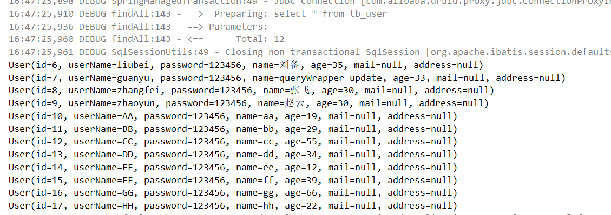


# 七、插件

MyBatis 允许你在已映射语句执行过程中的某一点进行拦截调用。其实插件的原理就是拦截器

```java
默认情况下，MyBatis 允许使用插件来拦截的方法调用包括：
	1、Executor (update, query, flushStatements, commit, rollback, 
                getTransaction, close, isClosed);
	2、ParameterHandler (getParameterObject, setParameters);
	3、ResultSetHandler (handleResultSets, handleOutputParameters);
	4、StatementHandler (prepare, parameterize, batch, update, query);
```

我们看到了可以拦截Executor接口的部分方法，比如update，query，commit，rollback等方法，还有其他接口的一些方法等。

```
总体概括为：
	1. 拦截执行器的方法
	2. 拦截参数的处理
	3. 拦截结果集的处理
	4. 拦截Sql语法构建的处理
```


## 1、自定义拦截器

### 1.1 编写拦截器类

```java
package com.ghy.mp.plugins;


import org.apache.ibatis.executor.Executor;
import org.apache.ibatis.mapping.MappedStatement;
import org.apache.ibatis.plugin.*;

import java.util.Properties;

/**
 * @Company www.ghy.com
 * @Author ghy
 */
@Intercepts({@Signature(
        type= Executor.class,
        method = "update",
        args = {MappedStatement.class,Object.class})})
public class MyInterceptor implements Interceptor {
    /**
     * 拦截方法，具体业务逻辑编写的位置
     * @param invocation
     * @return
     * @throws Throwable
     */
    @Override
    public Object intercept(Invocation invocation) throws Throwable {
        //在这里，编写拦截业务逻辑
        System.out.println("MyInterceptor intercept ...");
        //放行，执行后续方法
        return invocation.proceed();
    }

    @Override
    public Object plugin(Object target) {
        ////创建target对象的代理对象,目的是将当前拦截器加入到该对象中
        System.out.println("MyInterceptor plugin ...");
        return Plugin.wrap(target, this);
    }

    @Override
    public void setProperties(Properties properties) {
        //属性设置
        System.out.println("MyInterceptor setProperties ...");
    }
}

```

### 1.2 注册拦截器到Spring容器

```java
package com.ghy.mp.config;


import com.baomidou.mybatisplus.extension.plugins.PaginationInterceptor;
import com.ghy.mp.interceptor.MyInterceptor;
import com.ghy.mp.sqlinjector.MySqlInjector;
import org.springframework.context.annotation.Bean;
import org.springframework.context.annotation.Configuration;

/**
 * mybatis-plus 插件的配置类
 * @Company www.ghy.com
 * @Author ghy
 */
@Configuration
public class MybatisPlusConfig {

    /**
     * 注册拦截器
     * @return
     */
    @Bean
    public MyInterceptor myInterceptor(){
        return new MyInterceptor();
    }

}
```

1.3 测试

- 执行selectById方法
  - 发现只是执行了 plugin() 方法，并没有执行拦截方法。

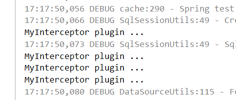

- 执行update方法

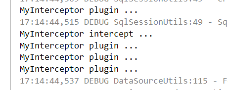

> 发现执行了拦截器拦截方法


## 2、执行分析插件

```
在MP中提供了对SQL执行的分析的插件，可用作阻断全表更新、删除的操作。注意：该插件仅适用于开发环境，不适用于生产环境。【性能问题】
```

### 2.1 注册Bean

```java
package com.ghy.mp.config;

import com.baomidou.mybatisplus.core.parser.ISqlParser;
import com.baomidou.mybatisplus.extension.parsers.BlockAttackSqlParser;
import com.baomidou.mybatisplus.extension.plugins.PaginationInterceptor;
import com.baomidou.mybatisplus.extension.plugins.SqlExplainInterceptor;
import com.ghy.mp.interceptor.MyInterceptor;
import com.ghy.mp.sqlinjector.MySqlInjector;
import org.springframework.context.annotation.Bean;
import org.springframework.context.annotation.Configuration;

import java.util.ArrayList;
import java.util.List;

/**
 * mybatis-plus 插件的配置类
 *
 * @Company www.ghy.com
 * @Author ghy
 */
@Configuration
public class MybatisPlusConfig {

    /**
     * 注册执行分析插件Bean
     * @return
     */
    @Bean
    public SqlExplainInterceptor sqlExplainInterceptor() {
        SqlExplainInterceptor sqlExplainInterceptor = new SqlExplainInterceptor();
        List<ISqlParser> sqlParserList = new ArrayList<>();
        // 攻击 SQL 阻断解析器、加入解析链
        sqlParserList.add(new BlockAttackSqlParser());
        sqlExplainInterceptor.setSqlParserList(sqlParserList);
        return sqlExplainInterceptor;
    }

}

```

从源码中可以看到 `防止全表更新与删除`

```java
package com.baomidou.mybatisplus.extension.parsers;

import com.baomidou.mybatisplus.core.parser.AbstractJsqlParser;
import com.baomidou.mybatisplus.core.toolkit.Assert;
import net.sf.jsqlparser.statement.delete.Delete;
import net.sf.jsqlparser.statement.insert.Insert;
import net.sf.jsqlparser.statement.select.SelectBody;
import net.sf.jsqlparser.statement.update.Update;

/**
 * 攻击 SQL 阻断解析器
 *
 * @author 
 * @since 
 */
public class BlockAttackSqlParser extends AbstractJsqlParser {

    @Override
    public void processInsert(Insert insert) {
        // to do nothing
    }
	//阻断删除
    @Override
    public void processDelete(Delete delete) {
        Assert.notNull(delete.getWhere(), "Prohibition of full table deletion");
    }
	//阻断更新
    @Override
    public void processUpdate(Update update) {
        Assert.notNull(update.getWhere(), "Prohibition of table update operation");
    }

    @Override
    public void processSelectBody(SelectBody selectBody) {
        // to do nothing
    }
}

```


### 2.2 测试

执行全表更新，发现阻止SQL执行

```java
/**
 * 全表更新，测试执行分析插件
 */
@Test
public void testUpdateAll() throws Exception {
    User user = new User().setUserName("Lily");
    int row = userMapper.update(user, null);
    System.out.println(row);
}
```

结果

```properties
Caused by: com.baomidou.mybatisplus.core.exceptions.MybatisPlusException: Prohibition of table update operation
	at com.baomidou.mybatisplus.core.toolkit.ExceptionUtils.mpe(ExceptionUtils.java:49)
	at com.baomidou.mybatisplus.core.toolkit.Assert.isTrue(Assert.java:38)
	at com.baomidou.mybatisplus.core.toolkit.Assert.notNull(Assert.java:72)
	at com.baomidou.mybatisplus.extension.parsers.BlockAttackSqlParser.processUpdate(BlockAttackSqlParser.java:45)
	at com.baomidou.mybatisplus.core.parser.AbstractJsqlParser.processParser(AbstractJsqlParser.java:92)
	at com.baomidou.mybatisplus.core.parser.AbstractJsqlParser.parser(AbstractJsqlParser.java:67)
	at com.baomidou.mybatisplus.extension.handlers.AbstractSqlParserHandler.sqlParser(AbstractSqlParserHandler.java:76)
	at com.baomidou.mybatisplus.extension.plugins.SqlExplainInterceptor.intercept(SqlExplainInterceptor.java:63)
	at org.apache.ibatis.plugin.Plugin.invoke(Plugin.java:61)
	at com.sun.proxy.$Proxy68.update(Unknown Source)
	at org.apache.ibatis.session.defaults.DefaultSqlSession.update(DefaultSqlSession.java:197)
	... 41 more
```

可以看到，当执行全表更新时，会抛出异常，这样有效防止了一些误操作


## 3、性能分析插件

```
性能分析拦截器，用于输出每条 SQL 语句及其执行时间，可以设置最大执行时间，超过时间会抛出异常。注意：该插件仅适用于开发环境，不适用于生产环境。【性能问题】
```

### 1.1 配置

mybatis-config.xml

```xml
<?xml version="1.0" encoding="UTF-8" ?>
<!DOCTYPE configuration PUBLIC "-//mybatis.org//DTD Config 3.0//EN"
        "http://mybatis.org/dtd/mybatis-3-config.dtd">
<configuration>
    
    <plugins>
        <plugin interceptor="com.baomidou.mybatisplus.extension.plugins.PerformanceInterceptor">
            <!-- 限制SQL的最大执行时间，毫秒为单位，若超出，则报错，可以判断是否需要进行SQL优化 -->
            <property name="maxTime" value="100"/>
            <!--SQL是否格式化 默认false-->
            <property name="format" value="true"/>
        </plugin>
    </plugins>
    
</configuration>
```

测试 selectById 【前面在application.yml中注释了mybatis-config的配置，请松开】

```properties
2020-03-03 20:52:22,717 3412   [           main] DEBUG p.mapper.UserMapper.selectById  - ==>  Preparing: SELECT id,user_name,name,age,email AS mail,deleted FROM tb_user WHERE id=? 
2020-03-03 20:52:22,753 3448   [           main] DEBUG p.mapper.UserMapper.selectById  - ==> Parameters: 1(Integer)
2020-03-03 20:52:22,769 3464   [           main] DEBUG p.mapper.UserMapper.selectById  - <==      Total: 1
2020-03-03 20:52:22,772 3467   [           main] DEBUG mybatis.spring.SqlSessionUtils  - Closing non transactional SqlSession [org.apache.ibatis.session.defaults.DefaultSqlSession@6d3c232f] Time：18 ms - ID：com.ghy.mp.mapper.UserMapper.selectById

Execute SQL：
    SELECT
        id,
        user_name,
        name,
        age,
        email AS mail,
        deleted 
    FROM
        tb_user 
    WHERE
        id=1 

User(id=1, userName=Lucy, password=null, name=张三, age=18, mail=test1@163.com, address=null, deleted=0)
```

`可以看到，执行时间为18ms。如果将maxTime设置为1，那么，该操作会抛出异常。`

```properties
Caused by: com.baomidou.mybatisplus.core.exceptions.MybatisPlusException:  The SQL execution time is too large, please optimize ! 
	at com.baomidou.mybatisplus.core.toolkit.ExceptionUtils.mpe(ExceptionUtils.java:49)
	at com.baomidou.mybatisplus.core.toolkit.Assert.isTrue(Assert.java:38)
	at com.baomidou.mybatisplus.core.toolkit.Assert.isFalse(Assert.java:50)
	at com.baomidou.mybatisplus.extension.plugins.PerformanceInterceptor.intercept(PerformanceInterceptor.java:192)
	at org.apache.ibatis.plugin.Plugin.invoke(Plugin.java:61)
	at com.sun.proxy.$Proxy68.query(Unknown Source)
	at com.baomidou.mybatisplus.core.executor.MybatisSimpleExecutor.doQuery(MybatisSimpleExecutor.java:67)
	at org.apache.ibatis.executor.BaseExecutor.queryFromDatabase(BaseExecutor.java:324)
	at org.apache.ibatis.executor.BaseExecutor.query(BaseExecutor.java:156)
	at org.apache.ibatis.executor.CachingExecutor.query(CachingExecutor.java:109)
	at org.apache.ibatis.executor.CachingExecutor.query(CachingExecutor.java:83)
	at sun.reflect.NativeMethodAccessorImpl.invoke0(Native Method)
	at sun.reflect.NativeMethodAccessorImpl.invoke(NativeMethodAccessorImpl.java:62)
	at sun.reflect.DelegatingMethodAccessorImpl.invoke(DelegatingMethodAccessorImpl.java:43)
	at java.lang.reflect.Method.invoke(Method.java:483)
	at org.apache.ibatis.plugin.Plugin.invoke(Plugin.java:63)
	at com.sun.proxy.$Proxy67.query(Unknown Source)
	at sun.reflect.NativeMethodAccessorImpl.invoke0(Native Method)
	at sun.reflect.NativeMethodAccessorImpl.invoke(NativeMethodAccessorImpl.java:62)
	at sun.reflect.DelegatingMethodAccessorImpl.invoke(DelegatingMethodAccessorImpl.java:43)
	at java.lang.reflect.Method.invoke(Method.java:483)
	at org.apache.ibatis.plugin.Plugin.invoke(Plugin.java:63)
	at com.sun.proxy.$Proxy67.query(Unknown Source)
	at org.apache.ibatis.session.defaults.DefaultSqlSession.selectList(DefaultSqlSession.java:147)
	... 43 more
```


## 4、乐观锁插件

### 4.1 概念

```
乐观锁（ Optimistic Locking ） 相对悲观锁而言，乐观锁机制采取了更加宽松的加锁机制。悲观锁大多数情况下依靠数据库的锁机制实现，以保证操作最大程度的独占性。但随之而来的就是数据库性能的大量开销，特别是对长事务而言，这样的开销往往无法承受。而乐观锁机制在一定程度上解决了这个问题。乐观锁，大多是基于数据版本（ Version ）记录机制实现。何谓数据版本？即为数据增加一个版本标识，在基于数据库表的版本解决方案中，一般是通过为数据库表增加一个 “version” 字段来实现。读取出数据时，将此版本号一同读出，之后更新时，对此版本号加一。此时，将提交数据的版本数据与数据库表对应记录的当前版本信息进行比对，如果提交的数据版本号等于数据库表当前版本号，则予以更新，否则认为是过期数据。

方便理解，可以认为如下:
乐观锁认为一般情况下数据不会造成冲突，所以在数据进行提交更新时才会对数据的冲突与否进行检测。如果没有冲突那就OK；如果出现冲突了，则返回错误信息并让用户决定如何去做。
```

```
悲观锁，正如其名，具有强烈的独占和排他特性。它指的是对数据被外界（包括本系统当前的其他事务，以及来自外部系统的事务处理）修改持保守态度，因此，在整个数据处理过程中，将数据处于锁定状态。悲观锁的实现，往往依靠数据库提供的锁机制（也只有数据库层提供的锁机制才能真正保证数据访问的排他性，否则，即使在本系统中实现了加锁机制，也无法保证外部系统不会修改数据）。

方便理解，可以认为如下:
悲观锁相当于锁表，一个SQL在执行时，其他都处于等待状态，只有等该SQL执行完后，才会执行下一个SQL
```


### 4.2  如何实现乐观锁呢？

```
首先说明一点的是：乐观锁在数据库上的实现完全是逻辑的，数据库本身不提供支持，而是需要开发者自己来实现。
常见的做法有两种：版本号控制及时间戳控制。
版本号控制的原理：
为表中加一个 version 字段；当读取数据时，连同这个 version 字段一起读出；数据每更新一次就将此值加一；
当提交更新时，判断数据库表中对应记录的当前版本号是否与之前取出来的版本号一致，如果一致则可以直接更新，如果不一致则表示是过期数据需要重试或者做其它操作
至于时间戳控制，其原理和版本号控制差不多，也是在表中添加一个 timestamp 的时间戳字段，然后提交更新时判断数据库中对应记录的当前时间戳是否与之前取出来的时间戳一致，一致就更新，不一致就重试。
```

今天采用版本号控制实现，即表中加一个version字段


### 4.3 具体实现

#### 4.3.1 主要适用场景

```
意图：
	当要更新一条记录的时候，希望这条记录没有被别人更新
乐观锁实现方式：
	取出记录时，获取当前 version
	更新时，带上这个 version
	执行更新时， set version = newVersion where version = oldVersion
	如果 version不对，就更新失败
```

#### 4.3.2 插件配置

```java
package com.ghy.mp.config;

import com.baomidou.mybatisplus.core.parser.ISqlParser;
import com.baomidou.mybatisplus.extension.parsers.BlockAttackSqlParser;
import com.baomidou.mybatisplus.extension.plugins.OptimisticLockerInterceptor;
import com.baomidou.mybatisplus.extension.plugins.PaginationInterceptor;
import com.baomidou.mybatisplus.extension.plugins.SqlExplainInterceptor;
import com.ghy.mp.interceptor.MyInterceptor;
import com.ghy.mp.sqlinjector.MySqlInjector;
import org.springframework.context.annotation.Bean;
import org.springframework.context.annotation.Configuration;

import java.util.ArrayList;
import java.util.List;

/**
 * mybatis-plus 插件的配置类
 *
 * @Company www.ghy.com
 * @Author ghy
 */
@Configuration
public class MybatisPlusConfig {

    /**
     * 乐观锁插件Bean
     * @return
     */
    @Bean
    public OptimisticLockerInterceptor optimisticLockerInterceptor() {
        return new OptimisticLockerInterceptor();
    }
}

```

#### 4.3.3 修改表

```
ALTER TABLE `tb_user` ADD COLUMN `version` INT(10) NULL AFTER `email`;
UPDATE `tb_user` SET `version`='1';
```

#### 4.3.4 修改实体类

```java
package com.ghy.mp.pojo;

import com.baomidou.mybatisplus.annotation.*;
import lombok.AllArgsConstructor;
import lombok.Data;
import lombok.NoArgsConstructor;
import lombok.experimental.Accessors;
import org.apache.ibatis.annotations.Select;

/**
 * tb_user 数据库表对应的持久化类
 * @Company www.ghy.com
 * @Author ghy
 */
@Data
@NoArgsConstructor
@AllArgsConstructor
@Accessors(chain = true) //支持链式编程
//@TableName("tb_user")
public class User {

    //.......

    @Version
    private Integer version;

}
```

#### 4.3.5 测试

方法

```java
/**
 * 乐观锁插件
 */
@Test
public void testVersion() throws Exception {
    User user = userMapper.selectById(8);
    user.setAge(88).setVersion(user.getVersion());
    int count = userMapper.updateById(user);
    System.out.println(count);
}
```

结果

```properties
2020-03-03 21:16:37,944 3861   [           main] DEBUG p.mapper.UserMapper.updateById  - ==>  Preparing: UPDATE tb_user SET user_name=?, name=?, age=?, email=?, version=?, deleted=? WHERE id=? AND version=? 
2020-03-03 21:16:37,947 3864   [           main] DEBUG p.mapper.UserMapper.updateById  - ==> Parameters: AA(String), aa(String), 88(Integer), aa@163.com(String), 2(Integer), 1(Integer), 8(Long), 1(Integer)

 Time：12 ms - ID：com.ghy.mp.mapper.UserMapper.updateById
Execute SQL：
    UPDATE
        tb_user 
    SET
        user_name='AA',
        name='aa',
        age=88,
        email='aa@163.com',
        version=2,
        deleted=1 
    WHERE
        id=8 
        AND version=1

2020-03-03 21:16:37,957 3874   [           main] DEBUG p.mapper.UserMapper.updateById  - <==    Updates: 1
2020-03-03 21:16:37,959 3876   [           main] DEBUG mybatis.spring.SqlSessionUtils  - Closing non transactional SqlSession [org.apache.ibatis.session.defaults.DefaultSqlSession@248deced]
1
```

可以看到，更新的条件中有version条件，并且更新的version为2。


使用debug测试，在`int count = userMapper.updateById(user);`打断点，然后修改数据库的版本信息为5，

继续运行，发现更新则不成功。这样就避免了多人同时更新时导致数据的不一致【模拟并发】。


# 八、逻辑删除

```
开发系统时，有时候在实现功能时，删除操作需要实现逻辑删除【伪删除】，所谓逻辑删除就是将数据标记为删除，而并非真正的物理删除（非DELETE操作），查询时需要携带状态条件，确保被标记的数据不被查询到。这样做的目的就是避免
数据被真正的删除。
注意:使用逻辑删除时，执行分析插件会失效
```

## 1、修改表结构

```
为tb_user表增加deleted字段，用于表示数据是否被删除，1代表删除，0代表未删除。

ALTER TABLE `tb_user` ADD COLUMN `deleted` INT(1) NULL DEFAULT 0 COMMENT '1代表删除，0代表未删除';
```

## 2、修改User实体

```

```

## 3、SpringBoot配置文件

```yml
mybatis-plus:
  global-config:
    db-config:
      logic-delete-value: 1
      logic-not-delete-value: 0
```

## 4、测试

```
/**
 * 逻辑删除
 */
@Test
public void testDeleteById() throws Exception {
    int row = userMapper.deleteById(8);
    System.out.println(row);
}
```

```properties
2020-03-03 19:53:57,394 3359   [           main] DEBUG p.mapper.UserMapper.deleteById  - ==>  Preparing: UPDATE tb_user SET deleted=1 WHERE id=? AND deleted=0 
2020-03-03 19:53:57,417 3382   [           main] DEBUG p.mapper.UserMapper.deleteById  - ==> Parameters: 8(Integer)
2020-03-03 19:53:57,427 3392   [           main] DEBUG p.mapper.UserMapper.deleteById  - <==    Updates: 1
2020-03-03 19:53:57,427 3392   [           main] DEBUG mybatis.spring.SqlSessionUtils  - Closing non transactional SqlSession [org.apache.ibatis.session.defaults.DefaultSqlSession@6050462a]
1
```


# 九、代码生成器

AutoGenerator 是 MyBatis-Plus 的代码生成器，通过 AutoGenerator 可以快速生成 Entity、Mapper、Mapper
XML、Service、Controller 等各个模块的代码，极大的提升了开发效率。

演示效果图网址： https://mp.baomidou.com/guide/generator.html 


- 创建工程

工程名：ghy-mp-generator

`创建一个独立的工程，存放一个独立的目录`

- pom.xml

```xml
<?xml version="1.0" encoding="UTF-8"?>
<project xmlns="http://maven.apache.org/POM/4.0.0"
         xmlns:xsi="http://www.w3.org/2001/XMLSchema-instance"
         xsi:schemaLocation="http://maven.apache.org/POM/4.0.0 http://maven.apache.org/xsd/maven-4.0.0.xsd">

    <modelVersion>4.0.0</modelVersion>

    <groupId>com.ghy</groupId>
    <artifactId>ghy-mp-generator</artifactId>
    <version>1.0-SNAPSHOT</version>

    <parent>
        <groupId>org.springframework.boot</groupId>
        <artifactId>spring-boot-starter-parent</artifactId>
        <version>2.1.4.RELEASE</version>
    </parent>

    <dependencies>

        <dependency>
            <groupId>org.springframework.boot</groupId>
            <artifactId>spring-boot-starter-web</artifactId>
        </dependency>

        <dependency>
            <groupId>org.springframework.boot</groupId>
            <artifactId>spring-boot-starter-test</artifactId>
            <scope>test</scope>
        </dependency>

        <!--mybatis-plus的springboot支持-->
        <dependency>
            <groupId>com.baomidou</groupId>
            <artifactId>mybatis-plus-boot-starter</artifactId>
            <version>3.1.1</version>
        </dependency>
        <dependency>
            <groupId>com.baomidou</groupId>
            <artifactId>mybatis-plus-generator</artifactId>
            <version>3.1.1</version>
        </dependency>
        <dependency>
            <groupId>org.springframework.boot</groupId>
            <artifactId>spring-boot-starter-freemarker</artifactId>
        </dependency>
        <!--mysql驱动-->
        <dependency>
            <groupId>mysql</groupId>
            <artifactId>mysql-connector-java</artifactId>
            <version>5.1.47</version>
        </dependency>
        <dependency>
            <groupId>org.slf4j</groupId>
            <artifactId>slf4j-log4j12</artifactId>
        </dependency>
        <dependency>
            <groupId>org.projectlombok</groupId>
            <artifactId>lombok</artifactId>
        </dependency>

    </dependencies>
</project>
```


- 测试代码

```java
package com.ghy.mp.generator;

import java.util.ArrayList;
import java.util.List;
import java.util.Scanner;

import com.baomidou.mybatisplus.core.exceptions.MybatisPlusException;
import com.baomidou.mybatisplus.core.toolkit.StringPool;
import com.baomidou.mybatisplus.core.toolkit.StringUtils;
import com.baomidou.mybatisplus.generator.AutoGenerator;
import com.baomidou.mybatisplus.generator.InjectionConfig;
import com.baomidou.mybatisplus.generator.config.DataSourceConfig;
import com.baomidou.mybatisplus.generator.config.FileOutConfig;
import com.baomidou.mybatisplus.generator.config.GlobalConfig;
import com.baomidou.mybatisplus.generator.config.PackageConfig;
import com.baomidou.mybatisplus.generator.config.StrategyConfig;
import com.baomidou.mybatisplus.generator.config.TemplateConfig;
import com.baomidou.mybatisplus.generator.config.po.TableInfo;
import com.baomidou.mybatisplus.generator.config.rules.NamingStrategy;
import com.baomidou.mybatisplus.generator.engine.FreemarkerTemplateEngine;

/**
 * <p>
 * mysql 代码生成器演示例子
 * </p>
 */
public class MysqlGenerator {

    /**
     * <p>
     * 读取控制台内容
     * </p>
     */
    public static String scanner(String tip) {
        Scanner scanner = new Scanner(System.in);
        StringBuilder help = new StringBuilder();
        help.append("请输入" + tip + "：");
        System.out.println(help.toString());
        if (scanner.hasNext()) {
            String ipt = scanner.next();
            if (StringUtils.isNotEmpty(ipt)) {
                return ipt;
            }
        }
        throw new MybatisPlusException("请输入正确的" + tip + "！");
    }

    /**
     * RUN THIS
     */
    public static void main(String[] args) {
        // 代码生成器
        AutoGenerator mpg = new AutoGenerator();

        // 全局配置
        GlobalConfig gc = new GlobalConfig();
        String projectPath = System.getProperty("user.dir");
        gc.setOutputDir(projectPath + "/src/main/java");
        gc.setAuthor("ghy");
        gc.setOpen(false);
        mpg.setGlobalConfig(gc);

        // 数据源配置
        DataSourceConfig dsc = new DataSourceConfig();
        dsc.setUrl("jdbc:mysql://127.0.0.1:3306/mp?useUnicode=true&useSSL=false&characterEncoding=utf8");
        // dsc.setSchemaName("public");
        dsc.setDriverName("com.mysql.jdbc.Driver");
        dsc.setUsername("root");
        dsc.setPassword("root");
        mpg.setDataSource(dsc);

        // 包配置
        PackageConfig pc = new PackageConfig();
        pc.setModuleName(scanner("模块名"));
        pc.setParent("com.ghy.mp.generator");
        mpg.setPackageInfo(pc);

        // 自定义配置
        InjectionConfig cfg = new InjectionConfig() {
            @Override
            public void initMap() {
                // to do nothing
            }
        };
        List<FileOutConfig> focList = new ArrayList<>();
        focList.add(new FileOutConfig("/templates/mapper.xml.ftl") {
            @Override
            public String outputFile(TableInfo tableInfo) {
                // 自定义输入文件名称
                return projectPath + "/src/main/resources/mapper/" + pc.getModuleName()
                        + "/" + tableInfo.getEntityName() + "Mapper" + StringPool.DOT_XML;
            }
        });
        cfg.setFileOutConfigList(focList);
        mpg.setCfg(cfg);
        mpg.setTemplate(new TemplateConfig().setXml(null));

        // 策略配置
        StrategyConfig strategy = new StrategyConfig();
        strategy.setNaming(NamingStrategy.underline_to_camel);
        strategy.setColumnNaming(NamingStrategy.underline_to_camel);
//        strategy.setSuperEntityClass("com.baomidou.mybatisplus.samples.generator.common.BaseEntity");
        strategy.setEntityLombokModel(true);
//        strategy.setSuperControllerClass("com.baomidou.mybatisplus.samples.generator.common.BaseController");
        strategy.setInclude(scanner("表名"));
        strategy.setSuperEntityColumns("id");
        strategy.setControllerMappingHyphenStyle(true);
        strategy.setTablePrefix(pc.getModuleName() + "_");
        mpg.setStrategy(strategy);
        // 选择 freemarker 引擎需要指定如下加，注意 pom 依赖必须有！
        mpg.setTemplateEngine(new FreemarkerTemplateEngine());
        mpg.execute();
    }

}
```

- 结果

```properties
请输入模块名：
user
请输入表名：
tb_user
15:00:23.816 [main] DEBUG com.baomidou.mybatisplus.generator.AutoGenerator - ==========================准备生成文件...==========================
15:00:24.382 [main] DEBUG com.baomidou.mybatisplus.generator.engine.AbstractTemplateEngine - 创建目录： [E:\idea_workspace\me\mp\ghy-mp-generator/src/main/java\com\ghy\mp\generator\user\entity]
15:00:24.384 [main] DEBUG com.baomidou.mybatisplus.generator.engine.AbstractTemplateEngine - 创建目录： [E:\idea_workspace\me\mp\ghy-mp-generator/src/main/java\com\ghy\mp\generator\user\controller]
15:00:24.385 [main] DEBUG com.baomidou.mybatisplus.generator.engine.AbstractTemplateEngine - 创建目录： [E:\idea_workspace\me\mp\ghy-mp-generator/src/main/java\com\ghy\mp\generator\user\service]
15:00:24.386 [main] DEBUG com.baomidou.mybatisplus.generator.engine.AbstractTemplateEngine - 创建目录： [E:\idea_workspace\me\mp\ghy-mp-generator/src/main/java\com\ghy\mp\generator\user\mapper]
15:00:24.387 [main] DEBUG com.baomidou.mybatisplus.generator.engine.AbstractTemplateEngine - 创建目录： [E:\idea_workspace\me\mp\ghy-mp-generator/src/main/java\com\ghy\mp\generator\user\service\impl]
log4j:WARN No appenders could be found for logger (freemarker.cache).
log4j:WARN Please initialize the log4j system properly.
log4j:WARN See http://logging.apache.org/log4j/1.2/faq.html#noconfig for more info.
15:00:24.629 [main] DEBUG com.baomidou.mybatisplus.generator.engine.AbstractTemplateEngine - 模板:/templates/entity.java.ftl;  文件:E:\idea_workspace\me\mp\ghy-mp-generator/src/main/java\com\ghy\mp\generator\user\entity\TbUser.java
15:00:24.633 [main] DEBUG com.baomidou.mybatisplus.generator.engine.AbstractTemplateEngine - 模板:/templates/mapper.java.ftl;  文件:E:\idea_workspace\me\mp\ghy-mp-generator/src/main/java\com\ghy\mp\generator\user\mapper\TbUserMapper.java
15:00:24.638 [main] DEBUG com.baomidou.mybatisplus.generator.engine.AbstractTemplateEngine - 模板:/templates/service.java.ftl;  文件:E:\idea_workspace\me\mp\ghy-mp-generator/src/main/java\com\ghy\mp\generator\user\service\ITbUserService.java
15:00:24.642 [main] DEBUG com.baomidou.mybatisplus.generator.engine.AbstractTemplateEngine - 模板:/templates/serviceImpl.java.ftl;  文件:E:\idea_workspace\me\mp\ghy-mp-generator/src/main/java\com\ghy\mp\generator\user\service\impl\TbUserServiceImpl.java
15:00:24.646 [main] DEBUG com.baomidou.mybatisplus.generator.engine.AbstractTemplateEngine - 模板:/templates/controller.java.ftl;  文件:E:\idea_workspace\me\mp\ghy-mp-generator/src/main/java\com\ghy\mp\generator\user\controller\TbUserController.java
15:00:24.646 [main] DEBUG com.baomidou.mybatisplus.generator.AutoGenerator - ==========================文件生成完成！！！==========================
```


# 十、Java架构栈

|                          Java架构栈                          |
| :----------------------------------------------------------: |
|  |

