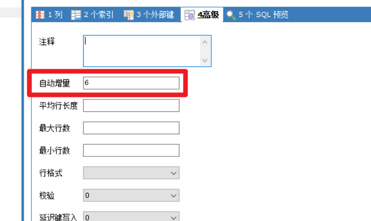

# 一、准备工作

## 1、创建表

```mysql
CREATE DATABASE `mybatisplus`;

USE `mybatisplus`;

CREATE TABLE `tb_user` (
  `id` BIGINT(20) NOT NULL AUTO_INCREMENT COMMENT '主键ID',
  `user_name` VARCHAR(20) NOT NULL COMMENT '用户名',
  `password` VARCHAR(20) NOT NULL COMMENT '密码',
  `name` VARCHAR(30) DEFAULT NULL COMMENT '姓名',
  `age` INT(11) DEFAULT NULL COMMENT '年龄',
  `email` VARCHAR(50) DEFAULT NULL COMMENT '邮箱',
  PRIMARY KEY (`id`)
) ENGINE=INNODB AUTO_INCREMENT=6 DEFAULT CHARSET=utf8;

INSERT  INTO `tb_user`(`id`,`user_name`,`password`,`name`,`age`,`email`) VALUES (1,'zhangsan','123456','张三',18,'zhangsan@163.com'),(2,'lisi','123456','李四',20,'lisi@163.com'),(3,'wangwu','123456','王五',28,'wangwu@163.com'),(4,'zhaoliu','123456','赵六',21,'zhaoliu@163.com'),(5,'sunqi','123456','孙七',24,'sunqi@163.com');
```


# 二、整合SpringBoot

## 1、实现步骤

> 1. 创建SpringBoot工程
> 2. 导入依赖
>    1. mysql驱动
>    2. mybatis-plus-boot-starter
>    3. lombok
> 3. springboot配置文件
> 4. 准备实体类
>    1. 标记注解
> 5. 准备Mapper 继承 BaseMapper<T>
> 6. 测试


## 2、具体实现

- 创建SpringBoot工程【mybatis-plus-springboot】
- 导入依赖

```xml
    <dependencies>
        <dependency>
            <groupId>org.springframework.boot</groupId>
            <artifactId>spring-boot-starter</artifactId>
        </dependency>

        <dependency>
            <groupId>org.springframework.boot</groupId>
            <artifactId>spring-boot-devtools</artifactId>
            <scope>runtime</scope>
            <optional>true</optional>
        </dependency>
        <dependency>
            <groupId>mysql</groupId>
            <artifactId>mysql-connector-java</artifactId>
            <scope>runtime</scope>
        </dependency>
        <dependency>
            <groupId>org.projectlombok</groupId>
            <artifactId>lombok</artifactId>
            <optional>true</optional>
        </dependency>
        <dependency>
            <groupId>org.springframework.boot</groupId>
            <artifactId>spring-boot-starter-test</artifactId>
            <scope>test</scope>
        </dependency>

        <!--mybatis-plus的springboot支持-->
        <dependency>
            <groupId>com.baomidou</groupId>
            <artifactId>mybatis-plus-boot-starter</artifactId>
            <version>3.1.1</version>
        </dependency>

        <dependency>
            <groupId>com.alibaba</groupId>
            <artifactId>druid-spring-boot-starter</artifactId>
            <version>1.1.10</version>
        </dependency>


    </dependencies>

```

- application.yml

```yml
spring:
  application:
    name: mybatis-plus-springboot
  #数据库信息
  datasource:
    driver-class-name: com.mysql.cj.jdbc.Driver
    url: jdbc:mysql://localhost:3306/mybatisplus?useSSL=false&serverTimezone=UTC&characterEncoding=utf-8&useUnicode=true
    username: root
    password: root
    type: com.alibaba.druid.pool.DruidDataSource


#mybatis-plus


#日志配置
logging:
  level:
    com.qf.mybatisplus.springboot.mapper: debug

```

- 实体类

```java
@Data
@TableName("tb_user")  //指定映射的表名
public class User implements Serializable {

    private Long id;
    private String userName;
    private String password;
    private String name;
    private Integer age;
    private String email;

}
```

- Mapper接口

```java
public interface IUserMapper extends BaseMapper<User> {
}
```

- 引导类

```java
@MapperScan(basePackages = {"com.qf.mybatisplus.springboot.mapper"})
public class MybatisPlusSpringbootApplication {

    public static void main(String[] args) {
        SpringApplication.run(MybatisPlusSpringbootApplication.class, args);
    }

}

```


- 测试

```java
package com.qf.mybatisplus.springboot;

import com.qf.mybatisplus.springboot.mapper.IUserMapper;
import com.qf.mybatisplus.springboot.pojo.User;
import org.junit.jupiter.api.Test;
import org.springframework.beans.factory.annotation.Autowired;
import org.springframework.boot.test.context.SpringBootTest;

import java.util.List;

@SpringBootTest
public class MybatisPlusSpringbootApplicationTests {

    @Autowired
    private IUserMapper userMapper;


    public void print(List<User> users){
        for (User user : users) {
            System.out.println("user = " + user);
        }
    }


    /**
     * MybatisPlus快速入门
     */
    @Test
    public void test01() {

        List<User> users = userMapper.selectList(null);
        print(users);
    }

}

```


## 三、CURD

### 1、增加

```
    /**
     * 插入一条记录
     *
     * @param entity 实体对象
     */
    int insert(T entity);
```

- 测试代码
  - 主键回填【自动完成的】

```
/**
 * 增加
 **/
@Test
public void test02() throws Exception {
    User user = new User();
    user.setUserName("jack").setPassword("123123").setEmail("jack@163.com").setAge(12).setName("杰克");
    int row = userMapper.insert(user);
    System.out.println("row = " + row);
    //主键回填
    System.out.println(user.getId());
}
```


- 主键生成策略
  - 默认是通过底层高低算法得到主键值
  - 可以通过IdType来指定主键策略
  - 在实体上对应数据库表主键的属性上标记一个注解

```java
    @TableId(type = IdType.AUTO)
    private Long id;
```

- 在测试前先修改数据库自增的ID值



- 再次测试


### 2、@TableField

- 在数据库表的字段名跟Java实体类的属性不一致时，需要通过该注解来标识作出特殊处理

- 指定不查询的字段

  - 指定密码不查询

  ```java
  @TableField(select = false)
  private String password;
  ```

- 指定具体的查询列名

  - 当数据库字段名跟实体类属性不一致，也没有满足驼峰映射

```java
    //private String email;

    @TableField("email")   //查询email字段时，封装给mail属性
    private String mail;
```


- 指定忽略属性，不跟数据库字段进行映射

```java
    //指定该属性不映射数据库字段名
    @TableField(exist = false)
    private String address;
```


### 3、删除

- deleteById：根据ID删除
- deleteByMap：根据Map条件删除
  - Map中的key是表的字段名
- delete：根据实体条件删除
  - Wrapper   -- 实现类【QueryWrapper】
    - QueryWrapper中可以封装实体属性

- deleteBatchIds：根据ID列表删除

```java
@Test
public void test04() throws Exception {
    User user = new User();
    user.setId(8L);

    QueryWrapper<User> wrapper = new QueryWrapper<>();
    wrapper.setEntity(user);
    int row = userMapper.delete(wrapper);
    System.out.println("row = " + row);

}

/**
 * deleteByMap
 *  map的key写的表的字段
 **/
@Test
public void test03() throws Exception {
    Map<String, Object> map = new HashMap<>();
    map.put("user_name", "jack");
    int row = userMapper.deleteByMap(map);
    System.out.println("row = " + row);
}
```


### 4、更新

- updateById：根据ID修改【参数是实体】
- update：设置实体，根据Wrapper条件更新


## 四、查询

```java
package com.qf.mybatisplus.springboot;

import com.baomidou.mybatisplus.core.conditions.Wrapper;
import com.baomidou.mybatisplus.core.conditions.query.Query;
import com.baomidou.mybatisplus.core.conditions.query.QueryWrapper;
import com.baomidou.mybatisplus.core.conditions.update.UpdateWrapper;
import com.baomidou.mybatisplus.core.metadata.IPage;
import com.baomidou.mybatisplus.extension.plugins.pagination.Page;
import com.qf.mybatisplus.springboot.mapper.IUserMapper;
import com.qf.mybatisplus.springboot.pojo.User;
import com.qf.mybatisplus.springboot.service.UserService;
import org.junit.jupiter.api.Test;
import org.springframework.beans.factory.annotation.Autowired;
import org.springframework.boot.test.context.SpringBootTest;

import java.util.HashMap;
import java.util.List;
import java.util.Map;

@SpringBootTest
public class MybatisPlusSpringbootApplicationSelectTests {

    @Autowired
    UserService userService;

    @Autowired
    private IUserMapper userMapper;


    public void print(List<User> users){
        for (User user : users) {
            System.out.println("user = " + user);
        }
    }


    /**
     * selectOne
     **/
    @Test
    public void test04() throws Exception {
        QueryWrapper<User> wrapper = new QueryWrapper<>();
        wrapper.eq("user_name", "jiujiujiu");
        User user = userMapper.selectOne(wrapper);
        System.out.println("user = " + user);
    }

    /**
     * selectMaps
     **/
    @Test
    public void test03() throws Exception {
        QueryWrapper<User> wrapper = new QueryWrapper<>();
        wrapper.ge("age", 20);
        List<Map<String, Object>> maps = userMapper.selectMaps(wrapper);
        for (Map<String, Object> map : maps) {
            for (String key : map.keySet()) {
                System.out.println(key + ":" + map.get(key));
            }
        }
    }

    /**
     *
     **/
    @Test
    public void test02() throws Exception {
        QueryWrapper<User> wrapper = new QueryWrapper<>();
        wrapper.ge("age", 20);
        Integer count = userMapper.selectCount(wrapper);
        System.out.println("count = " + count);
    }


    /**
     * 根据ID查询
     */
    @Test
    public void test01() {

        User user = userMapper.selectById(1);
        System.out.println("user = " + user);
    }

}

```

- 分页查询
  - 配置分页插件【组件应该配置在引导类所在的包及子包下】

  ```java
  @Configuration
  public class MyMybatisPlusConfig {
  
      @Bean
      public PaginationInterceptor paginationInterceptor(){
          return new PaginationInterceptor();
      }
  
  }
  ```

  

  - 测试

  ```
      /**
       *
       **/
      @Test
      public void test05() throws Exception {
  
          System.out.println("userService = " + userService);
  
          IPage<User> page = new Page<>();
          page.setCurrent(2);
          page.setSize(5);
  
          //QueryWrapper<User> wrapper = new QueryWrapper<>();
          //wrapper.eq("password", "123456");
  
          IPage<User> ipage = userMapper.selectPage(page, null);
  
          System.out.println("页码:" + ipage.getCurrent());
          System.out.println("总页数:" + ipage.getPages());
          System.out.println("页大小:" + ipage.getSize());
          System.out.println("总条数:" + ipage.getTotal());
          System.out.println("记录:" + ipage.getRecords());
  
      }
  ```

  

