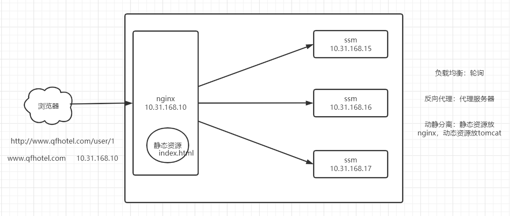
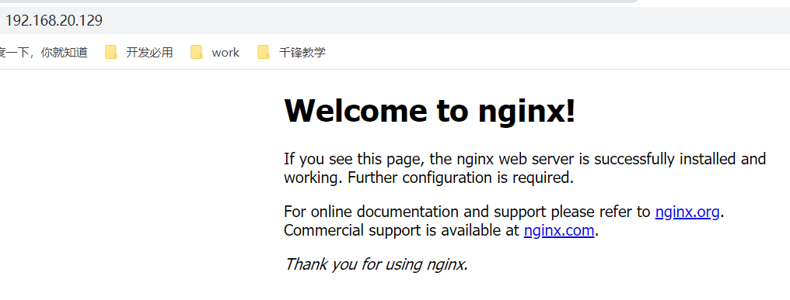
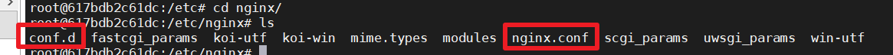
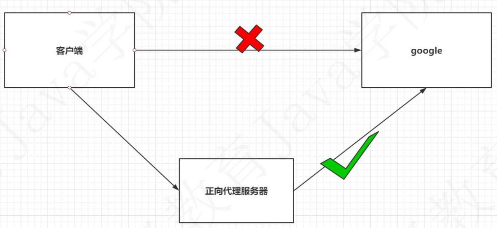
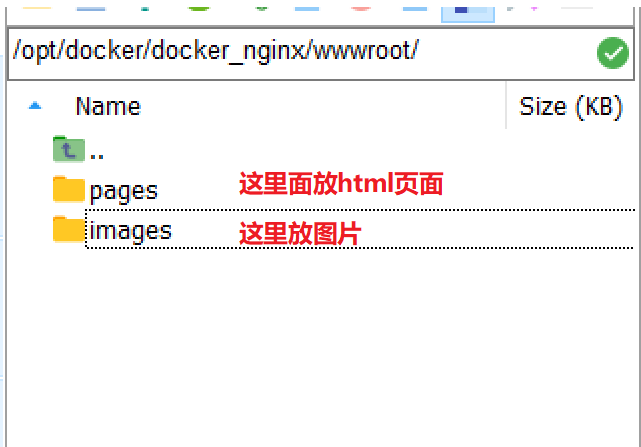
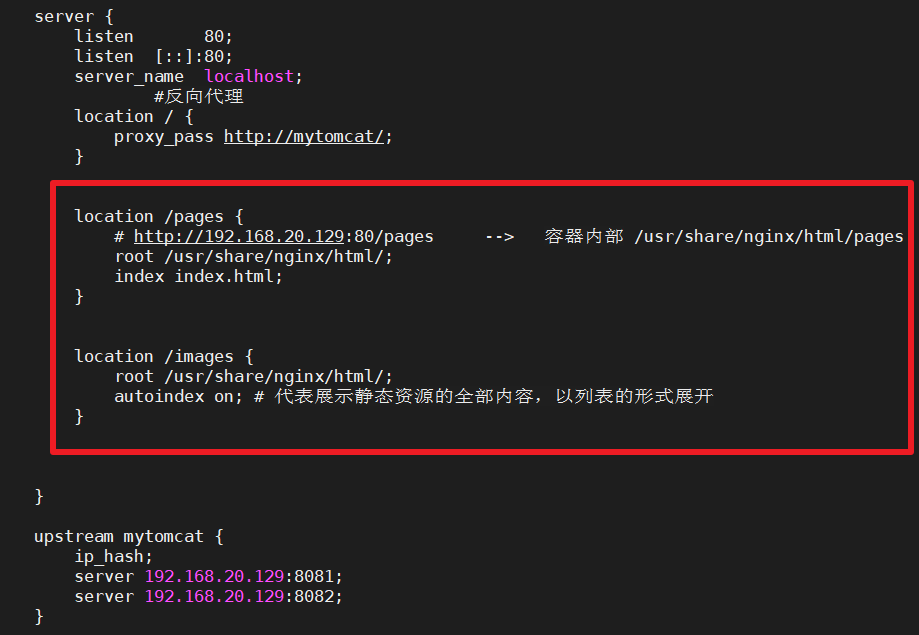
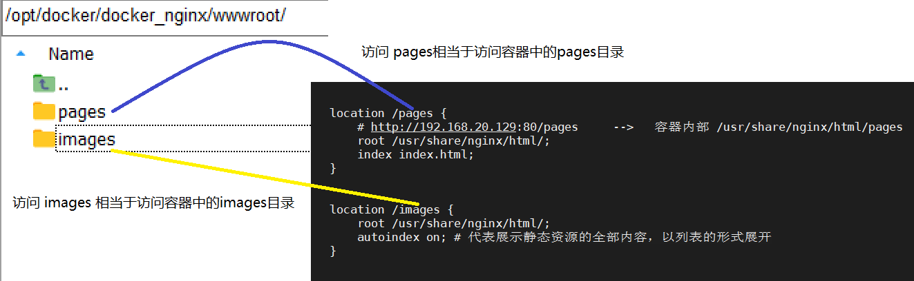
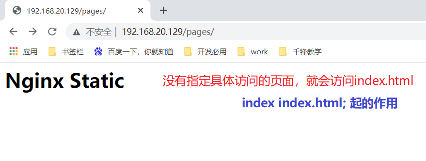
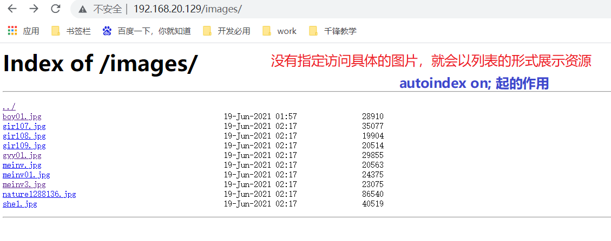

# 一、目前项目部署存在的问题

- 如果我现在一个web应用架设了多台服务器，那么如让用户在访问同一个地址时，每次访问到真实服务器是在多台服务器列表中去筛选一台比较空的服务器来帮我们处理这个请求呢？
- 为了保证性能和安全的考虑，一个tomcat官方对并发数【QPS：每秒访问量】是在150左右。那么如果同一时间访问在 ，那是不是要架设至少4台tomcat，并且还需要让这4tomcat平摊这500个并发。
- 如果现在访问的一是一个静态资源，把静态部署到tomcat上，那么也需要消耗tomcat的性能，能不能优化下？


# 二、Nginx概述

- 是一个高性能的HTTP和反向代理web服务器
- QPS是50000

| 作用                                                         |
| ------------------------------------------------------------ |
|  |

- 学习nginx就是学习它的配置


# 三、安装

>  使用docker安装nginx

- docker-compose.yml

```yml
version: '3.1'
services:
  nginx:
    restart: always
    image: daocloud.io/library/nginx:latest
    container_name: nginx
    ports:
      - 80:80
```

- docker-compose up -d 
  - 启动nginx容器
- 访问

| http://192.168.20.129:80                                     |
| ------------------------------------------------------------ |
|  |

- 配置文件

| 容器内的位置：/etc/nginx/nginx.conf                          |
| ------------------------------------------------------------ |
|  |

```nginx
user  nginx;
worker_processes  1;     #跟并发数有关

error_log  /var/log/nginx/error.log warn;
pid        /var/run/nginx.pid;


events {
    worker_connections  1024;    #跟并发数有关
}


http {     #匹配 http协议
    include       /etc/nginx/mime.types;     #导入一些mime-type类型
    default_type  application/octet-stream;  #默认的mime-type类型

    log_format  main  '$remote_addr - $remote_user [$time_local] "$request" '
                      '$status $body_bytes_sent "$http_referer" '
                      '"$http_user_agent" "$http_x_forwarded_for"';

    access_log  /var/log/nginx/access.log  main;

    sendfile        on;
    #tcp_nopush     on;

    keepalive_timeout  65;

    #gzip  on;

    include /etc/nginx/conf.d/*.conf;
}

```

- /etc/nginx/conf.d/*.conf

```nginx
server {    #服务，就是一个具体的项目
    listen       80;    #监听的端口
    listen  [::]:80;
    server_name  localhost;   #代表本机

    #charset koi8-r;
    #access_log  /var/log/nginx/host.access.log  main;

    location / {    # location位置   / : 代表拦截所有
        root   /usr/share/nginx/html;   # 处理静态资源，访问静态资源会去/usr/share/nginx/html找
        index  index.html index.htm;   # index: 没有指定访问资源时，就会访问 index.html
    }

    #error_page  404              /404.html;

    # redirect server error pages to the static page /50x.html
    #
    error_page   500 502 503 504  /50x.html;
    location = /50x.html {
        root   /usr/share/nginx/html;
    }

    # proxy the PHP scripts to Apache listening on 127.0.0.1:80
    #
    #location ~ \.php$ {
    #    proxy_pass   http://127.0.0.1;
    #}

    # pass the PHP scripts to FastCGI server listening on 127.0.0.1:9000
    #
    #location ~ \.php$ {
    #    root           html;
    #    fastcgi_pass   127.0.0.1:9000;
    #    fastcgi_index  index.php;
    #    fastcgi_param  SCRIPT_FILENAME  /scripts$fastcgi_script_name;
    #    include        fastcgi_params;
    #}

    # deny access to .htaccess files, if Apache's document root
    # concurs with nginx's one
    #
    #location ~ /\.ht {
    #    deny  all;
    #}
}
```

## 1、配置文件合在一起

```nginx
user  nginx;
worker_processes  1;     #跟并发数有关

error_log  /var/log/nginx/error.log warn;
pid        /var/run/nginx.pid;


events {
    worker_connections  1024;    #跟并发数有关
}

http {     #匹配 http协议
    include       /etc/nginx/mime.types;     #导入一些mime-type类型
    default_type  application/octet-stream;  #默认的mime-type类型

    log_format  main  '$remote_addr - $remote_user [$time_local] "$request" '
                      '$status $body_bytes_sent "$http_referer" '
                      '"$http_user_agent" "$http_x_forwarded_for"';

    access_log  /var/log/nginx/access.log  main;

    sendfile        on;

    keepalive_timeout  65;

    server {    #服务，就是一个具体的项目
        listen       80;    #监听的端口
        listen  [::]:80;
        server_name  localhost;   #代表本机

        location / {    # location位置   / : 代表拦截所有
            root   /usr/share/nginx/html;   # root根: 访问/ 就等同于访问/usr/share/nginx/html
            index  index.html index.htm;   # index: 代表没有指定访问资源时，默认给你的资源
        }

        error_page   500 502 503 504  /50x.html;
        location = /50x.html {
            root   /usr/share/nginx/html;
        }

        # proxy the PHP scripts to Apache listening on 127.0.0.1:80
        #
        #location ~ \.php$ {
        #    proxy_pass   http://127.0.0.1;
        #}

    }
}
```


# 四、Nginx的功能

## 1、准备工作

- 使用docker-compose搭建nginx，指定数据卷

- nginx配置文件

```nginx
user  nginx;
worker_processes  1;

error_log  /var/log/nginx/error.log warn;
pid        /var/run/nginx.pid;


events {
    worker_connections  1024;
}

http {
    include       /etc/nginx/mime.types;
    default_type  application/octet-stream;

    log_format  main  '$remote_addr - $remote_user [$time_local] "$request" '
                      '$status $body_bytes_sent "$http_referer" '
                      '"$http_user_agent" "$http_x_forwarded_for"';

    access_log  /var/log/nginx/access.log  main;

    sendfile        on;

    keepalive_timeout  65;

    server {
        listen       80;
        listen  [::]:80;
        server_name  localhost;

        location / {
            root   /usr/share/nginx/html;
            index  index.html index.htm;
        }

        error_page   500 502 503 504  /50x.html;
        location = /50x.html {
            root   /usr/share/nginx/html;
        }

        # proxy the PHP scripts to Apache listening on 127.0.0.1:80
        #
        #location ~ \.php$ {
        #    proxy_pass   http://127.0.0.1;
        #}

    }
}

```

- docker-compose.yml

```yml
version: '3.1'
services:
  nginx:
    restart: always
    image: daocloud.io/library/nginx:latest
    container_name: nginx
    ports:
      - 80:80
    volumes:
      - /opt/docker/docker_nginx/conf/nginx.conf:/etc/nginx/nginx.conf 
      - /opt/docker/docker_nginx/wwwroot/:/usr/share/nginx/html/ 
```


## 2、反向代理

### 2.1 正向代理

- 翻墙
- VPN
- 客户端知道服务器真实地址
- 正向代理是代理客户端去访问服务器，把客户端跟正向代理看成一个整体

| 正向代理                                                     |
| ------------------------------------------------------------ |
|  |

### 2.2 反向代理

- 客户端只知道代理服务器，不知道真实服务器是什么
- 代理服务器代理的是真实服务器，把代理服务器和真实服务器看成一个整体

| 反向代理                                                     |
| ------------------------------------------------------------ |
|  |


#### 2.2.1 需求

- 由nignx去代理tomcat，我直接访问nignx能够访问到tomcat


### 2.3 具体实现

- 来一台真实服务器。tomcat8001

```yml
version: "3.1"
services:
  tomcat8001:
    image: tomcat:8.5.23
    container_name: tomcat8001
    restart: always
    volumes:
      - /opt/tomcat/webapps/:/usr/local/tomcat/webapps
    ports:  #端口映射
      - 8001:8080
```

| http://192.168.20.129:8001/                                  |
| ------------------------------------------------------------ |
|  |


- 在nginx配置文件中配置反向代理规则

```nginx
user  nginx;
worker_processes  1;

error_log  /var/log/nginx/error.log warn;
pid        /var/run/nginx.pid;


events {
    worker_connections  1024;
}

http {
    include       /etc/nginx/mime.types;
    default_type  application/octet-stream;

    log_format  main  '$remote_addr - $remote_user [$time_local] "$request" '
                      '$status $body_bytes_sent "$http_referer" '
                      '"$http_user_agent" "$http_x_forwarded_for"';

    access_log  /var/log/nginx/access.log  main;

    sendfile        on;

    keepalive_timeout  65;

    server {
        listen       80;
        listen  [::]:80;
        server_name  localhost;
		#反向代理
        location / {
            #访问nginx时，代理到 http://192.168.20.129:8001/地址
            proxy_pass   http://192.168.20.129:8001;
        }

    }
}

```

- 访问nginx，就会访问到tomcat8001

| http://192.168.20.129                                        |
| ------------------------------------------------------------ |
|  |


## 3、负载均衡

### 3.1 轮询策略实现负载均衡

- 来两台真实服务器
  - tomcat1
  - tomcat2
- docker-compose.yml

```yml
version: "3.1"
services:
  tomcat1:
    image: tomcat:8.5.23
    container_name: tomcat1
    restart: always
    volumes:
      - /opt/tomcat1/webapps/:/usr/local/tomcat/webapps
    ports:  #端口映射
      - 8081:8080
  tomcat2:
    image: tomcat:8.5.23
    container_name: tomcat2
    restart: always
    volumes:
      - /opt/tomcat2/webapps/:/usr/local/tomcat/webapps
    ports:  #端口映射
      - 8082:8080
```


- 配置nginx服务器

```nginx
user  nginx;
worker_processes  1;

error_log  /var/log/nginx/error.log warn;
pid        /var/run/nginx.pid;


events {
    worker_connections  1024;
}

http {
    include       /etc/nginx/mime.types;
    default_type  application/octet-stream;

    log_format  main  '$remote_addr - $remote_user [$time_local] "$request" '
                      '$status $body_bytes_sent "$http_referer" '
                      '"$http_user_agent" "$http_x_forwarded_for"';

    access_log  /var/log/nginx/access.log  main;

    sendfile        on;

    keepalive_timeout  65;

    server {
        listen       80;
        listen  [::]:80;
        server_name  localhost;
		#反向代理，访问此位置时，跳转到mytomcat中
        location / {
            proxy_pass http://mytomcat/;    
        }

    }
    
    upstream mytomcat {
    	server 192.168.20.129:8081;
    	server 192.168.20.129:8082;
    }
    
}
```

- 重启nginx
- 测试 http://192.168.20.129/，就可以看到每次访问在两个tomcat中间跳


### 3.2 策略

#### 1、轮询【默认】

- 上述例子已经实现

#### 2、权重

- 根据服务器配置比例不同，数量大的，权重就大，被访问到的概述就大
  - 这个数量一般都配置成整数

##### 2.1 实现

- 修改nginx的配置文件

```nginx
user  nginx;
worker_processes  1;

error_log  /var/log/nginx/error.log warn;
pid        /var/run/nginx.pid;


events {
    worker_connections  1024;
}

http {
    include       /etc/nginx/mime.types;
    default_type  application/octet-stream;

    log_format  main  '$remote_addr - $remote_user [$time_local] "$request" '
                      '$status $body_bytes_sent "$http_referer" '
                      '"$http_user_agent" "$http_x_forwarded_for"';

    access_log  /var/log/nginx/access.log  main;

    sendfile        on;

    keepalive_timeout  65;

    server {
        listen       80;
        listen  [::]:80;
        server_name  localhost;
		#反向代理
        location / {
            proxy_pass http://mytomcat/;
        }

    }
    
    #-----------------------如下的部分是修改的------------------
    #权重策略: 代表10次请求，有1次是访问到tomcat8082,其他的都是访问到tomcat8081
    upstream mytomcat {
    	server 192.168.20.129:8081 weight=9;
    	server 192.168.20.129:8082 weight=1;
    }
    
}
```

- 重启docker-compose

```shell
docker-compose restart
```

- 测试
  - 发现10次请求，只有1次请求打到8082

#### 3、ip_hash

- 当你第一次访问是哪台服务器，那么后面就每次都是这台服务器。
  - 除模    129 % 2 == 0

```shell
#-----------------------如下的部分是修改即可，其他不便------------------
#ip_hash
upstream mytomcat {
    ip_hash;
    server 192.168.20.129:8081;
    server 192.168.20.129:8082;
}
```

- 重启docker-compose

```shell
docker-compose restart
```

- 测试
  - 第一次访问是哪台服务器，那么后面就每次都是这台服务器


## 4、动静分离

### 4.1 动态资源和静态资源

- 使用 proxy_pass 动态代理

- 使用 root 静态代理

### 4.2 部署静态资源

- 在映射数据卷存放静态资源的目录中先放点静态资源

| 准备静态资源                                                 |
| ------------------------------------------------------------ |
|  |

- 修改nginx配置文件

| nginx.conf                                                   |
| ------------------------------------------------------------ |
|  |

| 主机目录跟nginx配置的对应关系                                |
| ------------------------------------------------------------ |
|  |

- 测试

| 访问页面                                                     |
| ------------------------------------------------------------ |
|  |

| 访问图片                                                     |
| ------------------------------------------------------------ |
|  |

## 5、使用Nginx搭建文件服务器，通过docker中tomcat容器部署项目，上传文件到文件服务器

## https://blog.csdn.net/k393393/article/details/92674824