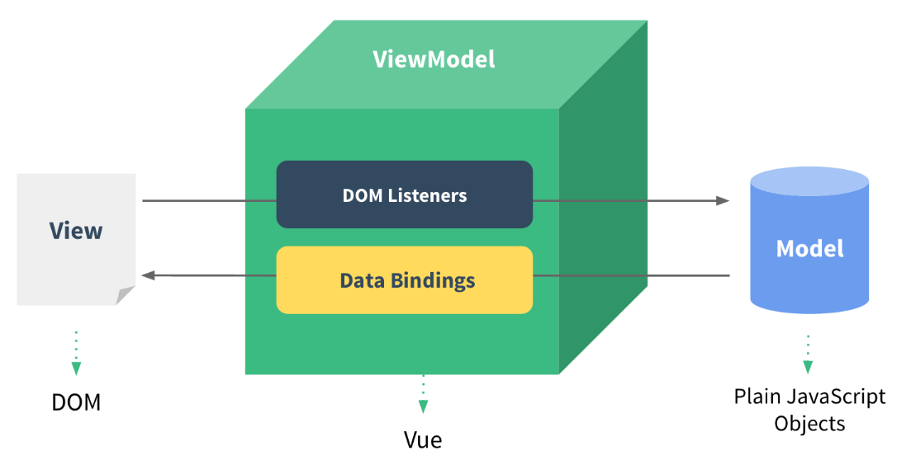
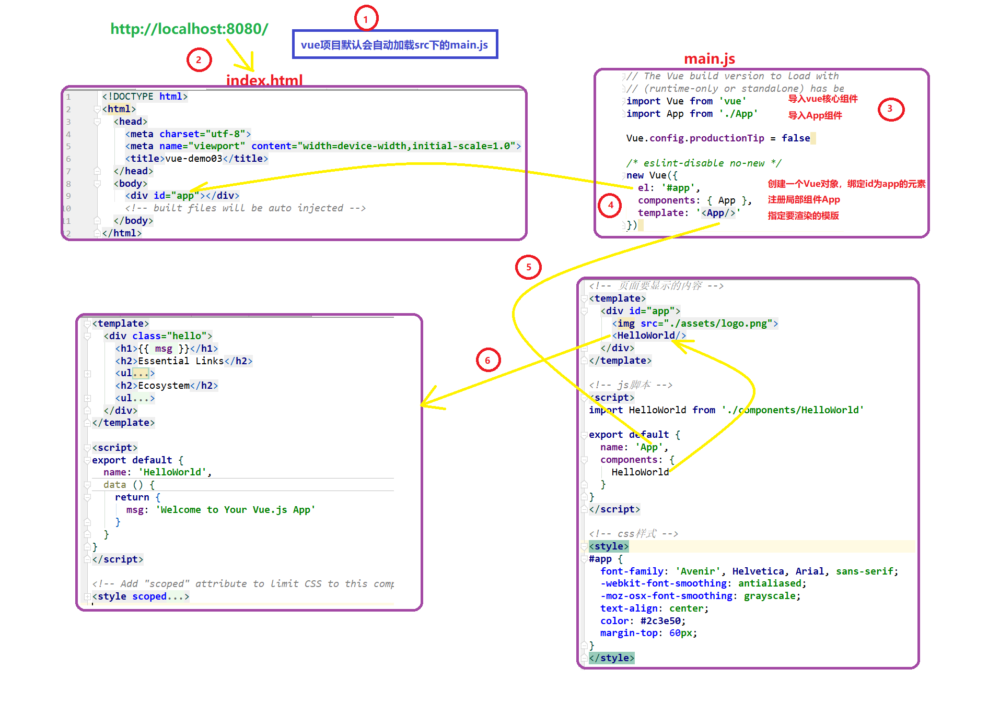
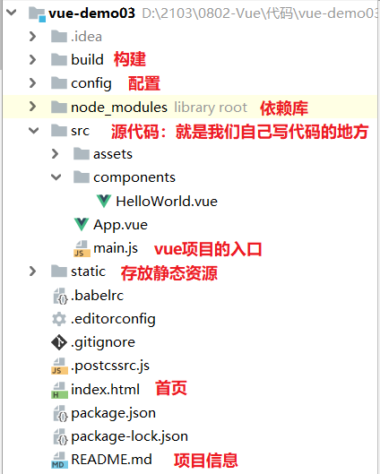
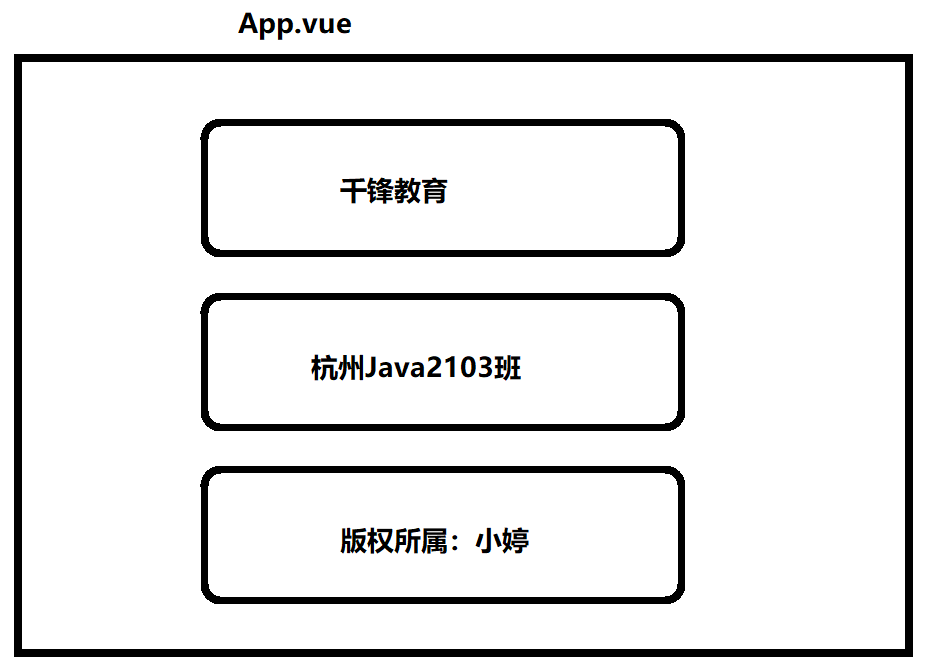
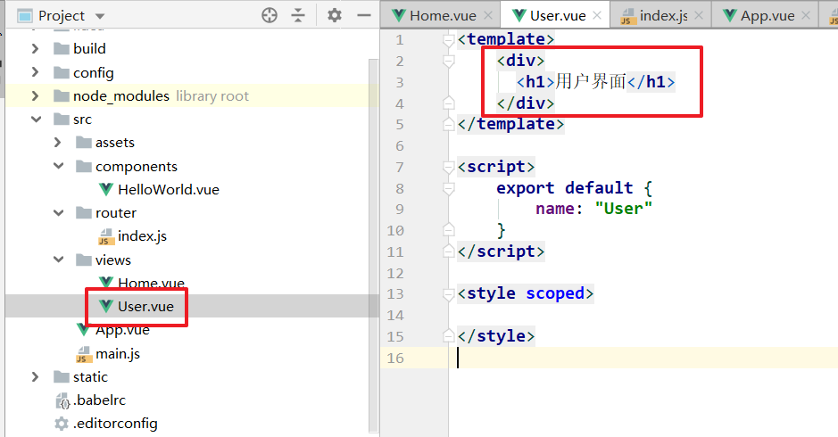
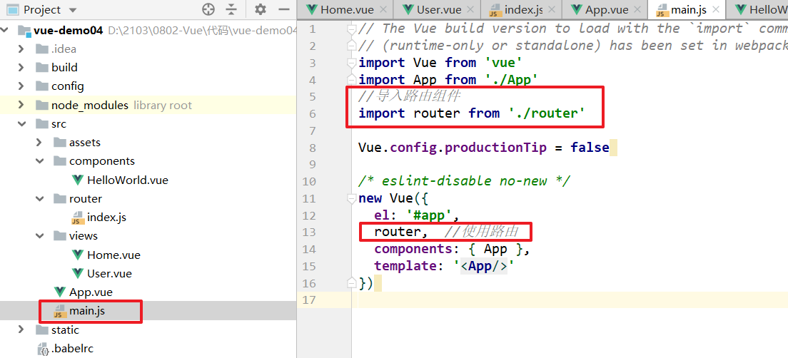
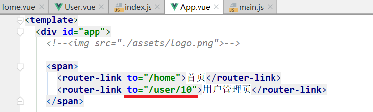
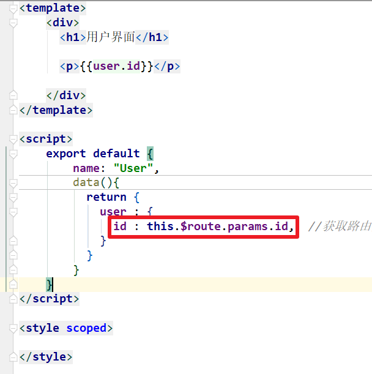

# 一、Vue概述

- 官网：https://cn.vuejs.org/

- vue是一个渐进式的js框架。
- vue是基于后台的MVC思想实现的。【MVVM】


# 二、MVVM

- Model：模型层，在这里表示 JavaScript 对象
- View：视图层，在这里表示 DOM（HTML 操作的元素）
- ViewModel：连接视图和数据的中间件，**Vue.js 就是 MVVM 中的 ViewModel 层的实现者**

| MVVM的原理图【双向数据绑定】                                 |
| ------------------------------------------------------------ |
|  |


# 三、快速入门

## 1、实现步骤【参考官网】

> 1. 引入vue.js
> 2. 创建一个div，定义其id属性
> 3. 创建vue对象，绑定到有id属性的app。编写代码

## 2、具体实现

```html
<!DOCTYPE html>
<html lang="en">
<head>
    <meta charset="UTF-8">
    <title>01-vue-quick.html</title>

    <script src="https://cdn.jsdelivr.net/npm/vue@2/dist/vue.js"></script>

</head>
<body>

<div id="app">
    <!-- 插值表达式 -->
    {{ message }}
</div>

</body>

<script>
    /* vue对象 */
    var app = new Vue({
        el: '#app',    //vue的核心属性 element的简写
        data: {   //数据，vue中的数据对象
            message: 'Hello Vue!'
        }
    })
</script>
</html>
```


## 3、插值表达式

- 语法

```
{{ vue的数据属性或vue的方法 }}
```

- 使用

```html
<!DOCTYPE html>
<html lang="en">
<head>
    <meta charset="UTF-8">
    <title>01-vue-quick.html</title>

    <script src="https://cdn.jsdelivr.net/npm/vue@2/dist/vue.js"></script>

</head>
<body>

<div id="app">
    <!-- 插值表达式 -->
    {{ message }}  <br/>
    {{product.name}} <br/>
    {{nums[2]}} <br/>
    {{products[1].name}}<br/>
    {{say()}}
</div>

</body>

<script>
    /* vue对象 */
    var app = new Vue({
        el: '#app',    //vue的核心属性 element的简写
        data: {   //数据，vue中的数据对象
            message: 'Hello Vue!',
            product: {
                name: "联想y7000",
                price: 7000,
                proDate: "2018-06-27"
            },
            nums : [10,25,12,30],
            products : [
                {
                    name: "联想y7000",
                    price: 7000,
                    proDate: "2018-06-27"
                },
                {
                    name: "海尔冰箱1050",
                    price: 6666,
                    proDate: "2019-08-27"
                }
            ]
        },
        methods : {
            say : function () {
                return "Hello";
            }
        }
    })
</script>
</html>
```


# 四、VUE指令

## 1、v-on

- 绑定事件
- v-on: 可以简写成 @

```html
<!DOCTYPE html>
<html lang="en">
<head>
    <meta charset="UTF-8">
    <title>02-vue-on.html</title>

    <script src="https://cdn.jsdelivr.net/npm/vue@2/dist/vue.js"></script>

</head>
<body>

<div id="app">

    <button onclick="test1()">原生的单击事件</button><br/>

    <button v-on:click="test2()">vue的单击事件</button><br/>

    <button @click="test3">v-on:的简写方式-- v-on:可以写成@</button><br/>
    
    <div @mousemove="test4" style="width: 300px; height: 100px; background-color:#AABBAA;">我是一个div</div>
    {{x}}

</div>

</body>

<script>
    var app = new Vue({
        el: '#app',
        data: {
            message: 'Hello Vue!',
            x : 0
        },
        methods : {
            test2 : function () {
                console.log("vue的单击事件....");
            },
            test3 : function () {
                console.log("v-on:可以写成@....");
            },
            test4 : function (event) {
                this.x = event.clientX;  //得到当前窗口的x轴坐标
            }
        }
    })

    function test1() {
        console.log("原生的单击事件....");
    }

</script>
</html>
```

- 事件细节【事件传参，事件修饰符，按键修饰符】

```html
<!DOCTYPE html>
<html lang="en">
<head>
    <meta charset="UTF-8">
    <title>03-事件细节.html</title>

    <script src="https://cdn.jsdelivr.net/npm/vue@2/dist/vue.js"></script>

</head>
<body>

<div id="app">

    <button @click="test1()">事件传参1</button><br/>
    
    <button @click="test2('lucy')">事件传参2</button><br/>

    <!-- 在vue的指定中，使用vue的data属性中的变量时，不要使用插值表达式，而是直接使用 -->
    <button @click="test3(message)">事件传参3</button><br/>


    <!-- 事件修饰符 : 阻止事件冒泡 -->
    <div @mousemove="test4" style="width: 300px; height: 100px; background-color:#AABBAA;">
        我是一个div[test4]
        <div @mousemove.stop="test5" style="width: 100px; height: 50px; background-color:yellow;">我是一个div[test5]</div>

    </div>

    <br/>

    <!-- 按键修饰符 -->
    <form action="01-vue-quick.html" method="post">
        username : <input name="username" type="text"/>
        <input type="button" value="提交"/>
    </form>

    <br/>
    用户名 : <input name="username" @keyup.enter="test6()" type="text"/>

</div>

</body>

<script>
    var app = new Vue({
        el: '#app',
        data: {
            message: 'Hello Vue!'
        },
        methods : {
            test1 : function (event) {
                console.log("v-on:可以写成@....");
                console.log(event);
            },
            test2 : function (obj) {
                console.log(obj);
            },
            test3 : function (obj) {
                console.log(obj);
            },
            test4 : function () {
                console.log("test4....")
            },
            test5 : function (event) {
                console.log("test5....")
                //event.stopPropagation();  //阻止事件传播
            },
            test6 : function () {
                console.log(11111);
            }
        }
    });

</script>
</html>
```


## 2、v-bind

- 属性绑定
- v-bind: 可以简写成 :

```html
<!DOCTYPE html>
<html lang="en">
<head>
    <meta charset="UTF-8">
    <title>04-v-bind.html</title>

    <script src="https://cdn.jsdelivr.net/npm/vue@2/dist/vue.js"></script>

</head>
<body>

<div id="app">

    <a href="http://www.baidu.com">baidu</a><br/>

    <a v-bind:href="link">百度</a><br/>

    <!-- v-bind: 可以简写成 : -->
    <a :href="link">百度[v-bind的简写]</a>

</div>

</body>

<script>
    var app = new Vue({
        el: '#app',
        data: {
            link : "http://www.baidu.com"
        },
        methods : {
        }
    });

</script>
</html>
```


## 3、v-html、v-text、v-model

- v-html 等同于js中innerHTML 和 jQuery中的html()
- v-text 等同于js中innerText和jQuery中的text()
- v-model 相当于name属性和value属性的总和

```
<!DOCTYPE html>
<html lang="en">
<head>
    <meta charset="UTF-8">
    <title>05-v-html-text.html</title>

    <script src="https://cdn.jsdelivr.net/npm/vue@2/dist/vue.js"></script>

</head>
<body>

<div id="app">

    <span v-html="link"></span><br/>

    <span v-text="link"></span><br/>

    <hr/>

    <!-- v-model 等同于 name 和 value -->
    用户名:<input v-model="username"/><br/>
    {{username}}

</div>

</body>

<script>
    var app = new Vue({
        el: '#app',
        data: {
            link:"<a href='http://www.baidu.com'>百度</a>",
            username : 'jack'
        },
        methods : {
        }
    });


</script>
</html>
```


## 4、v-if、v-else-if、v-else、v-show

- v-if：判断
- v-show：条件成立则显示

```html
<!DOCTYPE html>
<html lang="en">
<head>
    <meta charset="UTF-8">
    <title>06-v-if-show.html</title>

    <script src="https://cdn.jsdelivr.net/npm/vue@2/dist/vue.js"></script>

</head>
<body>

<div id="app">

    <p v-if="age < 16 && age >= 0">未成年人，只能想想</p>
    <p v-else-if="age <= 65">中年人，要努力奋斗</p>
    <p v-else>老年人，回家享受</p>

    <input type="text" v-model="age"/><br/>

    <div v-show="age < 16">v-show 未成年人，只能想想</div>
    <!--
        v-if : 条件成立，则渲染。条件不成立，则不渲染【没有元素】
        v-show : 条件成立，则显示。条件不成立，不显示【通过css样式来隐藏元素】
     -->

</div>

</body>

<script>
    var app = new Vue({
        el: '#app',
        data: {

            age : 12

        },
        methods : {
        }
    });


</script>
</html>
```


## 5、v-for

- 遍历json对象和数组

```html
<!DOCTYPE html>
<html lang="en">
<head>
    <meta charset="UTF-8">
    <title>07-v-for.html</title>

    <script src="https://cdn.jsdelivr.net/npm/vue@2/dist/vue.js"></script>

</head>
<body>

<div id="app">

    <ul>
        <!--
            v-for遍历对象 : (v, k, i)
                第一个位置 ：值
                第二个位置 : 键
                第三个位置 : 索引
         -->
        <li v-for="(value,key,index) in user">
            {{index}} - {{key}} - {{value}}
        </li>
    </ul>
    <hr/>


    <ul>
        <!--
            v-for遍历数组[数组元素是基本类型] : (v, i)
                第一个位置 ：值
                第三个位置 : 索引
         -->
        <li v-for="(value,index) in nums">
            {{index}} - {{value}}
        </li>
    </ul>

    <hr/>


    <ul>
        <!--
            v-for遍历数组[数组元素是对象] : (v, i)
                第一个位置 ：值
                第三个位置 : 索引
         -->
        <li v-for="(p,index) in products" v-if="index % 2 == 0">
            {{index}} - {{p.name}}=={{p.price}}=={{p.proDate}}
        </li>
    </ul>
    
    <!--
        分页条
     -->
    <span v-for="num in 10">
        {{num}}&nbsp;&nbsp;&nbsp;&nbsp;
    </span>


</div>

</body>

<script>
    var app = new Vue({
        el: '#app',
        data: {
            user : {
                username : "jack",
                age : 12
            },
            nums : [10,11,52,6,2,34],
            products : [
                { name:"A4纸", price:10, proDate:'2000-12-12'},
                { name:"宝宝用品", price:50, proDate:'2020-12-12'},
                { name:"餐车", price:10000, proDate:'1999-12-13'},
            ]
        },
        methods : {
        }
    });


</script>
</html>
```


# 五、监听属性、计算属性

- 监听属性

```html
<!DOCTYPE html>
<html lang="en">
<head>
    <meta charset="UTF-8">
    <title>08-监听属性.html</title>

    <script src="https://cdn.jsdelivr.net/npm/vue@2/dist/vue.js"></script>

</head>
<body>

<div id = "app">
    <p style = "font-size:25px;">计数器: {{ counter }}</p>
    <button @click="counter++" style = "font-size:25px;">点我</button>
</div>

</body>

<script>
    var app = new Vue({
        el: '#app',
        data: {
            counter : 0
        },
        methods : {
        },
        watch : {
            //两个参数
            //参数一：改变后的值
            //参数二：改变前的值
            counter : function (newVal, oldVal) {
                console.log('计数器值的变化 :' + oldVal + ' 变为 ' + newVal + '!');
            }
        }
    });


</script>
</html>
```

- 计算属性

```html
<!DOCTYPE html>
<html lang="en">
<head>
    <meta charset="UTF-8">
    <title>09-计算属性.html</title>

    <script src="https://cdn.jsdelivr.net/npm/vue@2/dist/vue.js"></script>

</head>
<body>

<div id = "app">
    <p style = "font-size:25px;">
        time1: {{time1()}}
    </p>
    <p style = "font-size:25px;">
        time2: {{time2}}
    </p>

    <button @click="addTime1(1)">add time1</button>
    <button @click="addTime2(1)">add time2</button>
</div>

</body>

<script>
    var app = new Vue({
        el: '#app',
        data: {

        },
        methods : {
            //time1是函数，所以每次调用都会执行
            time1 : function () {
                return Date.now();
            },
            addTime1 : function (obj) {
                console.log(this.time1() + obj);
            },
            addTime2 : function (obj) {
                console.log(this.time2 + obj);
            }
        },
        computed : {
            //time2是计算属性，所以只有第一次使用时才会执行，且会把该属性的值缓存下来，后面每次使用都使用的是缓存下来的值
            time2 : function() {
                return Date.now();
            }
        }

    });


</script>
</html>
```


# 六、组件化

- 在vue看来，万事万物皆组件。组件可以被复用

- 组件要使用，就必须先注册。
- 组件分为两类
  - 局部组件【只能在当前vue中使用】
  - 全局组件【可以在多个vue中使用】

## 1、局部组件

```html
<!DOCTYPE html>
<html lang="en">
<head>
    <meta charset="UTF-8">
    <title>09-计算属性.html</title>

    <script src="https://cdn.jsdelivr.net/npm/vue@2/dist/vue.js"></script>

</head>
<body>

<div id = "app">
    <!-- 使用组件 -->
    <mytitle></mytitle>
</div>

<hr/>

<div id = "app1">
    <!-- 使用组件 -->
    <!--<mytitle></mytitle>-->
    <button @click="test()">app1获取app中的内容</button>
</div>


</body>

<script>
    var vm = new Vue({
        el: '#app',
        data : {
          name : "lucy"
        },
        //组件
        components : {
            //组件注册
            //组件名 : { 组件的内容（vue对象） }
            "mytitle" : {
                //vue组件，那么data必须是函数，且有return返回值是json格式
                data : function () {
                    return {
                        message : "局部组件注册"
                    }
                },
                methods : {
                    changeMessage : function () {
                        this.message = "改改改";
                    }
                },
                //template ： vue组件需要挂载到哪个html内容上，template的内容必须有且只有一个根标准
                template : "<div><button @click='changeMessage()'>改变Message的值</button>{{message}}</div>"
            }
        }

    });

    new Vue({
        el : "#app1",
        methods : {
            test : function () {
                //在#app1中使用 #app对应的vue的中属性或者方法
                console.log("在#app1中使用 #app对应的vue的中属性：" + vm.name);
            }
        }
    });

</script>
</html>
```


## 2、全局组件

```html
<!DOCTYPE html>
<html lang="en">
<head>
    <meta charset="UTF-8">
    <title>09-计算属性.html</title>

    <script src="https://cdn.jsdelivr.net/npm/vue@2/dist/vue.js"></script>

</head>
<body>

<div id = "app">
    <!-- 使用组件 -->
    <mytitle></mytitle>
    <mytitle></mytitle>
</div>

<hr/>

<div id = "app1">
    <!-- 使用组件 -->
    <mytitle></mytitle>
    <mytitle></mytitle>
</div>


</body>

<script>

    //全局组件注册，可以在多个vue对象中去使用
    Vue.component("mytitle" , {
        //vue组件，那么data必须是函数，且有return返回值是json格式
        data : function () {
            return {
                message : "局部组件注册"
            }
        },
        methods : {
            changeMessage : function () {
                this.message = "改改改";
            }
        },
        //template ： vue组件需要挂载到哪个html内容上，template的内容必须有且只有一个根标准
        template : "<div><button @click='changeMessage()'>改变Message的值</button>{{message}}</div>"
    });


    var vm = new Vue({
        el: '#app',
        data : {
          name : "lucy"
        }

    });

    new Vue({
        el : "#app1",
        methods : {
        }
    });

</script>
</html>
```


# 七、生命周期

- vue对象在创建时，会有一套生命周期，在生命周期这个过程中，会有很多钩子函数会被触发

| 生命周期及钩子函数     |
| ---------------------- |
|  |


# 八、主流的项目开发方式

- 前后端分离开发
  - Java 程序员 ： 前台给你JSON ----【Controller + Service + Dao + POJO＋DB】---- 给前台JSON
    - postman
  - H5：把JSON --- 【后台】--- 渲染页面【处理JSON】
    - mock假数据
- 前台端联调
  - 后台：运行项目【用tomcat】
  - 前台：运行项目【node.js】


# 九、使用vue-cli脚手架来开发vue项目

## 1、安装node.js

- 简单理解：就是前台的一个tomcat

- 安装：闭着眼睛下一步

  - 安装包：node-v14.17.1-x64.msi

  - cmd：node -v


## 2、安装vue脚手架

- vue-cli
  - 安装
    - cmd：npm install vue-cli -g
- 安装cnpm

```
打开cmd，输入命令  
	npm install -g cnpm --registry=https://registry.npm.taobao.org

安装Vue需要npm的版本大于3，所以我们先升级一下npm，输入命令
	cnpm install cnpm -g

安装vue，输入命令
	cnpm install vue

安装vue-cli，输入命令
	cnpm install --global vue-cli
```


## 3、使用vue-cli创建vue项目

- 查看vue-cli所支持模板

| vue list                                                     |
| ------------------------------------------------------------ |
|  |

- 创建项目

| vue init webapck 项目名                                      |
| ------------------------------------------------------------ |
|  |

- 启动项目

| npm run dev                                                  |
| ------------------------------------------------------------ |
|  |

- 访问

| http://localhost:8080                                        |
| ------------------------------------------------------------ |
|  |


# 十、vue项目

## 1、使用vue-cli创建项目

> 1. vue init webpack 项目名
> 2. cnpm install
>    1. 安装当前项目所需要的模块
> 3. cd 项目目录中
> 4. cnpm run dev
>    1. 启动项目
> 5. 测试

| 执行流程                     |
| ---------------------------- |
|  |

| 目录结构                                                     |
| ------------------------------------------------------------ |
|  |


## 2、自己构建一个vue项目

- 需求

| 要呈现的效果                                                 |
| ------------------------------------------------------------ |
|  |

- 实现

  - 子组件

    - MyHeader.vue

    ```vue
    <template>
      <div>
        <h1>{{title}}</h1>
      </div>
    </template>
    
    <script>
      export default {
        name: 'MyHeader',
        data () {
          return {
            title : '千锋教育'
          }
        }
      }
    </script>
    
    <style scoped>
    
    </style>
    
    ```

    - MyBody.vue

    ```vue
    <template>
      <div>
        <h3>{{info}}</h3>
      </div>
    </template>
    
    <script>
    export default {
      name: 'MyBody',
      data () {
        return {
          info : '杭州Java2103班'
        }
      }
    }
    </script>
    
    <style scoped>
    
    </style>
    
    ```

    - MyFooter.vue

    ```vue
    <template>
      <div>
        <p>{{msg}}:{{name}}</p>
      </div>
    </template>
    
    <script>
    export default {
      name: 'MyFooter',
      data () {
        return {
          msg : '版权所属',
          name : '小婷'
        }
      }
    }
    </script>
    
    <style scoped>
    
    </style>
    
    ```

  - 父组件

    - App.vue

    ```vue
    <!-- 页面要显示的内容 -->
    <template>
      <div id="app">
        <!-- 3.使用组件 -->
        <MyHeader></MyHeader>
        <MyBody></MyBody>
        <MyFooter></MyFooter>
    
      </div>
    </template>
    
    <!-- js脚本 -->
    <script>
    //1.导入要使用文件
    import MyHeader from './components/MyHeader'
    import MyBody from './components/MyBody'
    import MyFooter from './components/MyFooter'
    
    export default {
      name: 'App',
      components: {
        //2.注册组件
        MyHeader,
        MyBody,
        MyFooter
      }
    }
    </script>
    
    <!-- css样式 -->
    <style>
    /*#app {
      font-family: 'Avenir', Helvetica, Arial, sans-serif;
      -webkit-font-smoothing: antialiased;
      -moz-osx-font-smoothing: grayscale;
      text-align: center;
      color: #2c3e50;
      margin-top: 60px;
    }*/
    </style>
    
    ```


## 3、组件之间的参数传递

### 3.1 父传子

- 父组件把参数传递给子组件

  - 子组件

  ```vue
  <template>
    <div>
      <h3>{{info}}</h3>
      <!-- counter是由父组件传过来 -->
      <h4>总人数:{{counter}}, 教室门牌号:{{classNum}}</h4>
  
    </div>
  </template>
  
  <script>
  export default {
    name: 'MyBody',
    data () {
      return {
        info : '杭州Java2103班',
        //counter : 10
      }
    },
    //用来接收其他组件传递过来的参数
    props : {
      counter:{
        type:Number,  //变量类型
        default : 10  //默认值
      },
      classNum :{
        type:String,
        required : true,
        default: "3101"
      }
    }
  }
  </script>
  
  <style scoped>
  
  </style>
  
  ```

  - 父组件

  ```vue
  <!-- 页面要显示的内容 -->
  <template>
    <div id="app">
      <!--
      <HelloWorld/>-->
  
      <MyHeader></MyHeader>
      <!-- :counter  是指子组件中一个vue的变量 -->
      <MyBody :counter="mycounter" :class-num="'3102'"></MyBody>
      <MyFooter></MyFooter>
  
    </div>
  </template>
  
  <!-- js脚本 -->
  <script>
  //import HelloWorld from './components/HelloWorld'
  import MyHeader from './components/MyHeader'
  import MyBody from './components/MyBody'
  import MyFooter from './components/MyFooter'
  
  export default {
    name: 'App',
    data(){
      return {
        mycounter : 100
      }
    },
    components: {
      //HelloWorld
      MyHeader,
      MyBody,
      MyFooter
    }
  }
  </script>
  
  <!-- css样式 -->
  <style>
  /*#app {
    font-family: 'Avenir', Helvetica, Arial, sans-serif;
    -webkit-font-smoothing: antialiased;
    -moz-osx-font-smoothing: grayscale;
    text-align: center;
    color: #2c3e50;
    margin-top: 60px;
  }*/
  </style>
  
  ```

### 3.2 子父互传

| 子父互传                                                     |
| ------------------------------------------------------------ |
|  |

| 简化版                                                       |
| ------------------------------------------------------------ |
|  |
|  |


# 十一、Axios

## 1、概述

- vue用来发送ajax请求的一个组件，但是它并不是vue的东西

## 2、官网

- https://www.kancloud.cn/yunye/axios/234845

### 2.1 axios语法

- 完整语法

```json
vm.axios({
        method : '请求方式',
        url : '请求url',
        data : 请求数据【json格式】
      }).then(function (resp) {
        //成功的回调函数
        //resp : 服务器端的返回的数据封装体，真正的数据封装在resp.data属性中
		console.log(resp.data);
      }).catch(function(error){
      	//出现错误的回调函数
      	console.log(error);
      });
```

- post请求

```json
vm.axios.post('请求url', 请求数据【json格式】)
  .then(function (response) {
      //成功的回调函数
    console.log(response);
  }).catch(function (error) {
      //出现错误的回调函数
    console.log(error);
  });
```

- get请求

```json
vm.axios.post('请求url?参数名=参数值', 请求数据【json格式】)
  .then(function (response) {
      //成功的回调函数
    console.log(response);
  }).catch(function (error) {
      //出现错误的回调函数
    console.log(error);
  });
```

```json
vm.axios.post('请求url', {
	params : {
		参数名:参数值
	}
}).then(function (response) {
      //成功的回调函数
    console.log(response);
  }).catch(function (error) {
      //出现错误的回调函数
    console.log(error);
  });
```


## 3、实现注册功能

### 3.1 搭建后台项目

- 使用postman测试【实现注册功能】

### 3.2 搭建前台项目

- 安装axios

```
cnpm install --save axios vue-axios
```

- main.js中引入

```
import axios from 'axios'
import VueAxios from 'vue-axios'

Vue.use(VueAxios, axios)
```


- App.vue

```vue
<!-- 页面要显示的内容 -->
<template>
  <div id="app">
    <form>
      用户名:<input type="text" v-model="user.userName" /><br/>
      密码:<input type="text" v-model="user.password"/><br/>
      真实姓名:<input type="text" v-model="user.name"/><br/>
      年龄:<input type="text" v-model="user.age"/><br/>
      邮箱:<input type="text" v-model="user.email"/><br/>
      <input type="button" @click="save()" value="注册"/>
    </form>
  </div>
</template>

<script>

export default {
  name: 'App',
  data(){
    return {
      user : {}
    }
  },
  methods: {
    save(){
      console.log(this.user);
      //把 this 赋值给vm，this在使用过程中会因为使用的地方不同，导致this所指不一样
      var vm = this;
      vm.axios({
        method : 'post',
        url : 'http://localhost:80/user/save',
        data : vm.user
      }).then(function (resp) {
        console.log(resp);
        var result = resp.data;

        if(result.success) {
          vm.user = {};
          alert(result.message);
          alert("去登录页");
        } else {
          alert(result.message);
        }

      });

    }
  }
}
</script>

<!-- css样式 -->
<style>
/*#app {
  font-family: 'Avenir', Helvetica, Arial, sans-serif;
  -webkit-font-smoothing: antialiased;
  -moz-osx-font-smoothing: grayscale;
  text-align: center;
  color: #2c3e50;
  margin-top: 60px;
}*/
</style>

```

- App.vue【ES6】

```vue
<!-- 页面要显示的内容 -->
<template>
  <div id="app">
    <form>
      用户名:<input type="text" v-model="user.userName" /><br/>
      密码:<input type="text" v-model="user.password"/><br/>
      真实姓名:<input type="text" v-model="user.name"/><br/>
      年龄:<input type="text" v-model="user.age"/><br/>
      邮箱:<input type="text" v-model="user.email"/><br/>
      <input type="button" @click="save()" value="注册"/>
    </form>
  </div>
</template>

<script>

export default {
  name: 'App',

  data(){
    return {
      user : {}
    }
  },
  methods: {
    /*save(){
      console.log(this.user);
      //把 this 赋值给vm，this在使用过程中会因为使用的地方不同，导致this所指不一样
      var vm = this;
      vm.axios({
        method : 'post',
        url : 'http://localhost:80/user/save',
        data : vm.user
      }).then(function (resp) {
        console.log(resp);
        var result = resp.data;

        if(result.success) {
          vm.user = {};
          alert(result.message);
          alert("去登录页");
        } else {
          alert(result.message);
        }

      });

    },*/

    //es6 新语法
    //1. 箭头函数 ： this传递性
    //2. let : 局部变量
    //3. 常量 : const
    save(){
      console.log(this.user);
      this.axios({
        method : 'post',
        url : 'http://localhost:80/user/save',
        data : this.user

      }).then((resp) => {
        console.log(resp);
        let result = resp.data;
        if(result.success) {
          this.user = {
            userName : "1111"
          };
          alert(result.message);
          alert("去登录页");
        } else {
          alert(result.message);
        }

      });

    }

  }
}
</script>

<!-- css样式 -->
<style>
/*#app {
  font-family: 'Avenir', Helvetica, Arial, sans-serif;
  -webkit-font-smoothing: antialiased;
  -moz-osx-font-smoothing: grayscale;
  text-align: center;
  color: #2c3e50;
  margin-top: 60px;
}*/
</style>

```


# 十二、路由

## 1、路由器

- 一种设备，具备路由功能

## 2、路由

- 让一台或者多台电脑分别选择一条可以上网的线路

## 3、vue中的路由

- 选择一条可以跳转的资源路径，到达目标组件
- 组件：router-view

## 4、快速入门

### 4.1 实现步骤

> 1. 创建vue项目，安装路由模块
> 2. 需要准备跳转的组件
> 3. 在路由表中注册路由信息【router/index.js】
> 4. 在main.js中使用路由
> 5. 定义路由出口

### 4.2 实现

| 需要准备跳转的组件                                           |
| ------------------------------------------------------------ |
|  |
|  |

| 在路由表中注册路由信息【router/index.js】                    |
| ------------------------------------------------------------ |
|  |

| 在main.js中使用路由                                          |
| ------------------------------------------------------------ |
|  |

| 定义路由出口 <router-view></router-view>                     |
| ------------------------------------------------------------ |
|  |


## 5、通过router-link进行路由跳转

| router-link                                                  |
| ------------------------------------------------------------ |
|  |

## 6、路由传参

| 路由表路由信息注册时，指定参数名【router/index.js】          |
| ------------------------------------------------------------ |
|  |

| 实际传参【App.vue】                                          |
| ------------------------------------------------------------ |
|  |

| 在指定的组件获取值                                           |
| ------------------------------------------------------------ |
|  |


# 十三、ElementUI

## 1、概述

- 是一个饿了么开发的UI库

- https://element.eleme.io/#/zh-CN

## 2、项目中使用

### 2.1 安装


