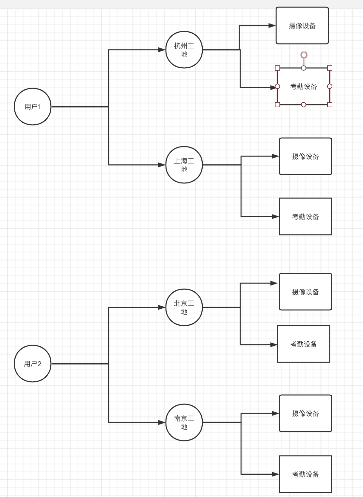

# 千锋工地管理后台

# 一、用例图

# 二、实现的功能

## 1.用户（AB协助）

- 多个用户：直接由数据库表中数据提供即可
- 用户登陆校验的功能

## 2.工地（A）

工地是属于用户的，不同的用户管理着不同的工地。

- 查看工地
- 添加工地
- 编辑工地
- 删除工地

## 3.设备（B）

- 查看某个工地里的所有设备
- 编辑某个工地里的某个设备
- 删除某个工地里的某个设备
- 添加设备： 设备添加到某个工地里
- 做一些基本的设备管理

## 4.搜索（AB） 

# 三、使用gitflow工作流程完成

# 四、开发工具：vue+springboot+mysql

# 五、开发时间进度流程：

- 今天晚上：编写一份项目技术方案。技术方案里的数据库表设计是重点。

时序图：

- gitee上创建项目工程、分配开发人员，为每个开发创建分支。master不进行开发
  - 1：wangwu
  - 2：zhangsan
  - master：合并1和2的内容
- 两个人进行协作开发
- 单元测试自测，自己做前后端联调
- 前端代码直接copy，后端代码必须使用git合并
- 周五上午验收

