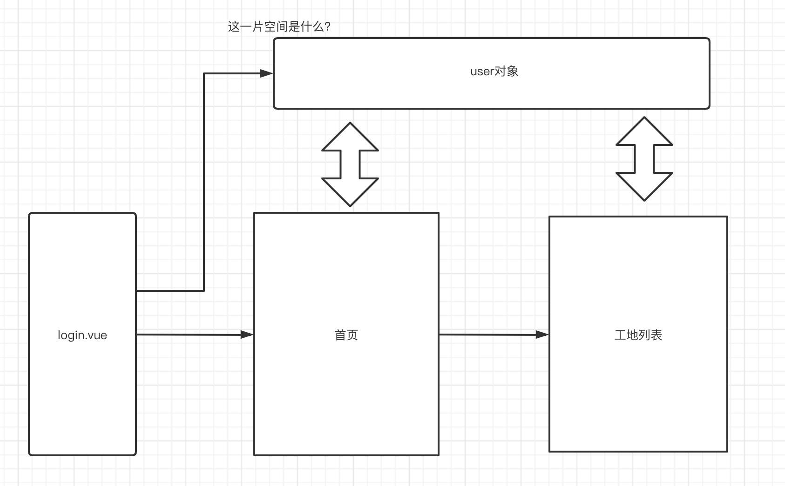

# 一、要解决的问题

用户登陆以后，用户的信息能够被存放在某一个空间中，之后的任何vue组件都能从该空间中获取用户信息




# 二、解决方案一：SessionStorage

使用浏览器的session空间：sessionStorage 来存放键值对：

- 步骤一：

在登陆成功后，向浏览器中存放：

```js
sessionStorage.setItem('isLogin', 'true');
```

- 步骤二：

在路由钩子函数中，每次路由时都可以访问这片空间中的键值对(main.js)

```js
// The Vue build version to load with the `import` command
// (runtime-only or standalone) has been set in webpack.base.conf with an alias.
import Vue from 'vue'
import App from './App'
import router from './router'
import ElementUI from 'element-ui';
import 'element-ui/lib/theme-chalk/index.css';
import axios from 'axios'
import VueAxios from 'vue-axios'
Vue.use(VueAxios, axios)
Vue.use(ElementUI);

Vue.config.productionTip = false

//isLogin  true

// 在跳转前执行
router.beforeEach((to, from, next) => {
  // 获取用户登录状态
  let isLogin = sessionStorage.getItem('isLogin');

  // 注销
  if (to.path == '/logout') {
    // 清空
    sessionStorage.clear();

    // 跳转到登录
    next({path: '/user/login'});
  }

  // 如果请求的是登录页
  else if (to.path == '/user/login') {
    if (isLogin != null) {
      // 跳转到首页
      next({path: '/product/list/xiaoming'});
    }
  }

  // 如果为非登录状态
  else if (isLogin == null) {
    // 跳转到登录页
    next({path: '/user/login'});
  }

  // 下一个路由
  next();
});


/* eslint-disable no-new */
new Vue({
  el: '#app',
  router,
  components: { App },
  template: '<App/>'
})

```


# 三、解决方案二：Vuex状态管理模块

## 1.创建一个store对象

在src下创建store文件夹，并在文件夹内创建index.js

```js
import Vue from 'vue'
import Vuex from 'vuex'
Vue.use(Vuex);

// 全局 state 对象，用于保存所有组件的公共数据
const state = {
  // 定义一个 user 对象
  // 在组件中是通过 this.$store.state.user 来获取
  user: {
    id:0,
    username: ''
  }
};

// 实时监听 state 值的最新状态，注意这里的 getters 可以理解为计算属性
const getters = {
  // 在组件中是通过 this.$store.getters.getUser 来获取
  getUser(state) {
    return state.user;
  }
};

// 定义改变 state 初始值的方法，这里是唯一可以改变 state 的地方，缺点是只能同步执行
const mutations = {
  // 在组件中是通过 this.$store.commit('updateUser', user); 方法来调用 mutations
  updateUser(state, user) {
    state.user = user;
  }
};

// 定义触发 mutations 里函数的方法，可以异步执行 mutations 里的函数
const actions = {
  // 在组件中是通过 this.$store.dispatch('asyncUpdateUser', user); 来调用 actions
  asyncUpdateUser(context, user) {
    context.commit('updateUser', user);
  }
};

export default new Vuex.Store({
  state,
  getters,
  mutations,
  actions
});
```


注意 这里设置了state——公共空间，在该空间中存放了一个user对象，这个对象可以被任何人操作。

操作的方式有两种：

- getter： this.$store.getters.getUser 获取user对象
- setter：this.$store.dispatch('asyncUpdateUser', user); 来设置user对象


## 2.修改main.js

```js
import store from './store'

/* eslint-disable no-new */
new Vue({
  el: '#app',
  router, // this.$router.push
  store, //加入了store
  components: { App },
  template: '<App/>'
})
```


## 3.登陆成功后设置user对象

login.vue:

```js
if(result.code==1000){
                       //登陆验证成功
                       vm.$message({
                          message: result.message,
                          type: 'success'
                       });
                       // 设置用户登录成功
                       sessionStorage.setItem('isLogin', 'true');
                       var user = result.data;
                       vm.$store.dispatch('asyncUpdateUser', user)//把user对象放到vuex空间中
                       setTimeout(function(){//通过定时器 。登陆成功后2秒跳到商品列表
                         vm.$router.push("/product/list")
                       },2000)
```


## 4.product.vue中获取vuex中的user对象

```js
 export default{
    data(){
      return {
        tableData:[],
        // username: this.$route.params.username
        user:{}
      }
    },
    mounted(){
      this.user = this.$store.getters.getUser //从vuex中获取user对象
      var vm = this; //把当前vue对象赋值给vm
      this.axios({
        method:'get',
        url:'https://www.fastmock.site/mock/b11db29e87f59a70887a828cd35112ac/product/list'
      }).then(function(response){
        var result = response.data;
        if(result.code==1000){
          //请求成功的
          vm.tableData = result.data;
        }


      })
```


## 5.防止页面刷新后丢失数据

- app.vue中加入：

```js
export default {
  name: 'App',
  mounted() {
        window.addEventListener('unload', this.saveState);
      },
      methods: {
        saveState() {
          sessionStorage.setItem('state', JSON.stringify(this.$store.state));
        }
      }
}
```

- 在store/index.js中修改：

```js
// 全局 state 对象，用于保存所有组件的公共数据
const state =sessionStorage.getItem('state') ? JSON.parse(sessionStorage.getItem('state')) : {
  // 定义一个 user 对象
  // 在组件中是通过 this.$store.state.user 来获取
  user: {
    id:0,
    username: ''
  }
};
```

