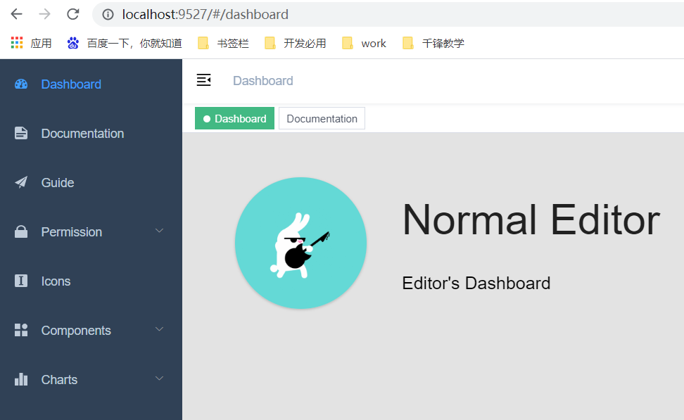
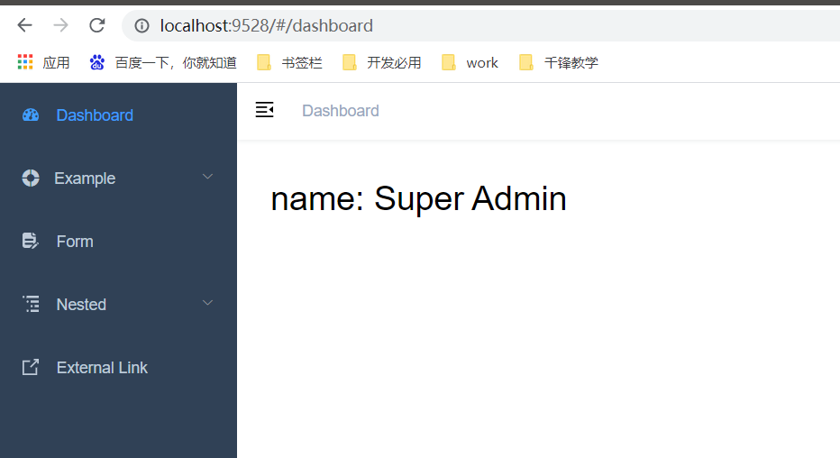

# 一、Vue能干嘛？

- 能够帮我们实现前台端分离开发
  - 前台：好看吗？


# 二、vue-element-admin

## 1、概述

- 官网：https://panjiachen.github.io/vue-element-admin-site/zh/
- 一个基于Vue和ElementUI实现的后台管理系统的前端框架
- 是一个成品的项目的，具备非常丰富的UI组件

## 2、vue-admin-template

- 是一个简化版的后台管理系统
- 可以根据上面提供的模板进行二次开发


# 三、安装

## 1、vue-element-admin

- 下载

```
# 克隆项目
git clone https://github.com/PanJiaChen/vue-element-admin.git
```

- 运行

```
# 进入项目目录
cd vue-element-admin

# 安装依赖
npm install

# 本地开发 启动项目
npm run dev
```

| npm run dev                                                  |
| ------------------------------------------------------------ |
|  |


## 2、vue-admin-template

- 下载

```
# 克隆项目
git clone https://github.com/PanJiaChen/vue-element-admin.git
```

- 运行

```
# 进入项目目录
cd vue-admin-template

# 安装依赖
npm install

# 本地开发 启动项目
npm run dev
```

| http://locahost:9528                                         |
| ------------------------------------------------------------ |
|  |


# 四、千锋学生后台管理系统

## 1、准备工作

### 1.1 熟悉vue-admin-template界面

### 1.2 数据库表

- 自己建

### 1.3 后台

- 自己写


## 2、功能实现

### 2.1 查询

- 后台

  - Controller返回ResultVO

  - ```json
    {
        success : true,
        message : "查询学生列表成功",
        data : [
            {学生1的json对象},
            {学生2的json对象}
        ]
    }
    ```

- 前台

  - 准备工作

    - 安装axios

    ```sh
    cnpm install --save axios vue-axios
    ```

    - main.js导入axios模块并使用

    ```javascript
    import axios from 'axios'
    import VueAxios from 'vue-axios'
    
    Vue.use(VueAxios, axios)
    ```

  - 找到路由的入口

  ```
  views/table/index.vue  //数据表格的入口js文件
  借于这个文件自己创建了一个student/student-list.vue
  ```

  - 修改路由信息【router/index.js】

  ```js
   //开始 
   {
      path: '/student',
      component: Layout,
      redirect: '/student/list',
      name: 'StudentManagement',
      meta: { title: '学生管理', icon: 'el-icon-s-help' },
      children: [
        {
          path: 'list',
          name: 'Table',
          component: () => import('@/views/student/student-list'),
          meta: { title: '学生列表', icon: 'table' }
        },
       //结束   
        {
          path: 'tree',
          name: 'Tree',
          component: () => import('@/views/tree/index'),
          meta: { title: 'Tree', icon: 'tree' }
        }
      ]
    },
  
  ```

  - 编辑student/student-list.vue

  ```javascript
  <template>
    <div class="app-container">
      <el-table
        v-loading="listLoading"
        :data="list"
        element-loading-text="Loading"
        border
        fit
        highlight-current-row
      >
        <el-table-column align="center" label="序号" width="95">
          <!-- slot-scope : 插槽
              scope : 当前行对象的引用
          -->
          <template slot-scope="scope">
            {{ scope.$index + 1 }}
          </template>
        </el-table-column>
  
        <el-table-column label="ID" width="95">
          <template slot-scope="scope">
            <!--  scope.row : 获取当前行数据 -->
            {{ scope.row.stuId }}
          </template>
        </el-table-column>
  
        <el-table-column label="学号" align="center">
          <template slot-scope="scope">
            <span>{{ scope.row.stuNo }}</span>
          </template>
        </el-table-column>
        <el-table-column label="姓名" width="150" align="center">
          <template slot-scope="scope">
            {{ scope.row.stuName }}
          </template>
        </el-table-column>
        <el-table-column class-name="status-col" label="性别" width="95" align="center">
          <template slot-scope="scope">
            {{ scope.row.gender == 0 ? '女' : '男' }}
          </template>
        </el-table-column>
        <!--<el-table-column align="center" prop="created_at" label="Display_time" width="200">
          <template slot-scope="scope">
            <i class="el-icon-time" />
            <span>{{ scope.row.display_time }}</span>
          </template>
        </el-table-column>-->
      </el-table>
  
    </div>
  </template>
  
  <script>
  
  export default {
    filters: {
      statusFilter(status) {
        const statusMap = {
          published: 'success',
          draft: 'gray',
          deleted: 'danger'
        }
        return statusMap[status]
      }
    },
    data() {
      return {
        list: null,
        listLoading: true
      }
    },
    //钩子页面，vue对象创建完成后会被调用
    created() {
      this.fetchData()
    },
    methods: {
      fetchData() {
  
        //向后台发送ajax请求
        var url = "http://localhost:80/student/list";
        this.axios.get(url).then( res => {
          this.list = res.data.data;
          console.log(this.list);
          //不要加载图标
          this.listLoading = false;
        });
  
      }
    }
  }
  </script>
  
  ```

  

### 2.2 分页

> 找到分页组件【Pagination】

- 后台
  - 通过mybatisplus的 selectPage(ipage，条件)

- 前台

  - 修改 student-list.vue

  ```vue
  <template>
    <div class="app-container">
      <el-table
        v-loading="listLoading"
        :data="list"
        element-loading-text="Loading"
        border
        fit
        highlight-current-row
      >
        <el-table-column align="center" label="序号" width="95">
          <!-- slot-scope : 插槽
              scope : 当前行对象的引用
          -->
          <template slot-scope="scope">
            {{ scope.$index + 1 }}
          </template>
        </el-table-column>
  
        <el-table-column label="ID" width="95">
          <template slot-scope="scope">
            <!--  scope.row : 获取当前行数据 -->
            {{ scope.row.stuId }}
          </template>
        </el-table-column>
  
        <el-table-column label="学号" align="center">
          <template slot-scope="scope">
            <span>{{ scope.row.stuNo }}</span>
          </template>
        </el-table-column>
        <el-table-column label="姓名" width="150" align="center">
          <template slot-scope="scope">
            {{ scope.row.stuName }}
          </template>
        </el-table-column>
        <el-table-column class-name="status-col" label="性别" width="95" align="center">
          <template slot-scope="scope">
            {{ scope.row.gender == 0 ? '女' : '男' }}
          </template>
      </el-table>
  
  <!--1.分页组件-->
      <pagination v-show="total>0" :total="total" :page.sync="listQuery.page" :limit.sync="listQuery.limit" @pagination="fetchData" />
  
    </div>
  </template>
  
  <script>
  import Pagination from '@/components/Pagination'
  
  export default {
    //2.注册组件
    components: { Pagination },
    filters: {
      statusFilter(status) {
        const statusMap = {
          published: 'success',
          draft: 'gray',
          deleted: 'danger'
        }
        return statusMap[status]
      }
    },
    data() {
      return {
        list: null,
        listLoading: true,
        //3.分页变量
        total: 0,
        listQuery: {
          page: 1,
          limit: 5
        }
      }
    },
    //钩子页面，vue对象创建完成后会被调用
    created() {
      this.fetchData()
    },
    methods: {
      fetchData() {
  
        //向后台发送ajax请求
  
        var url = "http://localhost:80/student/page/" + this.listQuery.page + "/" + this.listQuery.limit;
        this.axios.get(url).then( res => {
          let vo = res.data;
          this.list = vo.data.records;
          this.total = vo.data.total;
          console.log(this.list);
          //不要加载图标
          this.listLoading = false;
        });
  
      }
    }
  }
  </script>
  
  ```

  - 从 vue-element-admin 中把分页组件和需要滚动条复制过来

  ```
  components/Pagination
  utils/scroll-to.js
  ```

  

  ### 2.3 编辑

  - 后台

    - 回显数据【根据ID查询】

      - 参数【id : 10】

      ```
      url/:id
      ```

      - 返回数据

      ```
      {
          success : true,
          message : "查询学生列表成功",
          data : {学生1的json对象}
      }
      ```

    - 修改

      - 参数

      ```
      {
      	student的json格式
      }
      ```

      - 返回数据

      ```
      {
          success : true,
          message : "修改成功",
          data : null
      }
      ```

  - 前台

    - 在student-list.vue

      增加按钮【修改、删除】

    ```vue
    <el-table-column label="操作" align="center" width="230" class-name="small-padding fixed-width">
      <template slot-scope="{row,$index}">
        <el-button type="primary" size="mini" @click="findById(row.stuId)">
          修改
        </el-button>
        <el-button size="mini" type="danger" @click="deleteById(row.stuId)">
          删除
        </el-button>
      </template>
    </el-table-column>
    ```

    ​	   增加两个方法

    ```vue
    findById(id){
      console.log(id);
      this.$router.push("/student/update/" + id);
    },
    deleteById(id){
      console.log(id);
    },
    ```

    - router/index.js 增加更新的路由

    ```
    {
        path: 'update/:stuId',
        name: 'StudentUpdate',
        component: () => import('@/views/student/student-update'),
        meta: { title: '编辑', icon: 'tree' },
        hidden: true   //在侧边栏不显示编辑
    }
    ```

    - /views/student/student-update.vue

    ```vue
    <template>
      <div class="app-container">
        <el-form :model="student" label-width="120px">
          <el-form-item label="学号" >
            <el-input v-model="student.stuNo" :disabled="true"/>
          </el-form-item>
          <el-form-item label="姓名">
            <el-input v-model="student.stuName" />
          </el-form-item>
          <el-form-item label="性别">
            <el-radio v-model="student.gender" label="1">男</el-radio>
            <el-radio v-model="student.gender" label="0">女</el-radio>
          </el-form-item>
    
          <el-form-item>
            <el-button type="primary" @click="update()">修改</el-button>
            <el-button @click="onCancel">取消</el-button>
          </el-form-item>
        </el-form>
      </div>
    </template>
    
    <script>
    export default {
      data() {
        return {
          student: {
            stuId: 0,
            stuNo: '',
            stuName: '',
            gender: ''
          }
        }
      },
      mounted() {
        let stuId = this.$route.params.stuId;
        console.log(stuId);
        let url = "http://localhost:80/student/" + stuId;
        this.axios.get(url, null).then(res=>{
          let result = res.data;
          console.log(result.data);
          this.student = result.data;
          this.student.gender = result.data.gender.toString();
        });
      },
      methods: {
        update() {
          //发送ajax请求
          let url = "http://localhost:80/student/update";
          this.axios.post(url, this.student).then(res => {
            let result = res.data;
            if(result.success) {
              this.$message({
                message: result.message,
                type: 'success'
              });
              setTimeout(() => {
                this.$router.push("/student");
              },2000);
            } else {
              this.$message.error(result.message);
            }
          });
    
        },
        onCancel() {
          this.$message('已取消')
        }
      }
    }
    </script>
    
    <style scoped>
    .line{
      text-align: center;
    }
    </style>
    
    
    ```

    


